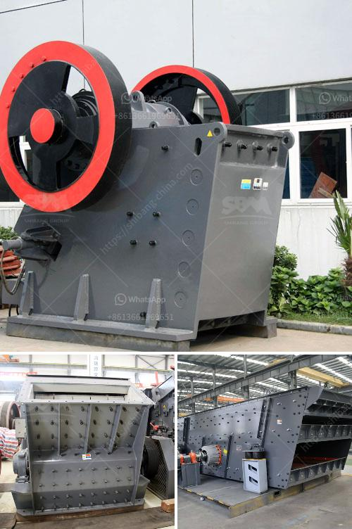

<h3>سعر كسارة الحجر الأمريكي</h3>
تعتبر كسارة الحجر الأمريكي أحد المعدات الهامة في صناعة البناء والإنشاءات. إنها تستخدم لسحق الصخور الكبيرة إلى الأحجام الصغيرة المطلوبة للاستخدام في مشاريع البناء المختلفة. يتنوع سعر كسارة الحجر الأمريكي وفقًا للعديد من العوامل المؤثرة.

أحد العوامل الرئيسية التي تؤثر في سعر كسارة الحجر الأمريكي هو نوعها وموديلها. هناك العديد من الموديلات المتوفرة في السوق وتختلف في الحجم والسعة والأداء. كلما كانت سعة الكسارة أكبر وأدائها أعلى، كان السعر أعلى. بينما الكسارات الصغيرة ذات السعة المحدودة تكون أرخص في السعر.

علاوة على ذلك، يتأثر سعر كسارة الحجر الأمريكي أيضًا بالعلامة التجارية وجودة التصنيع. هناك العديد من الشركات المصنعة المشهورة في السوق التي تتمتع بسمعة جيدة بسبب جودة منتجاتها. وبشكل عام، فإن الكسارات ذات الجودة العالية تكون أكثر تكلفة من تلك ذات الجودة المنخفضة.

عامل آخر يؤثر في سعر كسارة الحجر الأمريكي هو الموقع الجغرافي. يمكن أن تختلف التكاليف اللوجستية مثل تكاليف الشحن والنقل بشكل كبير باختلاف الموقع. في بعض الحالات، يمكن أن يكون هناك رسوم إضافية لشحن الكسارة إلى الموقع المطلوب، وذلك بناءً على المسافة ووسائل النقل المستخدمة.

بالإضافة إلى ذلك، يؤثر الطلب والعرض في سعر كسارة الحجر الأمريكي. في حالة ارتفاع الطلب على الكسارات وزيادة الطلب في السوق، فإن ذلك قد يرفع الأسعار. وعلى العكس، في حالة وجود توفر كبير من الكسارات وقلة الطلب، فإن الأسعار قد تنخفض.

بشكل عام، يتراوح سعر كسارة الحجر الأمريكي بين الـ200 إلى 400 دولار، ولكن يجب أن نفهم أن هذه الأرقام هي مجرد تقديرات تقاسمية وقد تتغير باختلاف العوامل المذكورة أعلاه.

في النهاية، من المهم أن يتم التفكير بعناية والتحقق من متطلبات المشروع والميزانية المتاحة قبل شراء كسارة الحجر الأمريكي. يجب أن يتم الحصول على عروض أسعار متعددة من الشركات المصنعة والتاجر قبل اتخاذ قرار الشراء. كما يجب أيضًا مراجعة آراء المستخدمين السابقين والاطلاع على التقييمات والتعليقات لمساعدتك في اتخاذ القرار الأفضل.

باختصار، سعر كسارة الحجر الأمريكي يتأثر بالعديد من العوامل مثل النوع والموديل والجودة والموقع والطلب والعرض. ينصح بمراجعة هذه العوامل قبل اتخاذ قرار الشراء لضمان الحصول على الكسارة الأمريكية المناسبة بأفضل قيمة سعرية.
<h3>Contact us</h3><ul><li><strong>Whatsapp:&nbsp;<a href="https://wa.me/8613661969651">+8613661969651</a></strong></li><li><a href="https://swt.shibang-china.com/?git&amp;zhl&amp;سعر كسارة الحجر الأمريكي"><strong>Online Service(chat now)</strong></a></li></ul><h3>Related</h3><ul><li><a href='كسارة الكاولين المحمولة في نيجيريا.md'>كسارة الكاولين المحمولة في نيجيريا</a></li><li><a href='تدفق عملية مصنع البنتونايت.md'>تدفق عملية مصنع البنتونايت</a></li><li><a href='مصنع كسارة الفحم المحمول 400 طن في الساعة.md'>مصنع كسارة الفحم المحمول 400 طن في الساعة</a></li><li><a href='آلة حفر الحجر الجرانيت في الهند.md'>آلة حفر الحجر الجرانيت في الهند</a></li><li><a href='مصنع استخراج النحاس الصغير.md'>مصنع استخراج النحاس الصغير</a></li></ul>