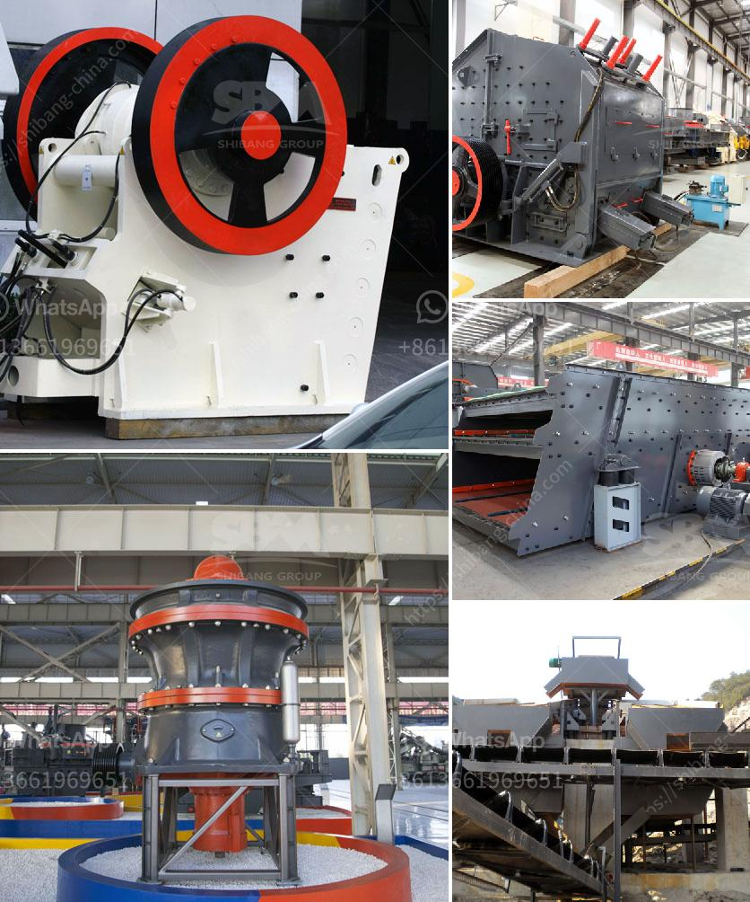

<h3>سعر كسارة الحجر الصلب</h3>
تعتبر كسارة الحجر الصلب أحد الأدوات اللازمة في عمليات التعدين والبناء، حيث تستخدم لسحق الصخور الكبيرة وتحويلها إلى حصى صغيرة قابلة للاستخدام في العديد من التطبيقات. وتختلف أسعار كسارات الحجر الصلب حسب حجم وقوة الكسارة وأداءها وموديلها.

في السوق، يمكن العثور على كسارات الحجر الصلب بأسعار تتراوح بين 200 إلى 400 دولار، وتختلف الأسعار حسب العلامة التجارية والمواصفات المختلفة لكل كسارة. تعتبر الكسارات ذات الأسعار المنخفضة الأكثر شيوعًا في الأسواق، حيث تتميز بموثوقية وكفاءة جيدة في سحق الصخور.

تتوفر الكسارات الصلبة بمجموعة متنوعة من الأحجام والقدرات، وعادة ما تكون الكسارات الأكثر تكلفة هي تلك ذات القدرات الأعلى. وفي العادة، تعتبر الكسارات بقدرة 250-300 طن في الساعة هي الأكثر طلبًا في السوق.

وبالإضافة إلى السعر، يجب أيضًا مراعاة تكاليف التشغيل والصيانة لكسارة الحجر الصلب. فعلى الرغم من أن سعر الشراء الأولي قد يبدو مرتفعًا، فإن تكاليف التشغيل اليومية ليست باهظة كالأجهزة الأخرى، مثل الكسارات المتنقلة أو الكسارات الأخرى التي تعمل بالديزل.

بصفة عامة، تُعتبر كسارة الحجر الصلب استثمارًا جيدًا للشركات والأفراد الذين يحتاجون إلى تحويل الصخور الكبيرة إلى حصى صغيرة. فإلى جانب استخدامها في البناء والتعدين، يمكن استخدام حصى الكسارة في الأعمال الطرقية وتجهيز الركام والخرسانة المستخدمة في الإنشاءات.

وفي النهاية، تُعتبر كسارة الحجر الصلب أداة هامة لتحسين كفاءة عمليات التعدين والبناء، وتُستخدم على نطاق واسع في الصناعة. بغض النظر عن السعر، يجب النظر في الأداء والمتانة وسهولة الصيانة عند شراء كسارة حجر صلبة، لضمان الحصول على منتج ذو جودة عالية يلبي احتياجاتك ويستمر لفترة طويلة.
<h3>Contact us</h3><ul><li><strong>Whatsapp:&nbsp;<a href="https://wa.me/8613661969651">+8613661969651</a></strong></li><li><a href="https://swt.shibang-china.com/?git&amp;zhl&amp;سعر كسارة الحجر الصلب"><strong>Online Service(chat now)</strong></a></li></ul><h3>Related</h3><ul><li><a href='تقرير المشروع لمصنع تكسير الحجر.md'>تقرير المشروع لمصنع تكسير الحجر</a></li><li><a href='آلة سحق الأسفلت بسعة 15 طن في الساعة.md'>آلة سحق الأسفلت بسعة 15 طن في الساعة</a></li><li><a href='خط إنتاج الباريت.md'>خط إنتاج الباريت</a></li><li><a href='كسارات الفك المستخدمة في الفلبين.md'>كسارات الفك المستخدمة في الفلبين</a></li><li><a href='قائمة الشركات المحاجر في نيجيريا.md'>قائمة الشركات المحاجر في نيجيريا</a></li></ul>