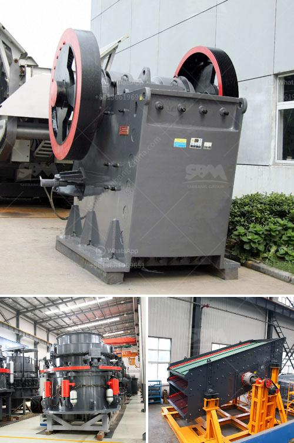

<h3>سعر كسارة الحجر المحمول في باكستان</h3>
تعتبر صناعة البناء من الصناعات الحيوية والمهمة في اقتصاد أي دولة، وتعتبر الحجارة أحد المواد الأساسية في إنشاء المنشآت والمباني. ولذلك، يعتبر مصنعو الحجارة وكسارات الحجر من أهم الجهات في هذا القطاع.

تستخدم كسارات الحجر المحمولة على نطاق واسع في صناعة البناء لسحق الحجارة وتكسيرها إلى قطع أصغر قابلة للاستخدام في البناء. وتتميز هذه الكسارات بأنها صغيرة الحجم وقابلة للنقل، مما يتيح تحريكها بسهولة بين المواقع المختلفة.

وفي السنوات الأخيرة، ارتفع الطلب على كسارات الحجر المحمولة في باكستان. يعود ذلك إلى العديد من العوامل، منها النمو السكاني المستمر والزيادة في عدد المشاريع الإنشائية. بالإضافة إلى ذلك، تواجه البلاد تحديات في توفير أنواع مختلفة من الحجارة المطلوبة في صناعة البناء.

يختلف سعر كسارة الحجر المحمولة في باكستان بناءً على عدة عوامل. من بين هذه العوامل هي ماركة الكسارة وجودتها وقدرتها على سحق الحجارة بكفاءة عالية. كما تؤثر سعة الكسارة في تحديد السعر، حيث تكون الكسارات ذات السعة الكبيرة أغلى من الكسارات ذات السعة الصغيرة.

بالإضافة إلى ذلك، يلعب العرض والطلب دورًا أساسيًا في تحديد سعر كسارات الحجر المحمولة. قد يرتفع سعر الكسارة إذا كان هناك طلب كبير عليها وعدد قليل من الكسارات المتاحة في السوق. وعلى العكس من ذلك، قد ينخفض السعر إذا كان هناك تنافس قوي بين الكسارات المختلفة.

وفي الوقت الحالي، يتراوح سعر كسارة الحجر المحمولة في باكستان بين 200 و 400 دولار. ومن المتوقع أن يستمر ارتفاع هذه الأسعار في المستقبل، بناءً على الطلب المتزايد والتحديات في توفير الحجارة المطلوبة.

باختصار، تعتبر كسارة الحجر المحمولة أداة أساسية في صناعة البناء في باكستان. وتختلف أسعارها بناءً على عدة عوامل، منها العلامة التجارية والجودة والسعة والعرض والطلب. ومن المتوقع أن تستمر ارتفاع أسعارها في المستقبل بناءً على الطلب المتزايد على الحجارة في البناء.
<h3>Contact us</h3><ul><li><strong>Whatsapp:&nbsp;<a href="https://wa.me/8613661969651">+8613661969651</a></strong></li><li><a href="https://swt.shibang-china.com/?git&amp;zhl&amp;سعر كسارة الحجر المحمول في باكستان"><strong>Online Service(chat now)</strong></a></li></ul><h3>Related</h3><ul><li><a href='كسارات حجر مستعملة للبيع.md'>كسارات حجر مستعملة للبيع</a></li><li><a href='كسارة للجرانيت.md'>كسارة للجرانيت</a></li><li><a href='جر المحمول في.md'>جر المحمول في</a></li><li><a href='مصنع تكسير الحجر الجيري في الهند.md'>مصنع تكسير الحجر الجيري في الهند</a></li><li><a href='كيماويات تعويم تحسين الفحم في الهند.md'>كيماويات تعويم تحسين الفحم في الهند</a></li></ul>