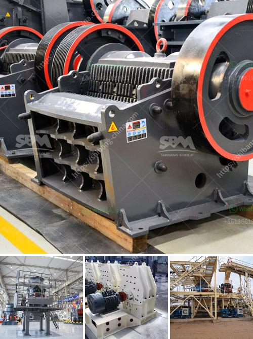

<h3>سعر كسارة الحجر المحمولة في الفلبين</h3>
تعد الكسارات المحمولة من المعدات الهامة في صناعة التعدين والبناء. تعتبر الفلبين من الدول التي تمتاز بثرواتها الطبيعية الغنية، وبالتالي فإن الحاجة إلى استخدام كسارات الحجر المحمولة تزداد في هذه البلاد. يهدف استخدام هذه الكسارات إلى تكسير وطحن الحجارة لإنتاج مواد البناء والبنى التحتية.

يتم تحديد سعر كسارة الحجر المحمولة في الفلبين بناءً على عدة عوامل. واحدة من هذه العوامل هي القوة الإنتاجية للكسارة المحمولة، حيث تتفاوت الأحجام والقدرات المختلفة للكسارات وفقًا للاحتياجات المحددة لكل عميل. بالطبع، يزداد سعر الكسارة مع زيادة إنتاجيتها. ومع ذلك، يمكن العثور على كسارات الحجر المحمولة بأسعار تتراوح بين 200-400 دولار في الفلبين، وذلك حسب الحجم والمواصفات المختلفة لكل نموذج.

علاوة على ذلك، يؤثر أيضًا العلامة التجارية على سعر الكسارة المحمولة. هناك العديد من الشركات المصنعة للكسارات المحمولة في السوق، وتختلف جودتها وتقنياتها. تعتبر العلامات التجارية المعروفة والرائدة في الصناعة أغلى بعض الشيء، حيث تقدم جودة أفضل وموثوقية أعلى.

علاوة على السعر، يجب أن يأخذ المشتري أيضًا في الاعتبار تكاليف الصيانة وقطع الغيار للكسارة المحمولة. يجب توفير قطع الغيار الأصلية لضمان الأداء الجيد للكسارة وتجنب التوقف غير المخطط له في عملية التعدين أو البناء.

باختصار، سعر كسارة الحجر المحمولة في الفلبين يتفاوت بناءً على العوامل المذكورة أعلاه، مثل القدرة الإنتاجية والعلامة التجارية وتكاليف الصيانة. قبل شراء كسارة حجر محمولة، يجب على المشتري أن يحدد الاحتياجات الخاصة به ويقارن بين العروض المتاحة في السوق للحصول على أفضل قيمة مقابل المال المستثمر. بفضل الكسارات المحمولة، يمكن للفلبينيين الاستفادة من مواد البناء عالية الجودة وتطوير المشاريع بطريقة فعالة اقتصاديًا.
<h3>Contact us</h3><ul><li><strong>Whatsapp:&nbsp;<a href="https://wa.me/8613661969651">+8613661969651</a></strong></li><li><a href="https://swt.shibang-china.com/?git&amp;zhl&amp;سعر كسارة الحجر المحمولة في الفلبين"><strong>Online Service(chat now)</strong></a></li></ul><h3>Related</h3><ul><li><a href='مواصفات مطحنة الكرة.md'>مواصفات مطحنة الكرة</a></li><li><a href='كسارة الصخور للكوارتز.md'>كسارة الصخور للكوارتز</a></li><li><a href='اقتراح مشروع تجاري لكسارة الحجر.md'>اقتراح مشروع تجاري لكسارة الحجر</a></li><li><a href='تقرير مشروع وحدات كسارة الحجر.md'>تقرير مشروع وحدات كسارة الحجر</a></li><li><a href='عملية سحق التعدين لخام الحديد.md'>عملية سحق التعدين لخام الحديد</a></li></ul>