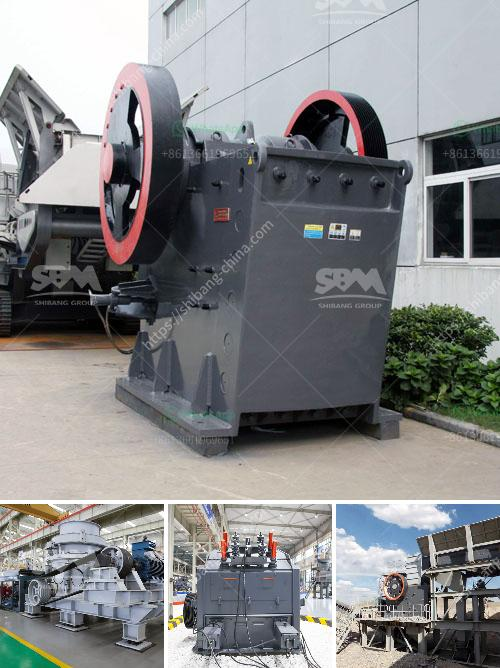

<h3>سعر كسارة الحجر المحمولة في</h3>
تعتبر كسارة الحجر المحمولة أحد الأدوات الهامة في صناعة التعدين والبناء، حيث تستخدم لسحق الحجارة الكبيرة إلى أحجام أصغر وتفصلها عن الغبار والأتربة. تعتبر هذه الكسارات مفيدة جداً للمقاولين والشركات الذين يعملون في مشاريع البناء والطرق، حيث يمكن نقلها بسهولة من موقع لآخر لتلبية الحاجة.

يتفاوت سعر كسارة الحجر المحمولة وفقًا للحجم والقوة والميزات المختلفة التي تقدمها. في متوسط، تتراوح أسعارها بين 200 إلى 400 دولار بحسب الطراز والعلامة التجارية والوظائف المتاحة.

يمكن العثور على بعض الكسارات المحمولة ذات الأسعار المنخفضة التي تبلغ حوالي 200 دولار، وهي تعتبر مناسبة للاستخدامات الأساسية وللمشاريع الصغيرة. هذه الكسارات تأتي بمحركات صغيرة الحجم ويمكن نقلها بسهولة من موقع لآخر. غالباً ما تكون قدرتها على سحق الحجارة محدودة، ويجب استخدامها بناءً على الاحتياجات الخاصة بالمشروع.

مع زيادة السعر بين 200 إلى 400 دولار، يمكن الحصول على كسارات محمولة أكثر قوة ومرونة في الاستخدام. يكون لديها محركات أكبر وقدرات سحق أعلى. هذه الكسارات يمكن أن تعمل على سحق الحجارة الأكبر حجماً والصخور الصلبة بسهولة.

بالإضافة إلى حجم وقوة الكسارات المحمولة، هناك بعض العوامل الأخرى التي يجب أن يأخذ في الحسبان عند شراء كسارة الحجر المحمولة، مثل الملحقات المرفقة وامكانية وصيانة والتشغيل. بعض الكسارات تأتي مع أحجام شبكة تنقية مختلفة لإعطاء المنتج النهائي المطلوب، بينما يمكن للآخرين تطبيقات متعددة مثل فصل الحديد أو تدوير الطحينة. يجب أيضاً أن يكون الاهتمام بصيانة الكسارة والتأكد من توفر قطع الغيار، لضمان العمل المستمر وزيادة العمر الافتراضي للجهاز.

باختصار، تعتبر كسارة الحجر المحمولة أداة حيوية لعمال البناء والمقاولين لتعزيز كفاءة عملهم وتوفير الوقت والمجهود. يتفاوت سعرها بين 200 إلى 400 دولار تقريبًا ويعتمد ذلك على الحجم والقوة والميزات المرفقة. إذا كنت تخطط لشراء كسارة حجر محمولة، يجب أن تأخذ بجميع العوامل المذكورة أعلاه للحصول على الجهاز الأنسب لاحتياجاتك ومتطلبات مشروعك.
<h3>Contact us</h3><ul><li><strong>Whatsapp:&nbsp;<a href="https://wa.me/8613661969651">+8613661969651</a></strong></li><li><a href="https://swt.shibang-china.com/?git&amp;zhl&amp;سعر كسارة الحجر المحمولة في"><strong>Online Service(chat now)</strong></a></li></ul><h3>Related</h3><ul><li><a href='سعر مطحنة رايموند للكاولين.md'>سعر مطحنة رايموند للكاولين</a></li><li><a href='سعر مطحنة الكرة.md'>سعر مطحنة الكرة</a></li><li><a href='كل معدة لكل جهاز كسارة فك.md'>كل معدة لكل جهاز كسارة فك</a></li><li><a href='تصميم آلة سحق الجبس بتنسيق PDF.md'>تصميم آلة سحق الجبس بتنسيق PDF</a></li><li><a href='خط تكسير الحجر.md'>خط تكسير الحجر</a></li></ul>