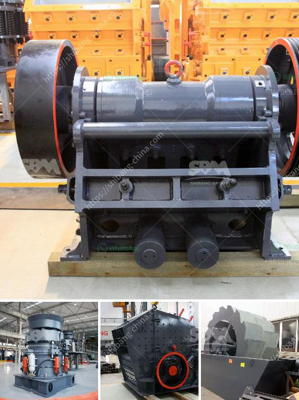

<h3>سعر كسارة الحجر بسعة 100 طن في الساعة</h3>
تتعدد استخدامات كسارة الحجر في مجال البناء والتشييد، حيث تستخدم لسحق الأحجار الكبيرة وتقسيمها إلى أحجام أصغر. تتراوح سعة كسارة الحجر من 100 طن في الساعة وأكثر، وفي هذه المقالة سنتطرق إلى سعرها.

سعر كسارة الحجر بسعة 100 طن في الساعة يتأثر بعدة عوامل، من بينها العلامة التجارية والجودة، ولكن الأهم هو نوع الكسارة والتقنية المستخدمة في صناعتها. يمكن العثور على تشكيلة واسعة من الكسارات في الأسواق، بدءًا من الكسارات الثابتة حتى الكسارات المتنقلة.

تعتبر الكسارات الثابتة أكثر تكلفةً وتعقيدًا في التركيب، حيث يجب أن تكون مثبتة داخل المحجر أو المصنع. يتطلب نقل هذا النوع من الكسارات عملية صعبة ومكلفة. نظرًا لهذه الأسباب، فإن الأسعار لهذه الكسارات عادة ما تكون أعلى.

مع ذلك، إذا كانت الكسارة متنقلة ويمكن نقلها بسهولة، فهي تعتبر حلاً أكثر تكلفة فعالية. يمكن استخدام الكسارات المتنقلة في عدة مواقع دون الحاجة إلى تكرار التركيب، وهذا يوفر الوقت والمال.

بالإضافة إلى ذلك، تصدر بعض البلدان كسارات الحجر بأسعار أقل من البلدان الأخرى، وهذا يتأثر بتكلفة المواد الأولية والعمالة والخدمات اللوجستية. لذلك، قد يكون سعر كسارة الحجر بسعة 100 طن في الساعة مختلفًا من بلد إلى آخر.

وفي النهاية، يعتمد سعر كسارة الحجر أيضًا على الطلب والعرض في السوق. إذا كان هناك طلب كبير على الكسارات في منطقتك، فقد ترتفع الأسعار بسبب الطلب المرتفع. وعلى العكس، إذا كان هناك منافسة كبيرة بين الشركات في سوق الكسارات، فقد تنخفض الأسعار لجذب المزيد من العملاء.

وبالتالي، فإن سعر كسارة الحجر بسعة 100 طن في الساعة يتفاوت وقد يتراوح بين عدة آلاف إلى عدة ملايين من الدولارات. ينصح بالتعاون مع شركات موثوقة وذات سمعة جيدة في السوق لشراء الكسارة المناسبة والتي تتناسب مع احتياجاتك وميزانيتك.
<h3>Contact us</h3><ul><li><strong>Whatsapp:&nbsp;<a href="https://wa.me/8613661969651">+8613661969651</a></strong></li><li><a href="https://swt.shibang-china.com/?git&amp;zhl&amp;سعر كسارة الحجر بسعة 100 طن في الساعة"><strong>Online Service(chat now)</strong></a></li></ul><h3>Related</h3><ul><li><a href='مصنع كسارة للبيع في باكستان.md'>مصنع كسارة للبيع في باكستان</a></li><li><a href='كسارة الصخور 250 طن في الساعة.md'>كسارة الصخور 250 طن في الساعة</a></li><li><a href='خط إنتاج الرمل الاصطناعي.md'>خط إنتاج الرمل الاصطناعي</a></li><li><a href='معدات كسارة الفك للبيع في الفلبين.md'>معدات كسارة الفك للبيع في الفلبين</a></li><li><a href='حجر الحجر الجيري المسحوق بحجم 34 بوصة.md'>حجر الحجر الجيري المسحوق بحجم 3/4 بوصة</a></li></ul>