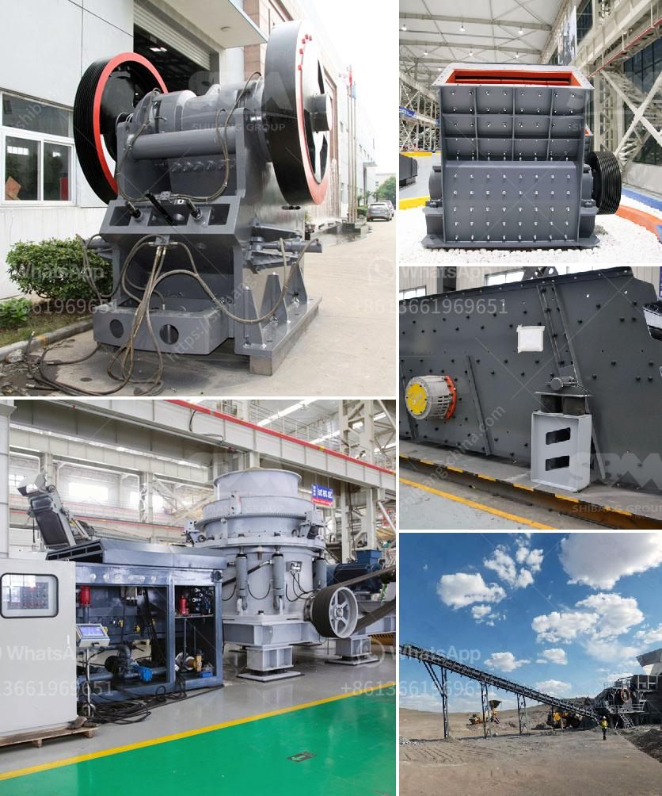

<h3>سعر كسارة الحجر سعة طن في الساعة</h3>
تعد كسارة الحجر بسعة طن في الساعة أحد المعدات الأساسية في صناعة التعدين والبناء. تعمل هذه الكسارات على سحق الحجر الكبير إلى قطع صغيرة بأحجام محددة، مما يسهل عملية استخدامها في الإنشاءات وتنقية المواد الخام.

تختلف أسعار كسارات الحجر بسعة طن في الساعة حسب عدة عوامل، بما في ذلك نوع الكسارة وقدرتها الإنتاجية والمحرك المستخدم في التشغيل والمواد المستخدمة في البناء ومناطق العمل والعلامة التجارية. وعادةً ما تتراوح أسعارها ما بين عدة آلاف إلى عشرات الآلاف من الدولارات.

يعتبر سعر كسارة الحجر بسعة طن في الساعة استثمارًا طويل الأمد للشركات التي تحتاج إلى سحق كميات كبيرة من الحجر يوميًا. فهذه الكسارات بسعة طن لديها القدرة على سحق الحجر الكبير بأحجام تتراوح بين 0-700 ملم إلى الحجم المطلوب الذي يناسب احتياجات العميل.

وتعتبر الكسارات بسعة طن في الساعة مفيدة في عدة مشاريع بناء وتعدين، مثل إعادة تدوير الركام وإعادة استخدامه في البناء، وتكسير الحصى الطبيعي لإنتاج الحصمة المطلوبة في الخرسانة، وتكسير الصخور الكبيرة لاستخراج المعادن والمواد الأخرى.

من الجدير بالذكر أنه يمكن أيضًا تأجير كسارات الحجر بسعة طن في الساعة بدلاً من شرائها، وهذا يعتمد على احتياجات العميل والموارد المادية المتاحة له. وبالإضافة إلى ذلك، فإن الاستثمار في كسارة الحجر يشمل أيضًا تكاليف الصيانة والتشغيل والمواد الاستهلاكية، ويجب على الشركات المهتمة اختيار الكسارة المناسبة التي تتناسب مع احتياجاتها وميزانيتها.

يمثل سعر كسارة الحجر بسعة طن في الساعة جانبًا مهمًا في عملية شراء المعدات الثقيلة. يجب على الشركات البحث والتحقق من جودة الكسارة والعلامة التجارية وتقييم سمعتها في السوق، والتأكد من الاحتياجات المحددة للمشروع قبل اتخاذ قرار الشراء. كما يفضل التعاون مع الشركات المصنعة الموثوقة التي تقدم ضمانًا على المنتجات وتقديم دعم فني وصيانة مستمرة.

باختصار، سعر كسارة الحجر بسعة طن في الساعة يتفاوت بين الشركات والمواصفات المطلوبة، ويعتبر استثمارًا مهمًا للشركات في صناعة التعدين والبناء. ويشمل هذا الاستثمار تكاليف الشراء والصيانة والتشغيل، ويجب على الشركات البحث واختيار الكسارة المناسبة لاحتياجاتها وميزانيتها لتحقيق أفضل عائد ممكن على الاستثمار.
<h3>Contact us</h3><ul><li><strong>Whatsapp:&nbsp;<a href="https://wa.me/8613661969651">+8613661969651</a></strong></li><li><a href="https://swt.shibang-china.com/?git&amp;zhl&amp;سعر كسارة الحجر سعة طن في الساعة"><strong>Online Service(chat now)</strong></a></li></ul><h3>Related</h3><ul><li><a href='كسارة الرخام وآلات الطحن.md'>كسارة الرخام وآلات الطحن</a></li><li><a href='مصنعين لشاشات الاهتزاز في جنوب أفريقيا.md'>مصنعين لشاشات الاهتزاز في جنوب أفريقيا</a></li><li><a href='مصانع غسيل صغيرة للبيع.md'>مصانع غسيل صغيرة للبيع</a></li><li><a href='كسارة فكية لتكسير الجرانيت.md'>كسارة فكية لتكسير الجرانيت</a></li><li><a href='أسعار كسارات الجيرة.md'>أسعار كسارات الجيرة</a></li></ul>