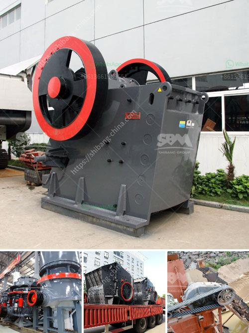

<h3>سعر كسارة الحجر في إيران</h3>
تُعدّ صناعة الحجر من الصناعات الهامة في إيران، حيث يتم استخدام الحجر في تشييد المباني والجسور والطرق والمساجد والمقابر والمنحوتات الفنية. ومن أجل الحصول على الحجر المستخدم في هذه القطاعات المختلفة، يتم استخدام كسارات الحجر.

تحظى كسارات الحجر باهتمام كبير في إيران نظرًا للطلب الكبير على هذه المنتجات. وتختلف أسعار كسارات الحجر في إيران بناءً على عوامل عدة، منها جودة الحجر، ونوع المعدات المستخدمة في الكسارة، والطاقة الإنتاجية للكسارة، والعلامة التجارية، وتكنولوجيا الإنتاج المستخدمة.

في عام 2021، يتراوح سعر كسارة الحجر في إيران بين 200-400 دولار أمريكي للطن الواحد. وتتأثر الأسعار أيضًا بنسبة الرطوبة في الحجر وبحسب المنطقة الجغرافية التي يتم فيها استخراج الحجر.

تعود تكاليف إنتاج الحجر إلى عدة عوامل، منها تكاليف استخراج الحجر من المحجر، وتكاليف تكسير الحجر وتجهيزه في الكسارة، وتكاليف النقل والتوصيل. ومن المهم أن نشير إلى أن إيران تمتلك كميات هائلة من المحاجر المخصّصة لاستخراج الحجر، مما يعزز الإمكانيات الإنتاجية ويقلل من التكاليف في هذا القطاع.

من الجدير بالذكر أن هناك أيضًا مصانع تعمّل على تصنيع الحجر المكسّر وتعبئته وتصديره إلى الأسواق الخارجية. وتشهد هذه الصناعة طلبًا متزايدًا من قبل العديد من الدول الأخرى. وبفضل الجودة العالية والأسعار التنافسية، يعتبر الحجر الإيراني مرغوبًا في العديد من الأسواق العالمية.

باختصار، يتراوح سعر كسارة الحجر في إيران بين 200-400 دولار أمريكي للطن الواحد، وتختلف هذه الأسعار بناءً على عدة عوامل. تلك الأسعار تُعدُّ متنافسة نسبيًا مقارنةً بأسعار الحجر المكسر في الأسواق العالمية. وتعدّ صناعة الحجر في إيران من الصناعات الناشئة التي يعمل عليها المستثمرون لتطويرها وزيادة حصتها في الأسواق العالمية.
<h3>Contact us</h3><ul><li><strong>Whatsapp:&nbsp;<a href="https://wa.me/8613661969651">+8613661969651</a></strong></li><li><a href="https://swt.shibang-china.com/?git&amp;zhl&amp;سعر كسارة الحجر في إيران"><strong>Online Service(chat now)</strong></a></li></ul><h3>Related</h3><ul><li><a href='مواد مطحنة الهامر.md'>مواد مطحنة الهامر</a></li><li><a href='كسارة الحجر للبيع.md'>كسارة الحجر للبيع</a></li><li><a href='مطحنة المطرقة لتركيز السعر.md'>مطحنة المطرقة لتركيز السعر</a></li><li><a href='أنظمة التحكم في كسارة الحجر المحمولة.md'>أنظمة التحكم في كسارة الحجر المحمولة</a></li><li><a href='مصنع تكسير الخرسانة في دبي.md'>مصنع تكسير الخرسانة في دبي</a></li></ul>