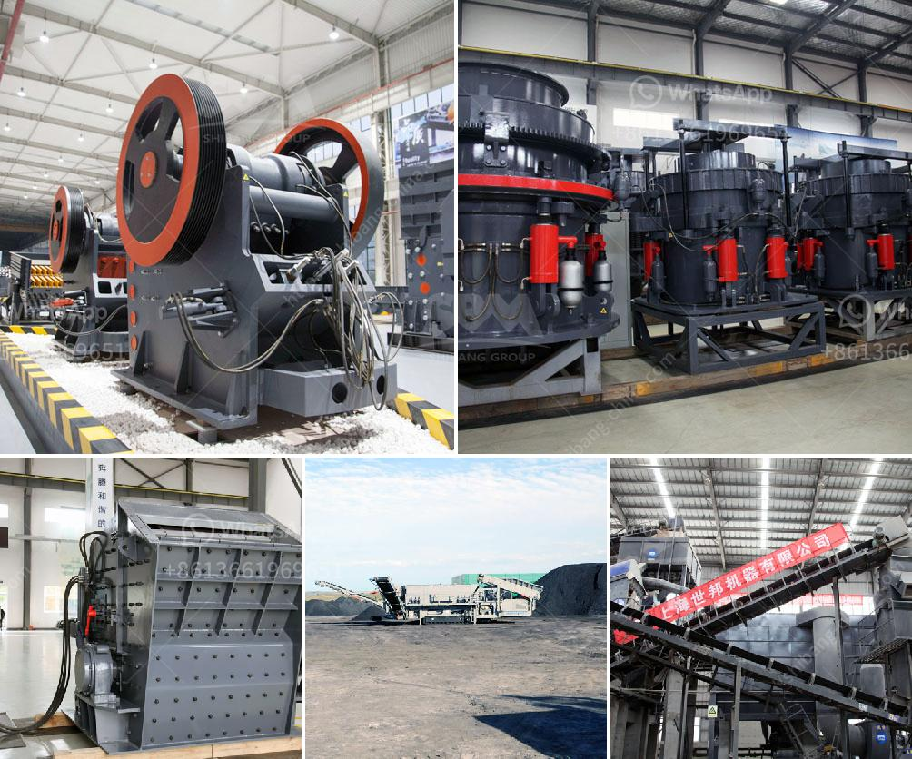

<h3>سعر كسارة الحجر في الساعة</h3>
يعد سعر كسارة الحجر في الساعة من المواضيع المثيرة للاهتمام في صناعة البناء والتشييد. تعد كسارة الحجر جهازًا ميكانيكيًا يستخدم لتكسير الصخور الكبيرة إلى قطع أصغر من الأحجام المستخدمة في البناء والأعمال الإنشائية. يمكن أن يساهم استخدام كسارة الحجر في توفير الكثير من الوقت والجهد في عملية التشييد وتحقيق العوائد الاقتصادية.

تختلف أسعار كسارات الحجر في الساعة وفقًا لعدة عوامل. أحد العوامل الرئيسية هو حجم الكسارة وقدرتها على التعامل مع الصخور المختلفة. كلما زادت سعة الكسارة وقدرتها على المعالجة، زاد سعرها. بالإضافة إلى ذلك، فإن مكونات ومواد البناء المستخدمة في الكسارة تؤثر أيضًا على تكلفتها. هناك تكنولوجيات مختلفة تستخدم في كسارات الحجر مثل الكسارة المخروطية والكسارة الفكية والكسارة الصدمية. تختلف تكلفة كل تقنية وتباينًا تبعًا لفوائدها وتطبيقاتها العامة.

في معظم الأحيان، تكون كسارات الحجر متاحة للإيجار بسعر محدد لكل ساعة. السعر يتوقف على التجهيزات والخدمات المقدمة مع الكسارة. قد توفر بعض الشركات عمالًا مدربين لتشغيل الكسارة وصيانتها بينما يتعين على الآخرين استئجار مشغلين بشكل منفصل، مما يؤثر على التكلفة. بعض الشركات توفر أيضًا خدمات نقل الكسارة من موقع إلى آخر، وهذا قد يترتب عليه تكاليف إضافية.

في العادة، يتراوح سعر كسارة الحجر في الساعة بين 200 إلى 400 دولار أمريكي. ومع ذلك، يجب على المقاولين أو العملاء التواصل مع الشركات المتخصصة للحصول على عروض أسعار محددة لمشروعهم المحدد. سعر الكسارة الفعلي قد يختلف اعتمادًا على الظروف والمتطلبات الخاصة بالمشروع.

باختصار، فإن سعر كسارة الحجر في الساعة يختلف حسب عدة عوامل مثل حجم الكسارة ونوعها، والخدمات المقدمة معها مثل التجهيزات والمشغلين، والخدمات الإضافية مثل النقل. ينصح المقاولون والعملاء بالاتصال بالشركات المحترفة للحصول على عروض أسعار مفصلة تتناسب مع احتياجاتهم ومتطلباتهم الخاصة.
<h3>Contact us</h3><ul><li><strong>Whatsapp:&nbsp;<a href="https://wa.me/8613661969651">+8613661969651</a></strong></li><li><a href="https://swt.shibang-china.com/?git&amp;zhl&amp;سعر كسارة الحجر في الساعة"><strong>Online Service(chat now)</strong></a></li></ul><h3>Related</h3><ul><li><a href='بيع كسارة حجر في ماهاراشترا.md'>بيع كسارة حجر في ماهاراشترا</a></li><li><a href='مصنع طحن الذهب في زيمبابوي.md'>مصنع طحن الذهب في زيمبابوي</a></li><li><a href='سعر مصنع كسارة الحجر بسعة 200 طن في الساعة.md'>سعر مصنع كسارة الحجر بسعة 200 طن في الساعة</a></li><li><a href='آلات طحن للمعادن في إندونيسيا.md'>آلات طحن للمعادن في إندونيسيا</a></li><li><a href='الهيدروليك في مطحنة الكرة الرأسية.md'>الهيدروليك في مطحنة الكرة الرأسية</a></li></ul>