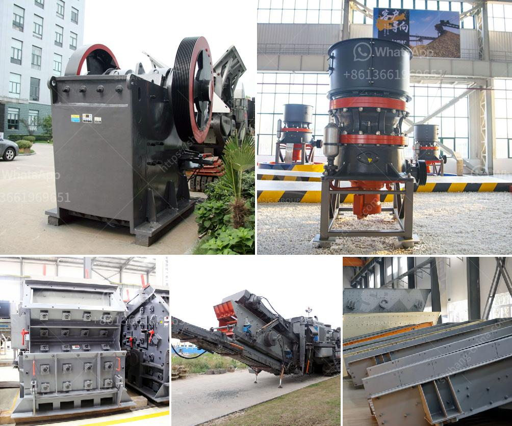

<h3>سعر كسارة الحجر في السوق</h3>
تُعتبر كسارة الحجر جهازًا مهمًا في صناعة البناء والتشييد، حيث تُستخدم لتكسير الصخور الكبيرة إلى قطع صغيرة قابلة للاستخدام في عدة تطبيقات، مثل إنشاء الطرق والبناء وتحسين التربة والاستخراج المعدني والزراعة. وبناءً على طبيعة العمل والتصميم، تتفاوت أسعار كسارات الحجر في السوق.

1. الحجم والسعة: تُتاح كسارات الحجر بأحجام وسعات متنوعة. الكسارات ذات السعات العالية والمستخدمة في العمليات الصناعية الكبيرة يمكن أن تكون أكثر تكلفة بالمقارنة مع الكسارات الصغيرة الحجم التي تُستخدم في المشاريع الصغيرة.

2. الجودة والمواصفات: يتنوع تصميم وجودة الكسارات بين الشركات المُصنعة. الكسارات ذات الجودة العالية والمُصنعة وفقًا للمعايير الصناعية ستكون أكثر تكلفة مقارنةً بتلك ذات التصميمات الأبسط.

3. الموقع الجغرافي: قد يتأثر سعر كسارة الحجر بالموقع الجغرافي للمشروع. قد تكون هناك تكاليف إضافية للنقل إذا كان الموقع بعيدًا عن مقر الشركة المُصنعة.

4. العرض والطلب: تؤثر قوانين العرض والطلب على سعر كسارة الحجر في السوق. في بعض الأوقات، تصبح الكسارات نادرة في السوق، مما يزيد من أسعارها. في حين يمكن أن تنخفض الأسعار عندما تكون هناك كميات كبيرة من الكسارات المتاحة في السوق.

من الصعب تحديد السعر المحدد لكسارة الحجر في السوق، حيث يتأثر بالعديد من العوامل المذكورة أعلاه وغيرها. بشكل عام، يمكن القول إن سعر كسارة الحجر يتراوح من حوالي 5000 دولار إلى 50000 دولار، وهذا يعتمد تمامًا على العوامل المذكورة أعلاه.

في النهاية، يجب على العملاء أن يقوموا بدراسة السوق والمقارنة بين الشركات المُصنعة المختلفة والتصاميم والمواصفات. يُنصح أيضًا بالعمل مع متخصصين محترفين لتحديد الحجم والسعة المطلوبة والعمل على تلبية احتياجاتهم بأسعار معقولة ومناسبة.
<h3>Contact us</h3><ul><li><strong>Whatsapp:&nbsp;<a href="https://wa.me/8613661969651">+8613661969651</a></strong></li><li><a href="https://swt.shibang-china.com/?git&amp;zhl&amp;سعر كسارة الحجر في السوق"><strong>Online Service(chat now)</strong></a></li></ul><h3>Related</h3><ul><li><a href='كسارة الحجر للبيع في الإمارات.md'>كسارة الحجر للبيع في الإمارات</a></li><li><a href='تعدين البازلت.md'>تعدين البازلت</a></li><li><a href='مطحنة الطحن.md'>مطحنة الطحن</a></li><li><a href='تصميم مطحنة الهامر.md'>تصميم مطحنة الهامر</a></li><li><a href='كسارة الحجر وأسعارها.md'>كسارة الحجر وأسعارها</a></li></ul>