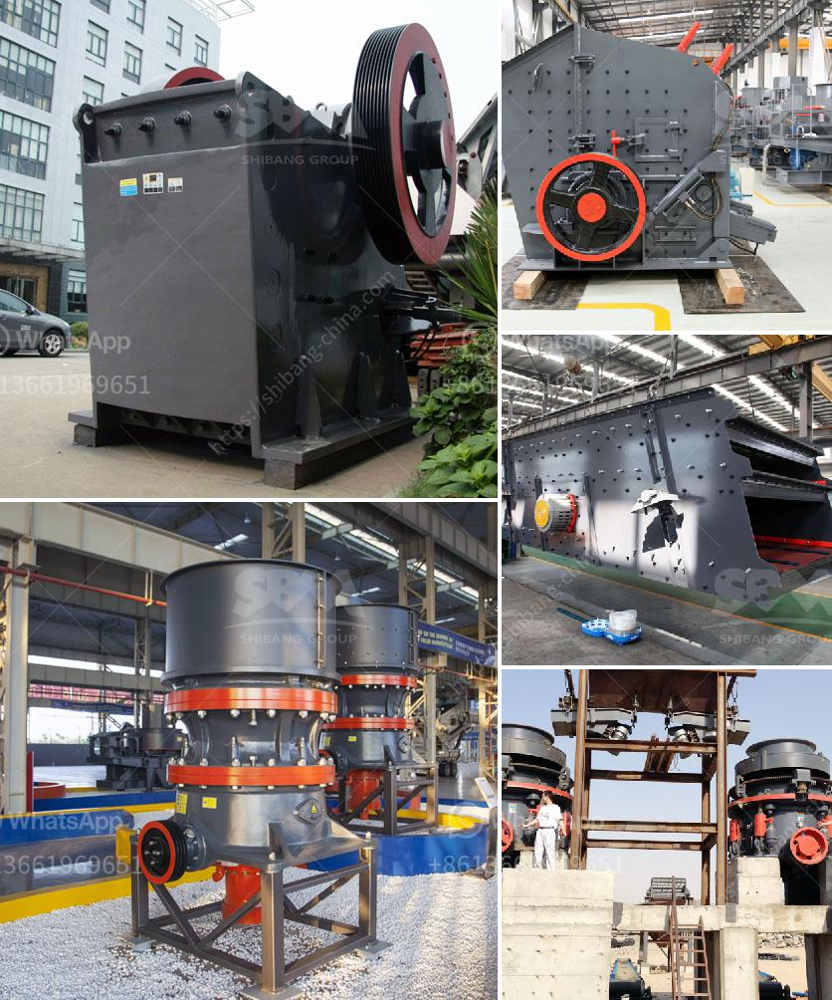

<h3>سعر كسارة الحجر في باكستان</h3>
تُعتبر الكسارات من أهم الآلات المستخدمة في صناعة البناء وتكسير الأحجار. وتعتبر باكستان واحدة من الدول التي تتميز بوفرة الموارد الحجرية، حيث تحتوي على مجموعة متنوعة من الأحجار الطبيعية مثل الرخام والجرانيت والحجر الجيري.

تتراوح أسعار كسارات الحجر في باكستان بين 200 إلى 400 دولار، وذلك يعتمد على العوامل المختلفة مثل الحجم والمواصفات الفنية للآلة. في حالة توفر الحجر بكميات كبيرة، فإن الأسعار غالبًا ما تكون منخفضة نسبيًا. وعلاوة على ذلك، من المهم أيضًا مراعاة التكاليف الإضافية للنقل والتركيب وصيانة الكسارة.

تعتمد الاختيار المثلى لكسارة الحجر في باكستان على احتياجات المشروع ومتطلباته. فمثلاً، إذا كنت تخطط لاستخدام الكسارة في مشروع صغير مثل البناء المنزلي أو الحديقة، فإن الكسارة ذات الأحجام والمواصفات الأصغر ستكون الخيار الأمثل.

أما إذا كنت تخطط لمشروع أكبر مثل البناء الصناعي أو استخراج الحجر، فإن الكسارات ذات الحجم الأكبر والقوة العالية ستكون الأكثر مناسبة. ومن الضروري ملاحظة أن تكلفة هذه الكسارات الأكبر قد تزداد بشكل ملحوظ نظرًا لمتطلبات الأداء العالية والقدرة القوية.

تتوفر الكسارات في باكستان بشكل واسع في الأسواق المحلية ومواقع التجارة الإلكترونية. يمكن العثور على العديد من البائعين والمصانع التي تقدم مجموعة متنوعة من العلامات التجارية والموديلات. وعلاوة على ذلك، يمكن التفاوض على الأسعار والحصول على صفقة أفضل عند شراء الكسارة بكميات كبيرة.

باختصار، يتوفر الكثير من الخيارات لشراء كسارة الحجر في باكستان بأسعار تتراوح بين 200 إلى 400 دولار. لكنه من الأفضل أن تدرس المتطلبات الخاصة بمشروعك وتستشير المتخصصين لاختيار الكسارة المناسبة، واستخدام كافة العوامل مثل السعر والحجم والمواصفات للحصول على أفضل صفقة ممكنة.
<h3>Contact us</h3><ul><li><strong>Whatsapp:&nbsp;<a href="https://wa.me/8613661969651">+8613661969651</a></strong></li><li><a href="https://swt.shibang-china.com/?git&amp;zhl&amp;سعر كسارة الحجر في باكستان"><strong>Online Service(chat now)</strong></a></li></ul><h3>Related</h3><ul><li><a href='كسارة التعدين في تنزانيا.md'>كسارة التعدين في تنزانيا</a></li><li><a href='موردين مطاحن الكرة في جنوب أفريقيا.md'>موردين مطاحن الكرة في جنوب أفريقيا</a></li><li><a href='الدوران الروتوري لكسارة الحجر الجيري.md'>الدوران الروتوري لكسارة الحجر الجيري</a></li><li><a href='تكلفة مصنع كسارة خام الحديد.md'>تكلفة مصنع كسارة خام الحديد</a></li><li><a href='كسارة حصى ورمل في نيبال.md'>كسارة حصى ورمل في نيبال</a></li></ul>