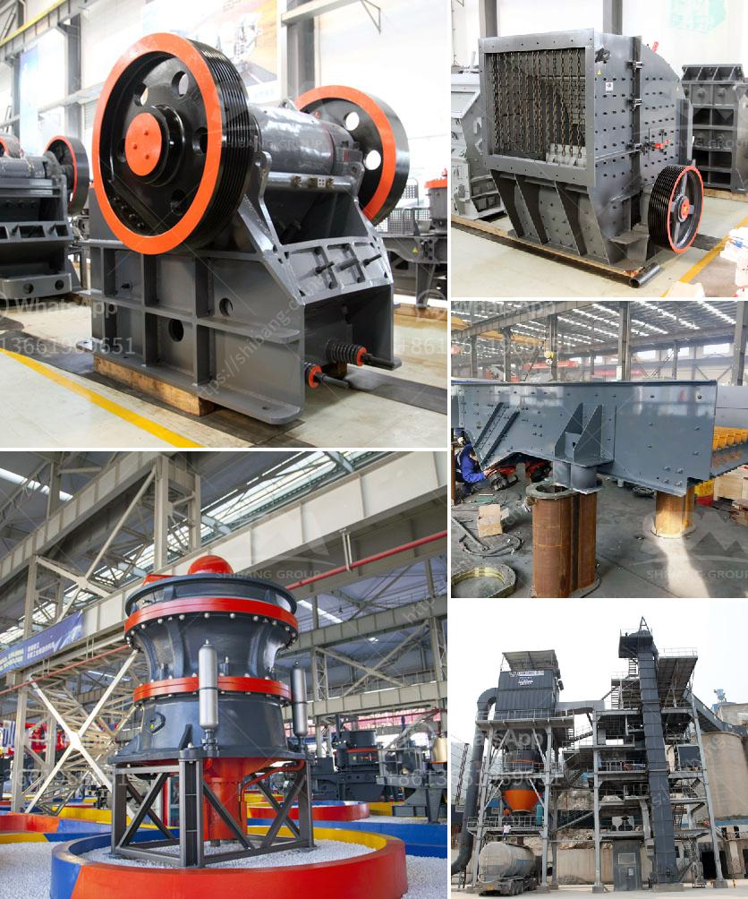

<h3>سعر كسارة الحجر في جنوب أفريقيا</h3>
تُعتبر صناعة التعدين من أهم القطاعات الاقتصادية في جنوب أفريقيا، حيث تشهد البلاد نشاطًا كبيرًا في استخراج وتصنيع المعادن. ومن بين المواد التي تُصنع في جنوب أفريقيا، يأتي حجر الكسارة كواحد من أهم المواد المستخدمة في مشاريع البناء والبنية التحتية.

تتوفر كسارات الحجر في جنوب أفريقيا بمجموعة متنوعة من المقاسات والأحجام، ويتوافق سعر هذه الكسارات مع المواصفات والميزات التي تتميز بها كل كسارة. يتأثر سعر كسارة الحجر بعدة عوامل، من بينها:

1. الماركة والجودة: تختلف الشركات المصنعة في جنوب أفريقيا في جودة منتجاتها وسمعتها في السوق، وبالتالي يتفاوت سعر الكسارات بين الماركات المختلفة. فعلى سبيل المثال، يمكن أن تجد كسارات من بعض الشركات التجارية بأسعار أرخص من تلك المصنوعة من أشهر الشركات المتخصصة في صناعة الكسارات.

2. القدرة والإنتاجية: تتنوع الكسارات في قدرتها على تكسير الحجر، حيث تتوفر كسارات صغيرة الحجم تعمل على تكسير الحجارة الصغيرة وتستخدم عادة في المشاريع الصغيرة وتركيبات المنازل. بينما تكون الكسارات الكبيرة أكثر إنتاجية وتستخدم في المشاريع الكبيرة والبنية التحتية.

3. تكنولوجيا ومواصفات الكسارة: تتوفر في السوق كسارات مجهزة بأحدث التقنيات والأجهزة الإلكترونية التي تسهل عملية التشغيل والصيانة. وعندما يتم تزويد الكسارات بمميزات إضافية مثل ضواغط الغبار والمكبس الهيدروليكي وغيرها، قد ترتفع تكلفة الكسارة.

بناءً على ذلك، يشير التقدير العام إلى أن سعر كسارة الحجر في جنوب أفريقيا يتراوح عادة بين 200 و 400 دولار، مع العلم أن هناك مجموعة متنوعة من الكسارات التي يمكن أن تتفاوت في الأسعار.

وفي الختام، يعتبر شراء كسارة الحجر في جنوب أفريقيا استثمارًا مهمًا، لذلك يجب على المشتري أن يقوم بدراسة الاحتياجات والمتطلبات الخاصة به قبل اتخاذ قرار الشراء. بالإضافة إلى ذلك، يجب البحث عن موردين ذوي سمعة جيدة والقيام بمقارنة الأسعار والخدمات المقدمة للحصول على أفضل صفقة ممكنة.
<h3>Contact us</h3><ul><li><strong>Whatsapp:&nbsp;<a href="https://wa.me/8613661969651">+8613661969651</a></strong></li><li><a href="https://swt.shibang-china.com/?git&amp;zhl&amp;سعر كسارة الحجر في جنوب أفريقيا"><strong>Online Service(chat now)</strong></a></li></ul><h3>Related</h3><ul><li><a href='مصنع الكرة.md'>مصنع الكرة</a></li><li><a href='مشترين وبائعين لآلات مطحنة ريموند.md'>مشترين وبائعين لآلات مطحنة ريموند</a></li><li><a href='كيفية صنع مسحوق الطين الأحمر للغراز.md'>كيفية صنع مسحوق الطين الأحمر للغراز</a></li><li><a href='كتلة الآلات وكسارة في AutoCAD.md'>كتلة الآلات وكسارة في AutoCAD</a></li><li><a href='شركات تكسير الحجر في بيرو.md'>شركات تكسير الحجر في بيرو</a></li></ul>