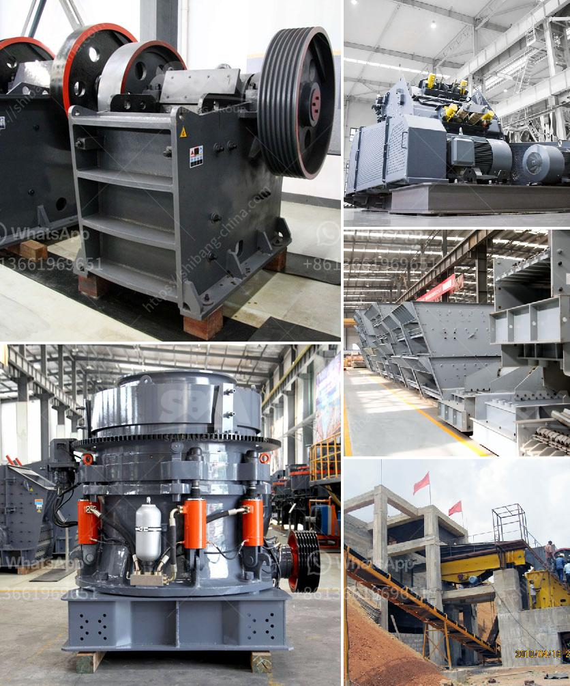

<h3>سعر كسارة الحجر في نيجيريا</h3>
تُعتبر كسارة الحجر من المعدات اللازمة في صناعة البناء والإنشاءات، حيث تُستخدم لسحق الصخور الكبيرة وتحويلها إلى حجارة صغيرة قابلة للاستخدام في مختلف المشاريع الإنشائية. يعتبر سعر كسارة الحجر في نيجيريا من العوامل المؤثرة في اقتناء المعدة، وقد يتأثر بعدة عوامل تتضمن التالي:

1- الحجم والقدرة: يتفاوت سعر كسارة الحجر بناءً على حجمها وقدرتها الإنتاجية. فالكسارات ذات القدرة العالية على سحق الحجارة ستكون أكثر تكلفة من الكسارات ذات القدرة الأقل.

2- الماركة والجودة: تؤثر الماركة والجودة أيضًا على سعر كسارة الحجر. فالكسارات المصنوعة من المواد ذات الجودة العالية والتي تحمل اسمًا مميزًا غالبًا ستكون أكثر تكلفة من الماركات العادية.

3- المكونات والأجزاء الإضافية: قد يزيد سعر كسارة الحجر بوجود أجزاء إضافية مُحسنة، مثل النقالات والمصانع الثانوية والناقلات ونظام التحكم بالطاقة، والتي تعزز كفاءة الكسارة وترفع سعرها.

4- حجم السوق وتوافر المنتج: في بعض الأحيان، يمكن أن يؤثر توافر كسارات الحجر في السوق على سعرها. إذا كانت الكسارات نادرة الوجود في السوق، فمن المحتمل أن يكون سعرها أعلى نسبيًا.

5- المصنع والمورد: يمكن لمصدر ومورد الكسارة التأثير أيضًا على التكلفة النهائية. قد يحدث اختلاف في أسعار الكسارات المُعروضة من مصنع لآخر أو من مورد لآخر بناءً على سياسة التسعير الخاصة بهم.

يمكن للعملاء في نيجيريا الحصول على كسارات حجرية بأسعار تتراوح عادةً بين 200 و 400 دولار أمريكي. ومع ذلك، يجب مراجعة هذه الأسعار بشكل دوري بناءً على عوامل السوق المختلفة المُذكورة سابقًا.

وبصورة عامة، يجب على العملاء البحث عن الموردين الموثوقين والمعروفين في السوق والذين يوفرون منتجات عالية الجودة بأسعار مناسبة. عند البحث عن كسارة الحجر المناسبة، يجب مقارنة الأسعار والمواصفات من عدة مصادر مختلفة قبل اتخاذ قرار الشراء النهائي.

باختصار، سعر كسارة الحجر في نيجيريا يتأثر بعدة عوامل تشمل الحجم والقدرة والماركة والجودة والمكونات الإضافية وتوافر المنتج في السوق ومصدر المورد. يجب على العملاء البحث ومقارنة الأسعار والمواصفات من مصادر متعددة للحصول على أفضل عرض مُناسب لاحتياجاتهم.
<h3>Contact us</h3><ul><li><strong>Whatsapp:&nbsp;<a href="https://wa.me/8613661969651">+8613661969651</a></strong></li><li><a href="https://swt.shibang-china.com/?git&amp;zhl&amp;سعر كسارة الحجر في نيجيريا"><strong>Online Service(chat now)</strong></a></li></ul><h3>Related</h3><ul><li><a href='سعر آلة كسارة الفك.md'>سعر آلة كسارة الفك</a></li><li><a href='مطحنة الكرة في التعدين.md'>مطحنة الكرة في التعدين</a></li><li><a href='سعر المطحنة للمعادن في بوليفيا.md'>سعر المطحنة للمعادن في بوليفيا</a></li><li><a href='تصميم مصنع تكسير وتخطيطه.md'>تصميم مصنع تكسير وتخطيطه</a></li><li><a href='كسارات متنقلة وشاشات مستعملة في جنوب أفريقيا.md'>كسارات متنقلة وشاشات مستعملة في جنوب أفريقيا</a></li></ul>