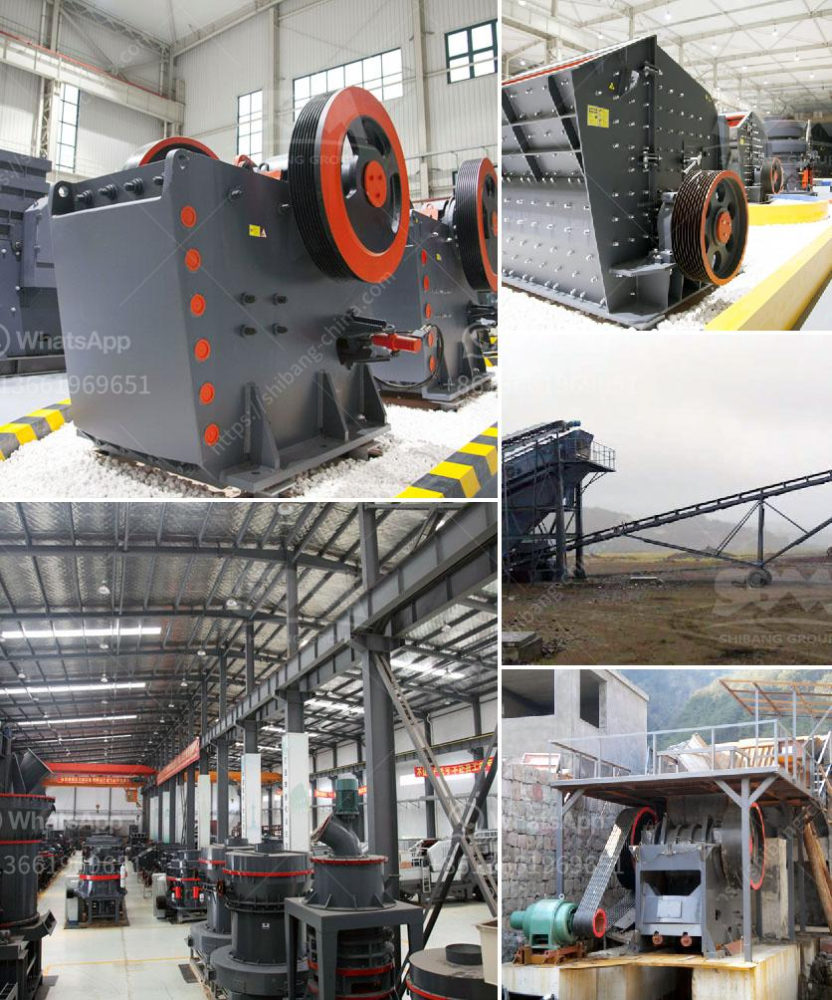

<h3>سعر كسارة الحجر</h3>
تعتبر كسارة الحجر أحد المعدات الهامة في صناعة البناء والتشييد وتستخدم لتكسير الصخور الكبيرة إلى قطع صغيرة تستخدم في إنشاء الطرق والأبنية والجسور. وعند البحث عن سعر كسارة الحجر، يجب أن يؤخذ في الاعتبار العديد من العوامل.

في البداية، يعتمد سعر كسارة الحجر على القدرة والحجم المطلوب. هناك العديد من الأحجام المتوفرة من كسارات الحجر، تتراوح بين الصغيرة المحمولة والكبيرة الثابتة. كما أن هناك مجموعة واسعة من القدرات المتاحة، تبدأ من أقل من 50 طن في الساعة وتصل إلى أكثر من 1000 طن في الساعة. وبالتالي، فإن السعر سيتأثر بشكل كبير بحجم وقدرة الكسارة المطلوبة.

علاوة على ذلك، فإن السعر سيتأثر أيضًا بالماركة والجودة. هناك العديد من الشركات المصنعة لكسارات الحجر في السوق، وكل منها يقدم منتجًا بمزايا وعيوب مختلفة. فمن الأفضل اختيار ماركة معروفة وذات سمعة جيدة لضمان جودة المنتج وكفاءته. ومع ذلك، فإن هذه الشركات المشهورة قد تقدم منتجات بأسعار أعلى نسبياً.

أخيرًا، يجب أخذ ظروف السوق في الاعتبار عند تحديد سعر كسارة الحجر. يتأثر السعر بالعرض والطلب، فعندما يكون هناك طلب عالي على تلك المعدات فإن الأسعار عادة ما تكون مرتفعة. كذلك، يمكن أن تختلف الأسعار من بلد لآخر، حيث تختلف تكاليف الإنتاج والتوزيع.

بشكل عام، يمكن العثور على كسارات الحجر بأسعار تتراوح بين 200 و 400 دولار للطن. ولكن يجب أن يتم الانتباه إلى أن السعر قد يزيد أو يقل بناءً على العوامل المذكورة سابقًا.

وفي الختام، يجب على المستثمرين الذين يبحثون عن شراء كسارة الحجر أن يأخذوا في الاعتبار جميع العوامل المذكورة أعلاه قبل اتخاذ قرار الشراء. فمن المهم البحث والمقارنة بين العديد من الخيارات المتاحة والتأكد من أن الكسارة تلبي جميع المتطلبات والاحتياجات الخاصة.
<h3>Contact us</h3><ul><li><strong>Whatsapp:&nbsp;<a href="https://wa.me/8613661969651">+8613661969651</a></strong></li><li><a href="https://swt.shibang-china.com/?git&amp;zhl&amp;سعر كسارة الحجر"><strong>Online Service(chat now)</strong></a></li></ul><h3>Related</h3><ul><li><a href='آلة كسارة الحجر الصغيرة.md'>آلة كسارة الحجر الصغيرة</a></li><li><a href='مطحنة الكرات المطحنة في الهند.md'>مطحنة الكرات المطحنة في الهند</a></li><li><a href='أفضل علامات تجارية للآلات في المحجر.md'>أفضل علامات تجارية للآلات في المحجر</a></li><li><a href='سعر كسارة حجر الركام في جنوب أفريقيا.md'>سعر كسارة حجر الركام في جنوب أفريقيا</a></li><li><a href='عملية الطحن الرطب.md'>عملية الطحن الرطب</a></li></ul>