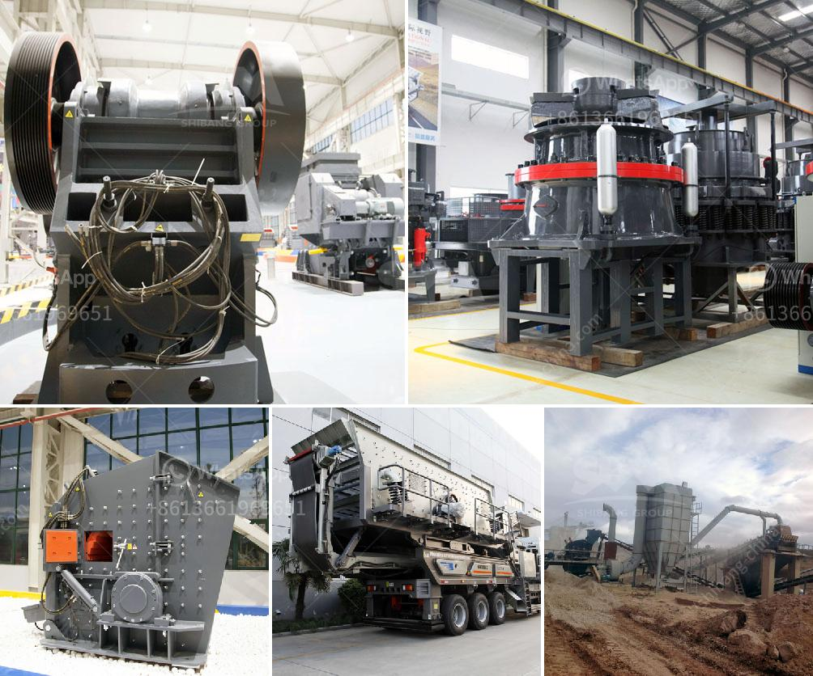

<h3>سعر كسارة الحصى في رانشي</h3>
تلعب كسارات الحصى دورًا حاسمًا في صناعة البناء والبنية التحتية. فهي تستخدم لسحق الحصى وتحويله إلى مواد بنائية تستخدم في الطرق والأبنية السكنية والمشاريع الهندسية الأخرى. إن معرفة سعر كسارة الحصى في رانشي ، وهي مدينة في ولاية جارجا، الهند، تعد معلومة أساسية للعديد من المقاولين والمطورين.

تختلف أسعار كسارات الحصى في رانشي بناءً على عدة عوامل. من بين هذه العوامل، نجد:

1. القدرة والحجم: تختلف تكاليف الكسارات حسب حجمها وقدرتها. قد يتطلب شراء كسارة كبيرة قدرة عالية تكاليف أكبر بالمقارنة مع كسارة صغيرة الحجم تستخدم لأعمال أصغر.

2. الجودة والعلامة التجارية: هناك تشكيلة واسعة من كسارات الحصى في السوق، تختلف في الجودة والعلامة التجارية. قد تجد بعض العلامات التجارية ذات السمعة الجيدة والجودة العالية تكون أكثر تكلفة من غيرها.

3. تكنولوجيا التشغيل: تعتبر كسارات الحصى المزودة بأحدث التقنيات والمزايا التشغيلية أكثر تكلفة بالمقارنة مع تلك التي لا تحتوي على تلك الابتكارات. فعلى سبيل المثال، قد تزيد تكاليف الكسارات ذات النظام الآلي عن تلك التي يتم تشغيلها يدويًا.

هناك العديد من الموردين والشركات التي تقدم كسارات الحصى في رانشي بأسعار مختلفة. ينبغي على المقاولين والمطورين أن يقوموا بعمل دراسة جيدة ومقارنة الأسعار قبل اتخاذ أي قرار. يوصى أيضًا بالتشاور مع مهندسين وخبراء في صناعة البناء للحصول على توجيه مهني حول أفضل طراز من كسارات الحصى الذي يناسب احتياجات المشروع المحدد.

في الختام، يمتلك سعر كسارة الحصى في رانشي تباينًا ملحوظًا باعتباره مرتبطًا بعدة عوامل، ولذا ينصح العملاء بالاستشارة والمقارنة واختيار الكسارة المناسبة التي تلبي احتياجاتهم وميزانياتهم بأفضل صورة ممكنة.
<h3>Contact us</h3><ul><li><strong>Whatsapp:&nbsp;<a href="https://wa.me/8613661969651">+8613661969651</a></strong></li><li><a href="https://swt.shibang-china.com/?git&amp;zhl&amp;سعر كسارة الحصى في رانشي"><strong>Online Service(chat now)</strong></a></li></ul><h3>Related</h3><ul><li><a href='مطحنة السيليكا المطحونة للبيع.md'>مطحنة السيليكا المطحونة للبيع</a></li><li><a href='مصنع معالجة رمل الحديد للبيع في باكستان.md'>مصنع معالجة رمل الحديد للبيع في باكستان</a></li><li><a href='مصنع مطحنة ريموند في الهند.md'>مصنع مطحنة ريموند في الهند</a></li><li><a href='شركة الإسمنت في بروتيا جلين.md'>شركة الإسمنت في بروتيا جلين</a></li><li><a href='بيانات مصنع تحضير خام الكروم.md'>بيانات مصنع تحضير خام الكروم</a></li></ul>