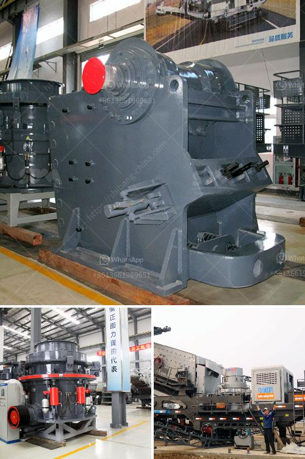

<h3>سعر كسارة الحصى</h3>
يُعد سعر كسارة الحصى من الموضوعات التي تثير اهتمام العديد من الأشخاص، خاصةً في مجال الصناعات والمقاولات. حيث تمتلك هذه الكسارات دورًا أساسيًا في عمليات تكسير وفرز الحجارة وتحويلها إلى مواد صغيرة قابلة للاستخدام في العديد من المشروعات الإنشائية.

تتفاوت أسعار كسارة الحصى بحسب العديد من العوامل، بما في ذلك البلد المصنع للكسارة وجودة المواد المستخدمة في تصنيعها وقدرتها الإنتاجية وميزاتها الفنية وغيرها من العوامل. يمكن أن يتراوح التكلفة التقريبية لكسارة الحصى بين 200 إلى 400 دولار، ولكن هذا الرقم يعتمد على أن لدينا أجهزة التكسير الأساسية فقط.

فيما يتعلق بالعناصر الأخرى في عملية تكسير الحصى، فإنه سيتم تكلفة إضافية لشراء المعدات الأخرى المطلوبة، مثل الناقلات الآلية والمناولين الهيدروليكية والأدوات والمستلزمات الأخرى الضرورية للعملية بأكملها. يجب أيضاً احتساب تكاليف الصيانة والاستهلاك، حيث يتطلب الأمر استبدال بعض الأجزاء القابلة للتلف على مدار الاستخدام الطويل.

ورغم أن التكلفة العالية لشراء وصيانة هذه المعدات قد تكون مرتفعة نسبيًا، إلا أنها تعتبر استثمارًا ضروريًا لعدة قطاعات مختلفة. فمن الصعب تصور سوق البناء والتشييد بدون استخدام معدات التكسير والفرز. تُستخدم هذه الكسارات في العديد من التطبيقات مثل بناء الطرق والجسور والأبنية والمصانع الصناعية وغيرها من المشاريع الكبيرة والصغيرة.

بالإضافة إلى ذلك، يُعد استخدام كسارة الحصى أكثر فعالية من الناحية الاقتصادية، حيث يمكن للمقاول إعادة استخدام الحصى المكسر وتوفير المواد الخام والتكاليف المتعلقة بها.

في الختام، فإن سعر كسارة الحصى يتفاوت بحسب العديد من العوامل المختلفة والمتداخلة. وعلى الرغم من التكاليف العالية لشراء وصيانة هذه المعدات، فإنها تعد استثمارًا ضروريًا لقطاعات البناء والتشييد. استخدام هذه الكسارات يساهم في تقليل تكاليف الإنشاءات بشكل عام وزيادة كفاءة العمل في مختلف المشاريع.
<h3>Contact us</h3><ul><li><strong>Whatsapp:&nbsp;<a href="https://wa.me/8613661969651">+8613661969651</a></strong></li><li><a href="https://swt.shibang-china.com/?git&amp;zhl&amp;سعر كسارة الحصى"><strong>Online Service(chat now)</strong></a></li></ul><h3>Related</h3><ul><li><a href='شاشة اهتزازية للبيع في الفلبين.md'>شاشة اهتزازية للبيع في الفلبين</a></li><li><a href='مطحنة الطحن الصينية.md'>مطحنة الطحن الصينية</a></li><li><a href='عملية غسيل الرمل.md'>عملية غسيل الرمل</a></li><li><a href='كسارة مخروطية بوزولانا 100 طن في الساعة.md'>كسارة مخروطية بوزولانا 100 طن في الساعة</a></li><li><a href='سعر آلة طاحونة الهامر.md'>سعر آلة طاحونة الهامر</a></li></ul>