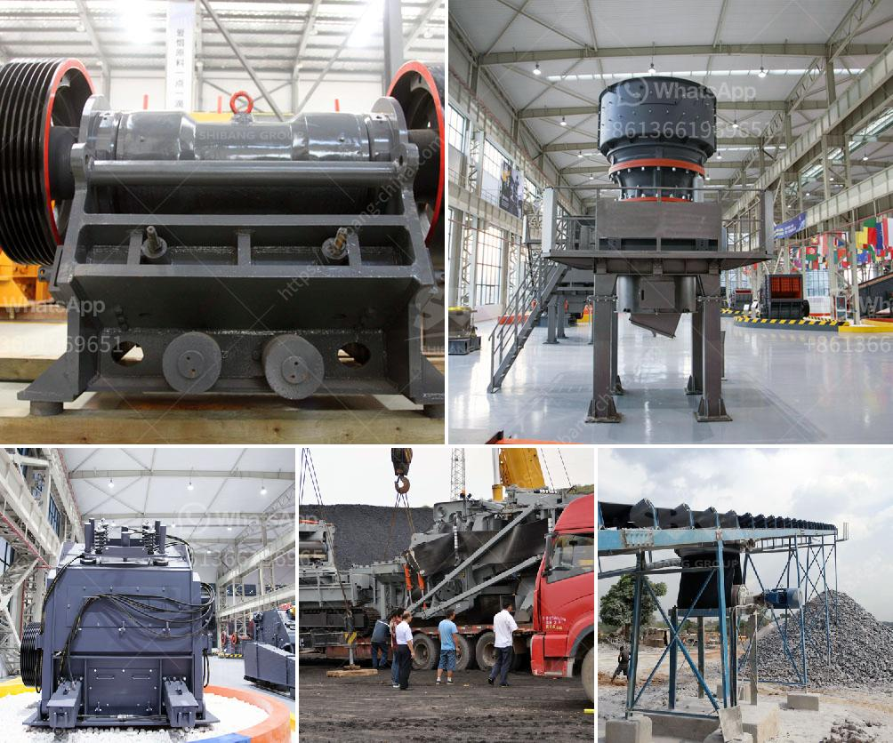

<h3>سعر كسارة الخرسانة في بنجلاديش</h3>
تعتبر كسارات الخرسانة من الأدوات الضرورية في صناعة البناء والإنشاء. وفي بنجلاديش، فإن سعر كسارة الخرسانة يختلف بناءً على عدة عوامل.

أحد العوامل التي تؤثر في سعر كسارة الخرسانة هو الحجم والقدرة الإنتاجية للكسارة. فكلما كانت كسارة الخرسانة أكبر حجمًا وأعلى قدرة إنتاجية، كلما ارتفع سعرها. يتم قياس قدرة الكسارة بوحدة الطن في الساعة، وتتراوح قدرة الكسارات في بنجلاديش بين 50 طنًا في الساعة و200 طنًا في الساعة.

علاوة على ذلك، تؤثر قوة المحرك وتكنولوجيا الكسارة على سعرها. إذا كانت الكسارة مزوَّدة بمحرك قوي يتمتع بتكنولوجيا حديثة وقادرة على تحمل الاستخدامات الشاقة، فإن سعرها يكون أعلى. وهذا يعني أن الكسارات ذات القوة والتكنولوجيا الأفضل تكلف أكثر من تلك التي تعتبر ضعيفة أو تقنيتها قديمة.

عند شراء كسارة الخرسانة في بنجلاديش، يجب أيضًا النظر في عمر الكسارة. فكلما كانت الكسارة جديدة وغير مستخدمة، كلما كانت أكثر تكلفة. وهذا لأن الكسارات الجديدة عادةً ما تكون أكثر كفاءة وتوفر الأداء الأمثل.

بالإضافة إلى ذلك، تختلف أسعار كسارات الخرسانة بناءً على الماركة. وتشتهر بعض الشركات المصنعة بجودة منتجاتها وسمعتها الطيبة، مما يؤدي إلى ارتفاع سعرها. ومن الناحية العكسية، يمكن أن تكون هناك كسارات أرخص في السعر من الشركات التي ليست لديها نفس السمعة والجودة.

بشكل عام، فإن سعر كسارة الخرسانة في بنجلاديش يتراوح بين 500,000 تاكا و1,500,000 تاكا، أي ما يعادل تقريبًا بين 2000 دولار و20,000 دولار أمريكي، وذلك بناءً على العوامل المذكورة أعلاه.

لذا، فإن اختيار كسارة الخرسانة يجب أن يتم بعناية وعلى أساس الاحتياجات المحددة، بالإضافة إلى الميزانية المتاحة للمشروع. ويُنصَح بعرض العديد من الخيارات المتاحة ومقارنتها بناءً على الحجم، والسعة، والأداء، والتكنولوجيا، والمراجعات، وغيرها من العوامل المهمة للحصول على كسارة الخرسانة المثالية بأفضل سعر ممكن.
<h3>Contact us</h3><ul><li><strong>Whatsapp:&nbsp;<a href="https://wa.me/8613661969651">+8613661969651</a></strong></li><li><a href="https://swt.shibang-china.com/?git&amp;zhl&amp;سعر كسارة الخرسانة في بنجلاديش"><strong>Online Service(chat now)</strong></a></li></ul><h3>Related</h3><ul><li><a href='شركة تصنيع آلة طحن لمسحوق ٣٠٠ شبكة.md'>شركة تصنيع آلة طحن لمسحوق ٣٠٠ شبكة</a></li><li><a href='سعر كسارة الحجر المحمولة في الفلبين.md'>سعر كسارة الحجر المحمولة في الفلبين</a></li><li><a href='محطات الكسارات في الكويت.md'>محطات الكسارات في الكويت</a></li><li><a href='طحن الفلدسبار بواسطة مطحنة الكرة في الفلبين.md'>طحن الفلدسبار بواسطة مطحنة الكرة في الفلبين</a></li><li><a href='تطبيق كسارة الصدم.md'>تطبيق كسارة الصدم</a></li></ul>