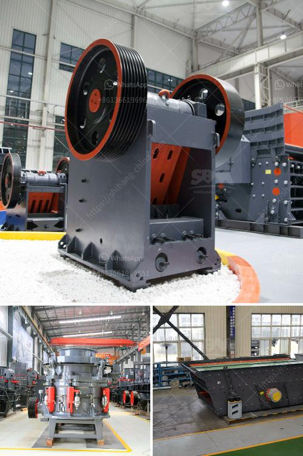

<h3>سعر كسارة الخرسانة</h3>
سعر كسارة الخرسانة هو أحد العوامل المهمة التي يجب أن يأخذ بها المهندسون المدنيون ومقاولو البناء في الاعتبار عند التخطيط لمشروع بناء أو تجديد مبنى. تساعد كسارة الخرسانة في تحويل الخرسانة الجامدة إلى قطع صغيرة منتظمة الحجم، مما يجعلها أسهل في النقل والتخلص منها. يتأثر سعر الكسارة بعدة عوامل، بما في ذلك الحجم والقدرة والنوعية والعلامة التجارية ومستوى الطلب في السوق.

قد يتفاوت سعر كسارة الخرسانة بين 200 و 400 دولار تقريبًا. ولكن يجب ملاحظة أن هذا السعر يمكن أن يختلف بشكل كبير حسب المواصفات المطلوبة من قبل العميل. فمثلاً كسارة الخرسانة التي تحتوي على موتور أكثر قوة وتتميز بجودة أفضل قد تكون أغلى من التصاميم الأكثر بساطة. بالإضافة إلى ذلك، يمكن أن تؤثر العلامة التجارية على سعر الكسارة، حيث أن بعض العلامات التجارية المعروفة بجودتها العالية قد تكون أكثر تكلفة.

بالإضافة إلى ذلك، يجب أن نأخذ في الاعتبار أن هناك تكاليف أخرى تتعلق بكسارة الخرسانة، مثل تكاليف الصيانة وقطع الغيار، وقد تؤثر هذه التكاليف على الاختيار النهائي للكسارة. يجب أيضًا مراعاة جودة المنتج النهائي الذي يتم الحصول عليه بواسطة الكسارة، حيث أن سعر الكسارة لا يعكس فقط تكلفة الجهاز بذاته، ولكنه يعكس أيضًا الجودة والكفاءة التي يمكن للكسارة توفيرها في عملية تحويل الخرسانة إلى قطع صغيرة.

باختصار، سعر كسارة الخرسانة يتأثر بعدة عوامل مثل الحجم والقدرة والنوعية والعلامة التجارية ومستوى الطلب في السوق. يجب على المهندسين ومقاولي البناء أن يقوموا بدراسة وتحليل تلك العوامل واختيار الكسارة التي تتناسب مع متطلبات مشروعهم وميزانيتهم. يجب أيضًا أن يتم اعتبار تكاليف الصيانة وقطع الغيار في حساب السعر النهائي. يتمثل الهدف في الحصول على معدات عالية الجودة تلبي الاحتياجات والمتطلبات المحددة وتعزز كفاءة وجودة عملية البناء.
<h3>Contact us</h3><ul><li><strong>Whatsapp:&nbsp;<a href="https://wa.me/8613661969651">+8613661969651</a></strong></li><li><a href="https://swt.shibang-china.com/?git&amp;zhl&amp;سعر كسارة الخرسانة"><strong>Online Service(chat now)</strong></a></li></ul><h3>Related</h3><ul><li><a href='أسعار كسارات نيجيريا الجديدة.md'>أسعار كسارات نيجيريا الجديدة</a></li><li><a href='آلات غسيل الفحم.md'>آلات غسيل الفحم</a></li><li><a href='مطحنة الأسطوانة بيرينج.md'>مطحنة الأسطوانة بيرينج</a></li><li><a href='معدات التعدين في جنوب أفريقيا.md'>معدات التعدين في جنوب أفريقيا</a></li><li><a href='آلة طحن الرخام.md'>آلة طحن الرخام</a></li></ul>