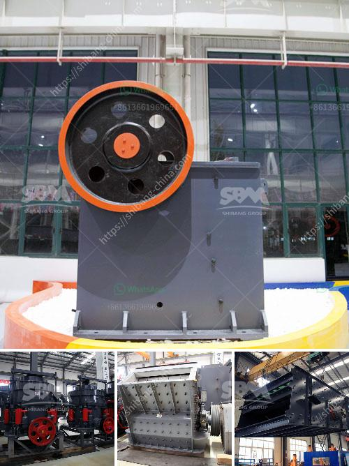

<h3>سعر كسارة الرول</h3>
سعر كسارة الرول هو واحد من العوامل الرئيسية التي ينبغي أن يأخذها المشترين في الاعتبار عند شراء هذا الجهاز. إنه عامل مهم لأنه يحدد ما إذا كانت الكسارة ستكون ميسورة التكلفة وفعالة من حيث الأداء أم لا. يتراوح سعر كسارات الرول عادةً بين 200 إلى 400 دولار ، ولكن يمكن أن يختلف هذا السعر تبعًا للعوامل المختلفة.

أولاً وقبل كل شيء ، يعتمد سعر كسارة الرول على الجودة والعلامة التجارية للجهاز. هناك العديد من العلامات التجارية المعروفة في سوق الكسارات والتي تعرف بأنها ذات جودة عالية وتوفر أداءً ممتازًا. وعادةً ما تكون منتجات هذه العلامات التجارية أغلى بشكل عام من المنتجات التي تحمل علامات تجارية غير شهيرة. ومع ذلك، فمن الجيد أن تستثمر في معدات ذات جودة عالية لأنها ستكون أكثر دوامًا وأقل عرضة للتعطل.

ثانيًا ، يعتمد سعر الكسارة على قوتها وسرعتها. إذا كان لديك جهاز يعمل بسرعة أعلى وقوة أعلى ، فمن المتوقع أن يكون أكثر تكلفة. عند شراء كسارة الرول ، يجب أن تأخذ بنظر الاعتبار المشروع الذي تخطط له واستخداماته المحتملة. إذا كنت تخطط لاستخدامها لأعمال صغيرة وغير مكثفة ، فمن الممكن الحصول على جهاز أرخص بكثير من الأجهزة المهنية التي تستخدم لمشاريع أكبر.

ثالثًا ، العوامل الإضافية مثل التقنية والابتكارات الجديدة يمكن أن تساهم في رفع سعر الكسارة. إذا كان لديك جهاز يوفر ميزات إضافية مثل تقنية متقدمة أو إضاءة إضافية أو ملحقات إضافية ، فقد يكون هناك زيادة في السعر. يجب عليك تقييم ما إذا كانت هذه الميزات أساسية بالنسبة لك أو إذا كانت هناك حاجة حقيقية لها قبل أن تقرر الاستثمار فيها.

باختصار، سعر كسارة الرول يعتمد على العوامل المختلفة مثل الجودة والعلامة التجارية والقوة والسرعة والميزات الإضافية. يتراوح سعر هذا الجهاز عادةً بين 200 إلى 400 دولار ، ولكن من المهم أن تتحقق من استثمارك المحتمل وتحديد استخداماتك المحتملة قبل اتخاذ القرار النهائي. من الأفضل أن تستثمر في جهاز ذو جودة عالية لضمان المتانة والأداء الجيد على المدى الطويل.
<h3>Contact us</h3><ul><li><strong>Whatsapp:&nbsp;<a href="https://wa.me/8613661969651">+8613661969651</a></strong></li><li><a href="https://swt.shibang-china.com/?git&amp;zhl&amp;سعر كسارة الرول"><strong>Online Service(chat now)</strong></a></li></ul><h3>Related</h3><ul><li><a href='تكلفة أنظمة حزام النقل للتعدين.md'>تكلفة أنظمة حزام النقل للتعدين</a></li><li><a href='كسارة صخور محمولة صغيرة للسحق.md'>كسارة صخور محمولة صغيرة للسحق</a></li><li><a href='مشغل مصنع كسارة في كسارة.md'>مشغل مصنع كسارة في كسارة</a></li><li><a href='مصانع إعادة تدوير النحاس في الصين.md'>مصانع إعادة تدوير النحاس في الصين</a></li><li><a href='مطاحن الهامر المستخدمة في تعدين الذهب.md'>مطاحن الهامر المستخدمة في تعدين الذهب</a></li></ul>