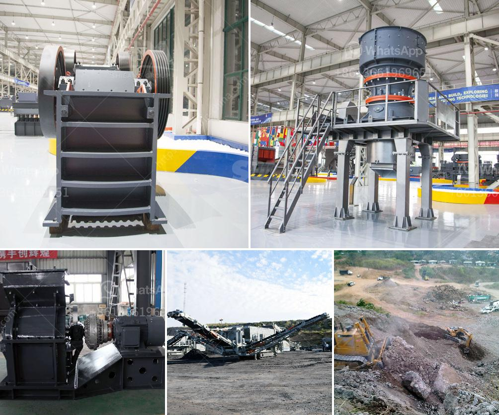

<h3>سعر كسارة الزحف المتنقلة</h3>
تعتبر كسارة الزحف المتنقلة واحدة من أهم الأدوات التي يعتمد عليها قطاع التعدين والبناء لتكسير الصخور والمواد الصلبة لتحويلها إلى مواد قابلة للإستخدام في البناء والإنشاءات. وتتراوح الأسعار المتوفرة لكسارة الزحف المتنقلة بين 200 و 400 ألف دولار.

تعتبر كسارة الزحف المتنقلة أداة قوية للغاية، حيث يمكن أن تتحرك بسهولة وتتنقل بين الموقعين المختلفين في البناء أو المنجم. يمكن للكسارة المتحركة تفكيكها وتركيبها بسرعة دون الحاجة إلى معدات إضافية، ما يجعلها مثالية للاستخدام في المشروعات الكبيرة.

من أبرز مميزات كسارة الزحف المتنقلة هو أن لديها القدرة على تكسير الصخور الكبيرة بسهولة. بالإضافة إلى ذلك، تحتوي على محرك قوي يعمل بالديزل أو الكهرباء، مما يوفر الطاقة اللازمة لتشغيل الكسارة وضمان الأداء العالي والفعالية.

يعتبر سعر كسارة الزحف المتنقلة بين 200 و 400 ألف دولار هو سعر متوسط لهذا النوع من المعدات. ويعتمد السعر على العديد من العوامل مثل الحجم والقدرة والمواصفات التقنية للكسارة. ومن النماذج المتاحة في هذا النطاق السعري يمكن ذكر نماذج مثل Terex Finlay C-1540 و Powerscreen 1150 Maxtrak وغيرها.

عند النظر في شراء كسارة الزحف المتنقلة، يجب على المشتري أن يأخذ بعين الاعتبار عدة عوامل أخرى بالإضافة إلى السعر. بعض العوامل تشمل الصيانة والخدمة التي تقدمها الشركة المصنعة، وتكلفة قطع الغيار وقدرتها على التعامل مع أنواع مختلفة من المواد.

بالخلاصة، تعتبر كسارة الزحف المتنقلة أداة أساسية في قطاع التعدين والبناء، وتوفر قوة تكسير عالية وسهولة الاستخدام والتنقل. وبالنظر إلى مدى أهميتها وفعاليتها، يمكن تفسير ارتفاع سعرها بين 200 و 400 ألف دولار. الاستثمار في شراء كسارة متحركة ذات جودة عالية هو استثمار ذكي للشركات والمقاولين الذين يرغبون في زيادة إنتاجيتهم وتحسين كفاءتهم في العمل.
<h3>Contact us</h3><ul><li><strong>Whatsapp:&nbsp;<a href="https://wa.me/8613661969651">+8613661969651</a></strong></li><li><a href="https://swt.shibang-china.com/?git&amp;zhl&amp;سعر كسارة الزحف المتنقلة"><strong>Online Service(chat now)</strong></a></li></ul><h3>Related</h3><ul><li><a href='مصنع تكسير نصف متنقل.md'>مصنع تكسير نصف متنقل</a></li><li><a href='آلة فحص متنقلة في جنوب أفريقيا.md'>آلة فحص متنقلة في جنوب أفريقيا</a></li><li><a href='أسعار مصانع التكسير الكاملة لعلامة باكستر.md'>أسعار مصانع التكسير الكاملة لعلامة باكستر</a></li><li><a href='مطحنة السيليكا المطحونة للبيع.md'>مطحنة السيليكا المطحونة للبيع</a></li><li><a href='كسارة الفك 400 ×.md'>كسارة الفك 400 ×</a></li></ul>