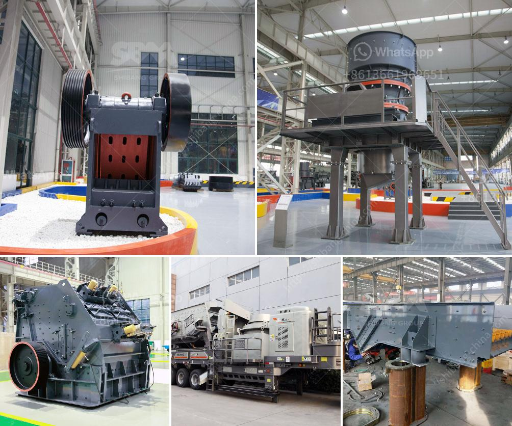

<h3>سعر كسارة الصخور 8 مم</h3>
تعتبر كسارة الصخور من المعدات الأساسية في عمليات التكسير والطحن في صناعة التعدين والبناء. وتختلف أحجام الكسارات المتاحة في السوق حسب احتياجات ومتطلبات العملاء. ومن بين هذه الأحجام يوجد حجم 8 مم.

تعتبر كسارة الصخور 8 مم الأكثر شيوعًا وتستخدم على نطاق واسع في صناعة البناء والتشييد والطرق. تتميز هذه الكسارة بإمكانية تكسير الصخور بحجم 8 مم لتناسب متطلبات العملاء المختلفة.

وتؤثر العديد من العوامل في تحديد سعر كسارة الصخور 8 مم. أحد هذه العوامل هو الطلب والعرض في السوق. فإذا كان هناك طلب كبير على هذا النوع من الكسارات ، فمن المرجح أن يرتفع سعرها. بالمقابل ، إذا كان العرض أكبر من الطلب ، فمن المرجح أن ينخفض سعرها.

تعتمد الأسعار أيضًا على العلامة التجارية والجودة. هناك العديد من الشركات المصنعة لكسارات الصخور 8 مم وتختلف في جودتها وكفاءتها. ومن الطبيعي أن تكون الكسارات ذات الجودة العالية أكثر تكلفة من الأخرى ذات الجودة المنخفضة.

يتأثر السعر أيضًا بتكلفة المواد الخام وتكاليف الإنتاج والعملية التصنيعية. بالإضافة إلى ذلك ، تلعب التكاليف اللوجستية وتكلفة الشحن دورًا في تحديد سعر الكسارة أيضًا. فعلى سبيل المثال ، إذا كان المصنع بعيدًا عن الموقع الذي يتم فيه استخدام الكسارة ، فمن المحتمل أن تزداد تكاليف النقل والشحن.

قد يتوفر في السوق أيضًا أنواع مختلفة من الكسارات ذات الحجم القريب مثل 6 مم أو 10 مم. قد يؤثر ذلك أيضًا على سعر كسارة الصخور 8 مم ، حيث يمكن أن يكون العملاء مهتمين بشراء هذه الأنواع الأخرى بدلاً من ذلك.

عند البحث عن سعر كسارة الصخور 8 مم ، ينصح بالاستفسار من الشركات المصنعة المختلفة والباعة المعتمدين. قد توفر بعض الشركات العروض والخصومات على الكسارات لزيادة المبيعات. كما ينصح بعرض المواصفات المطلوبة والتعامل مع الشركات الموثوق بها لضمان الحصول على المنتج الذي يلبي احتياجات العميل بأقل تكلفة ممكنة.

بالختام ، يمكن القول إن سعر كسارة الصخور 8 مم يتأثر بعدد من العوامل مثل الطلب والعرض والجودة والعلامة التجارية وتكاليف الإنتاج. لذا ينصح بمقارنة الأسعار والاستفسار للحصول على أفضل صفقة ممكنة.
<h3>Contact us</h3><ul><li><strong>Whatsapp:&nbsp;<a href="https://wa.me/8613661969651">+8613661969651</a></strong></li><li><a href="https://swt.shibang-china.com/?git&amp;zhl&amp;سعر كسارة الصخور 8 مم"><strong>Online Service(chat now)</strong></a></li></ul><h3>Related</h3><ul><li><a href='كسارة تأثير صناعية.md'>كسارة تأثير صناعية</a></li><li><a href='شركة تصنيع مطحنة ريموند في جنوب أفريقيا.md'>شركة تصنيع مطحنة ريموند في جنوب أفريقيا</a></li><li><a href='مطحنة عمودية معلومات أيرلندا.md'>مطحنة عمودية معلومات أيرلندا</a></li><li><a href='عمليات سحق الركام.md'>عمليات سحق الركام</a></li><li><a href='سعر رخيص لآلة تصنيع حبيبات الفحم.md'>سعر رخيص لآلة تصنيع حبيبات الفحم</a></li></ul>