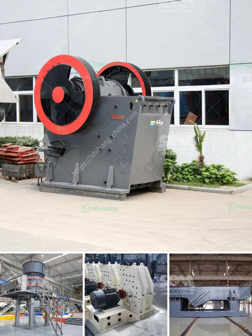

<h3>سعر كسارة الصخور في منجم بيرو</h3>
تعتبر صناعة التعدين من الصناعات التي تلعب دورًا هامًا في الاقتصاد العام للبلدان، حيث تسهم في إنتاج العديد من المواد الأساسية التي يعتمد عليها العديد من القطاعات الأخرى. وأحد أنواع التعدين الهامة هو تعدين الصخور، حيث يتم استخراج الصخور من الأرض لاستخدامها في عمليات البناء والإنشاءات.

من بين الدول التي تحتوي على مناجم صخور هامة هو بيرو، حيث تعد صناعة تعدين الصخور من القطاعات الحيوية في الاقتصاد البيروفي. وتحظى مناجم بيرو باهتمام كبير من قبل مستثمرين محليين ودوليين، نظرًا لوجود تنوع كبير في صخورها وعوائدها الاقتصادية. وتصنف صخور بيرو من بين أهم الصخور في العالم من حيث المحتوى المعدني والجودة.

واحدة من الأدوات المهمة في عملية تعدين الصخور هي كسارة الصخور، والتي تستخدم لتكسير الصخور الكبيرة إلى جزيئات صغيرة قابلة للتعامل. وتعتبر كسارة الصخور من الأجهزة الثقيلة التي تعمل بواسطة محركات قوية ونظام هيدروليكي، وتستخدم لتحطيم وسحق الصخور المختلفة إلى أحجام مختلفة.

تتأثر أسعار كسارات الصخور في منجم بيرو بعدة عوامل، من بالتكلفة المترتبة على شراء الجهاز نفسه وصيانته وتشغيله، إلى تكلفة الوقود والكهرباء والمواد الاستهلاكية الأخرى التي تستخدم في عملية الكسارة. علاوة على ذلك، يؤثر الطلب والعرض في أسعار الكسارات، حيث إذا كان هناك إقبال كبير على شراء الكسارات فقد يتم رفع الأسعار، والعكس صحيح.

متوسط أسعار كسارات الصخور في منجم بيرو تتراوح عادة بين 200 دولار إلى 400 دولار للطن، ويتم تحديد الأسعار النهائية على حسب حجم الكسارة وقوتها وكفاءتها. يجب ملاحظة أن هذه الأسعار هي قابلة للتغير وتختلف من مكان لآخر وتعتمد أيضًا على التغيرات في سوق التعدين والعوامل الاقتصادية الأخرى.

في الختام، تعتبر صناعة تعدين الصخور في منجم بيرو من القطاعات الحيوية في اقتصاد البلاد، وتحظى بإقبال كبير من قبل المستثمرين. وتعتبر كسارات الصخور أدوات أساسية في عملية تعدين الصخور، وتختلف أسعارها بين 200 إلى 400 دولار للطن، وتتأثر بالعديد من العوامل المختلفة.
<h3>Contact us</h3><ul><li><strong>Whatsapp:&nbsp;<a href="https://wa.me/8613661969651">+8613661969651</a></strong></li><li><a href="https://swt.shibang-china.com/?git&amp;zhl&amp;سعر كسارة الصخور في منجم بيرو"><strong>Online Service(chat now)</strong></a></li></ul><h3>Related</h3><ul><li><a href='آلة غسيل الذهب.md'>آلة غسيل الذهب</a></li><li><a href='آلة سحق محمولة من إسبانيا.md'>آلة سحق محمولة من إسبانيا</a></li><li><a href='حساب سعة كسارة الأسطوانة.md'>حساب سعة كسارة الأسطوانة</a></li><li><a href='مصنع تكسير نصف متنقل.md'>مصنع تكسير نصف متنقل</a></li><li><a href='إجراءات مكتبية لمصنع كسارة الحجر في مدى.md'>إجراءات مكتبية لمصنع كسارة الحجر في مدى</a></li></ul>