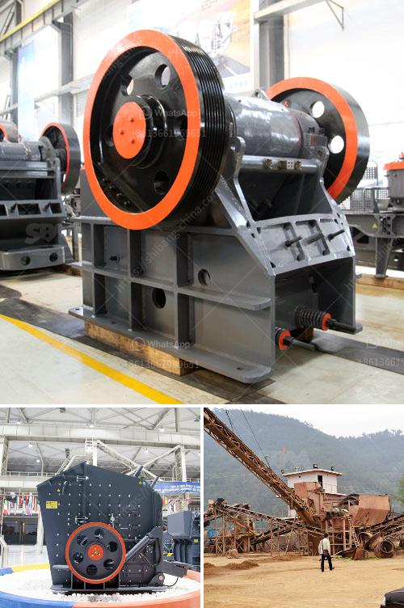

<h3>سعر كسارة الصخور</h3>
تعتبر كسارة الصخور جهازًا هامًا في صناعة التعدين والبناء. إنها تستخدم لتحطيم الصخور الكبيرة إلى قطع صغيرة تستخدم في عدة تطبيقات مختلفة. يعتبر سعر كسارة الصخور عاملًا حاسمًا عند التفكير في شرائها واستخدامها في المشاريع المختلفة.

تتنوع الأسعار المتاحة لكسارات الصخور بين نماذج مختلفة وحسب القدرة والمواصفات المطلوبة. يمكن العثور على كسارات الصخور بأسعار مختلفة تتراوح في الغالب بين 200 و 400 دولار. تعتمد التكلفة على عوامل عدة مثل الحجم والمواد المستخدمة في البناء والمواصفات الفنية للكسارة.

عادةً ما يكون سعر كسارة الصخور منخفضًا إذا كانت صغيرة الحجم وتستخدم للمهام البسيطة والمشاريع الصغيرة. ومع ذلك، فإن الأجهزة ذات القدرات الكبيرة والمواصفات المتقدمة تكون مكلفة بشكل عام. يمكن أن تصل أسعار بعض النماذج المتقدمة إلى عدة آلاف من الدولارات.

من المهم مراعاة جودة ومتانة الكسارة عند شرائها. فإذا كانت تجلب لك التكلفة المنخفضة جهازًا هشًا وغير موثوق، فقد تواجه مشاكل تتطلب صيانة مستمرة وتكاليف إضافية. بالمقابل، يمكن أن تستدام كسارة ذات جودة عالية لفترة طويلة وتتحمل الظروف القاسية دون تلف.

بعض العوامل التي تؤثر على سعر كسارة الصخور هي العلامة التجارية ومكان الشراء. يوصى بالتسوق المستفيض للعثور على أفضل عروض الأسعار ومقارنة الموديلات المختلفة قبل اتخاذ قرار الشراء.

بصفة عامة، كسارة الصخور هي استثمار هام وجوهري للشركات والمهندسين المعماريين وأصحاب المشاريع في مجال التعدين والبناء. يجب أن يتم اختيار الكسارة المناسبة وفقًا لاحتياجات المشروع وميزانية المشتري. يجب على المستعملين أيضًا أخذ جميع العوامل الأخرى في الاعتبار مثل الصيانة والخدمة الما بعد البيع التي تقدمها الشركة المصنعة لضمان أن الكسارة تعمل بكفاءة وبشكل مستدام.
<h3>Contact us</h3><ul><li><strong>Whatsapp:&nbsp;<a href="https://wa.me/8613661969651">+8613661969651</a></strong></li><li><a href="https://swt.shibang-china.com/?git&amp;zhl&amp;سعر كسارة الصخور"><strong>Online Service(chat now)</strong></a></li></ul><h3>Related</h3><ul><li><a href='سعر آلة الطحن في ماليزيا.md'>سعر آلة الطحن في ماليزيا</a></li><li><a href='مصنع كرة الاسمنت المواد والطاقة.md'>مصنع كرة الاسمنت المواد والطاقة</a></li><li><a href='الحجم في مطاحن طحن الأسمنت.md'>الحجم في مطاحن طحن الأسمنت</a></li><li><a href='مطحنة عمودية معلومات أيرلندا.md'>مطحنة عمودية معلومات أيرلندا</a></li><li><a href='استيراد كسارة الفك الصين في باكستان.md'>استيراد كسارة الفك الصين في باكستان</a></li></ul>