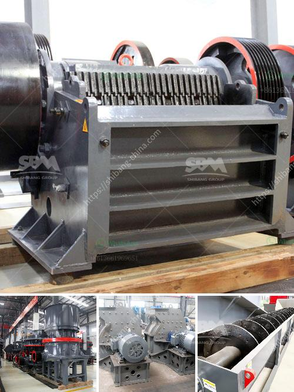

<h3>سعر كسارة الطاحونة الصناعية</h3>
تعتبر كسارة الطاحونة الصناعية أحد الآلات الحديثة التي تستخدم في العديد من الصناعات، مثل صناعة البناء، صناعة الاسمنت وصناعة المعادن. تأتي هذه الآلة بأحجام وأنواع متعددة، وتختلف تكاليف شراءها حسب المواصفات والقدرات المختلفة.

سعر كسارة الطاحونة الصناعية يتأثر بعدة عوامل، بما في ذلك القدرة، والمواصفات، والشركة المصنعة، والجودة، والبلد. ومن المهم أن نلاحظ أن كسارة الطاحونة الصناعية ليست غير مرتبطة بتكلفة الاستثمار فحسب، بل تؤثر أيضًا في تكاليف التشغيل والصيانة في المستقبل.

عندما يتعلق الأمر بالسعر، يمكن أن يتراوح سعر كسارة الطاحونة الصناعية من 200 إلى 400 دولارًا للوحدة، ولكن هذا السعر قابل للتغيير حسب تفاصيل المواصفات والموديلات. على سبيل المثال، يمكن أن يزيد السعر مع الزيادة في القدرة والمواصفات الفردية للآلة.

قد تتعدد أنواع كسارات الطاحونة الصناعية، ومن هذه الأنواع:

1. كسارة فكية: تستخدم لسحق المواد الخام والمواد الصلبة بأحجام مختلفة.

2. كسارة تأثير: تستخدم لسحق المواد الصلبة باستخدام حركة ذراع تأثير تضغط المواد معًا.

3. كسارة مخروطية: تستخدم لسحق المواد الجافة والرطبة وتحويلها إلى حبيبات صغيرة.

4. كسارة الأسطوانة: تستخدم لسحق المواد بفضل ضغط الأسطوانتين الملتقطتين.

تثبت كسارة الطاحونة الصناعية أهميتها في العديد من الصناعات، فهي تساهم في تحسين جودة المنتج النهائي وزيادة كفاءة العملية الإنتاجية. ومن الجدير بالذكر أن الاستثمار في كسارة الطاحونة الصناعية يمكن أن يكون استثمارًا مربحًا على المدى الطويل. فعند استخدام الآلة بشكل صحيح، يمكن للشركات تحقيق توفير في تكاليف الإنتاج وزيادة الإنتاجية.

بالنظر إلى طبيعة الاستثمار، يجب أن يتم اختيار الشركة المصنعة لهذه الآلة بعناية. يُنصح بشراء آلة ذات جودة عالية لضمان المتانة والأداء الجيد على المدى الطويل. كما يجب أيضًا أن يُؤخذ في الاعتبار تكاليف الصيانة اللاحقة ومدى توفر قطع الغيار وخدمة ما بعد البيع من الشركة المصنعة.

في الختام، يعتبر سعر كسارة الطاحونة الصناعية مستثمرة هامة للشركات في العديد من الصناعات. قبل شراء هذه الآلة، يجب على المستثمرين دراسة احتياجاتهم ومتطلباتهم بدقة والاستشارة مع الخبراء في هذا المجال. فعند تنفيذ الاستثمار بشكل صحيح واستخدام هذه الآلة بكفاءة، يمكن تحقيق العديد من المزايا للشركات وتحقيق أرباح مستدامة على المدى الطويل.
<h3>Contact us</h3><ul><li><strong>Whatsapp:&nbsp;<a href="https://wa.me/8613661969651">+8613661969651</a></strong></li><li><a href="https://swt.shibang-china.com/?git&amp;zhl&amp;سعر كسارة الطاحونة الصناعية"><strong>Online Service(chat now)</strong></a></li></ul><h3>Related</h3><ul><li><a href='مصنع آلات كسارة الحجر الماسي في الهند.md'>مصنع آلات كسارة الحجر الماسي في الهند</a></li><li><a href='تأجير كسارة صغيرة دبلن.md'>تأجير كسارة صغيرة دبلن</a></li><li><a href='آلة تحويل الحجر الجيري إلى مسحوق.md'>آلة تحويل الحجر الجيري إلى مسحوق</a></li><li><a href='كسارة تأثير VSI.md'>كسارة تأثير VSI</a></li><li><a href='كرات لمطحنة الكرة.md'>كرات لمطحنة الكرة</a></li></ul>