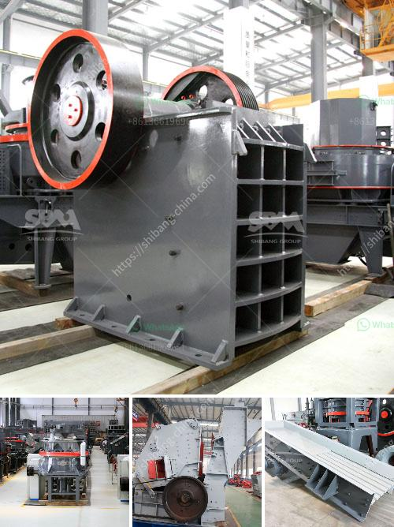

<h3>سعر كسارة الطين</h3>
تُعتبر الكسارات أدوات مهمة في صناعة البناء والتشييد، حيث تقوم بطحن وسحق المواد الخام مثل الصخور والأحجار والطين للحصول على حبيبات صغيرة يمكن استخدامها في الإنشاءات المختلفة. ومن بين هذه الكسارات، تلعب كسارة الطين دورًا مهمًا في صناعة الطوب والأواني الفخارية.

من الضروري أن يكون سعر كسارة الطين في متناول الجميع لتشجيع العديد من العمال وأصحاب المشاريع على اقتنائها. تتوفر كسارات الطين بتصاميم وأحجام مختلفة لتتناسب مع احتياجات مختلفة، وهذا ما ينعكس في تباين الأسعار.

يتراوح سعر كسارة الطين بين 200 دولار و 400 دولار، وذلك يعتمد على الحجم والقدرات والمواصفات المطلوبة للكسارة. يُفضل أن تكون الكسارة قوية وقادرة على تحمل الإجهادات المستقبلية والعمل لفترة طويلة. ويعتمد سعر الكسارة أيضًا على العلامة التجارية والمكونات المستخدمة فيها.

ينبغي أن تكون الكسارة سهلة الاستخدام وذات كفاءة عالية لضمان عمل سلس وفعالية في الوقت نفسه. يجب أن تحتوي الكسارة على محرك قوي يقدر بالتعامل مع الطين الثقيل بسرعة وسهولة.

عند اختيار كسارة الطين، يجب أن يؤخذ في الاعتبار أيضًا التكلفة الإجمالية للكسارة. فبالإضافة إلى سعر الشراء، يجب أخذ الاستهلاكية في الاعتبار. وتتضمن الاستهلاكية تكاليف الوقود والصيانة وقطع الغيار اللازمة للكسارة. يُعتبر توفير قطع الغيار الأصلية ضرورة حتى يتمكن المستخدم من إجراء الصيانة الدورية وضمان استمرارية عمل الكسارة.

بشكل عام، يجب البحث والاستفسار عن العديد من العروض والمقارنة بين مختلف الموديلات والمواصفات قبل شراء كسارة الطين، حيث يمكن العثور على العروض التي تناسب احتياجاتك وميزانيتك. يُنصح باختيار كسارة ذات موثوقية عالية ومعتمدة من قِبل المستخدمين السابقين والمهنيين.

اختيار كسارة الطين هو خطوة هامة في عملية البناء والتشييد، فإذا تم الاختيار الصحيح ستحصل على جودة عالية وتوفير في التكاليف على المدى الطويل. سعر كسارة الطين البين 200 و 400 دولار هو سعر مناسب يساعد على الحصول على هذه المزايا ويعزز نجاح المشروعات البناء بشكل عام.
<h3>Contact us</h3><ul><li><strong>Whatsapp:&nbsp;<a href="https://wa.me/8613661969651">+8613661969651</a></strong></li><li><a href="https://swt.shibang-china.com/?git&amp;zhl&amp;سعر كسارة الطين"><strong>Online Service(chat now)</strong></a></li></ul><h3>Related</h3><ul><li><a href='آلات كسارة الحجر في ماليزيا.md'>آلات كسارة الحجر في ماليزيا</a></li><li><a href='كسارة فك محمولة في المملكة العربية السعودية.md'>كسارة فك محمولة في المملكة العربية السعودية</a></li><li><a href='كسارة مخروطية غير مستخدمة في إثيوبيا للبيع.md'>كسارة مخروطية غير مستخدمة في إثيوبيا للبيع</a></li><li><a href='آلات إنتاج الجبس.md'>آلات إنتاج الجبس</a></li><li><a href='معدات طحن مطحنة ريموند.md'>معدات طحن مطحنة ريموند</a></li></ul>