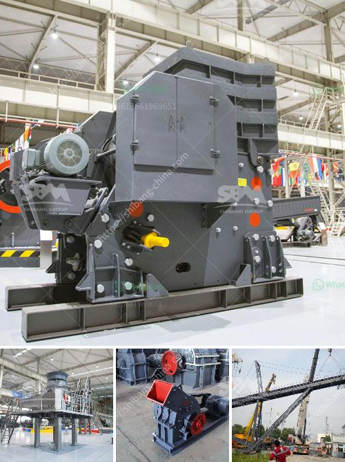

<h3>سعر كسارة الفحم القدرة</h3>
تعتبر كسارة الفحم أحد الأجهزة الهامة في صناعة الفحم واستخراجه، حيث تقوم بسحق الفحم إلى حجم مناسب للاستخدامات المختلفة. يمكن أن يختلف سعر كسارة الفحم وفقًا لعدة عوامل، مثل القدرة والمواصفات التقنية والعلامة التجارية.

عند مناقشة سعر كسارة الفحم بسعة 200-400 طن/ساعة، يجب أن نأخذ في الاعتبار عدة أمور. قد تتراوح الأسعار في السوق بين تختلف  من حيث الجودة والمواصفات، والتي يمكن أن تتراوح بين 100,000 دولار و300,000 دولار. يعتمد سعر الكسارة على الجودة والمواصفات، وكذلك على مكان تصنيعها والتكلفة التي تتطلبها عمليات الشحن والتوصيل.

بالإضافة إلى ذلك، يجب النظر في التكلفة الإضافية لقطع الغيار والصيانة. قد تختلف تكلفة قطع الغيار باختلاف العلامة التجارية والموديل، وتحتاج الكسارة لصيانة واهتمام دوري للحفاظ على أدائها الأمثل وضمان عمرها الطويل. يجب أن يكون لديك خطة صيانة مستدامة للكسارة، وقد يؤثر ذلك على التكلفة الإجمالية للاستثمار.

سيتغير السعر أيضًا بناءً على الحجم الذي تحتاجه. إذا كنت تحتاج إلى كسارة فحم صغيرة الحجم بسعة 200 طن/ساعة، فقد يكون سعرها أرخص بالمقارنة مع كسارة فحم كبيرة الحجم بسعة 400 طن/ساعة.

لتحديد السعر الأمثل لكسارة الفحم، يجب على المشتري أن يقيم احتياجاته بعناية ويُشاور مُصنّعي الكسارات المختلفة. قد يكون لديهم توصيات حول الطرازات والموديلات الأكثر ملاءمة للاستخدام المطلوب. يجب أن تحاول الاستفادة من المشورة الفنية والمعلومات الواردة في المواصفات للكسارات المختلفة لتحديد سعر ونوع الكسارة التي تناسب احتياجاتك.

بشكل عام، يمكن القول إن سعر كسارة الفحم بسعة 200-400 طن/ساعة يتراوح ما بين 100,000 دولار و300,000 دولار تقريبًا بناءً على العوامل المذكورة أعلاه. من الضروري أن يقوم المشتري بإجراء دراسة مستفيضة قبل اتخاذ قرار الشراء لضمان أنه يحصل على جهاز عالي الجودة ويتماشى مع ميزانيته واحتياجاته.
<h3>Contact us</h3><ul><li><strong>Whatsapp:&nbsp;<a href="https://wa.me/8613661969651">+8613661969651</a></strong></li><li><a href="https://swt.shibang-china.com/?git&amp;zhl&amp;سعر كسارة الفحم القدرة"><strong>Online Service(chat now)</strong></a></li></ul><h3>Related</h3><ul><li><a href='كسارة الحجر في المملكة المتحدة.md'>كسارة الحجر في المملكة المتحدة</a></li><li><a href='أسعار مطاحن الهامر.md'>أسعار مطاحن الهامر</a></li><li><a href='مختلف طرق سحق وطحن السيراميك.md'>مختلف طرق سحق وطحن السيراميك</a></li><li><a href='تاجر كسارة الحجر في الصين.md'>تاجر كسارة الحجر في الصين</a></li><li><a href='سعر كسارة الحجر سعة طن في الساعة.md'>سعر كسارة الحجر سعة طن في الساعة</a></li></ul>