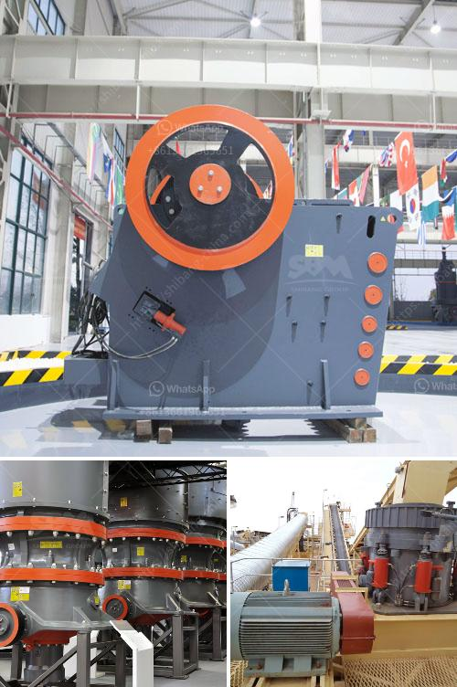

<h3>سعر كسارة الفحم</h3>
تعد كسارة الفحم أحد الأدوات الهامة في صناعة التعدين وإنتاج الفحم. تستخدم هذه الأجهزة لسحق الفحم إلى أحجام صغيرة مناسبة للإستخدام المستمر في عمليات الحرق أو الإستخدام الصناعي. يتفاوت سعر كسارة الفحم بناءً على العديد من العوامل ومعايير الجودة والأداء.

يعتمد سعر كسارة الفحم على الحجم والخصائص التقنية للجهاز، فكلما كانت الكسارة أكثر تطورًا وقوية ومتطورة التكنولوجيا، زاد سعرها. بالإضافة إلى ذلك، يؤثر العرض والطلب في السوق على الأسعار، حيث قد يكون سعر الكسارات الفحم مرتفعًا في حالة نقص الإمدادات أو الطلب العالي.

يجب أن تتناسب الأسعار مع الأداء والجودة المقدمة. قد تتراوح أسعار كسارات الفحم بين 200 إلى 400 دولار اعتمادًا على الفئة والمواصفات. على سبيل المثال، قد تكون الكسارات اليدوية المصغرة أرخص في السعر، وتكون مثالية للاستخدام الشخصي أو الاستخدام الصغير الحجم. بينما تكون الكسارات الاحترافية التي تستخدم في التعدين والإنتاج الصناعي مرتفعة التكلفة، حيث قد تصل أسعارها إلى الآلاف من الدولارات.

يجب أن يتم اختيار الكسارة وفقًا لاحتياجات المستخدم والبيئة التشغيلية. يجب أخذ العديد من العوامل في الاعتبار مثل الطاقة، وقدرة التحميل، والمرونة والكفاءة في الأداء.

بشكل عام، يجب أن يكون للمشتري فهم جيد لاحتياجاته ومواصفاته المحددة قبل الشراء، والتحقق من جودة الجهاز وسمعتها في السوق. ينصح أيضًا بمقارنة الأسعار وتقييم الموديلات المختلفة للوصول إلى اختيار صحيح وعقلاني.

في النهاية، يجب أن يكون هدف المستخدم هو الحصول على جهاز عالي الجودة وفعال ويعكس القيمة المضافة للإنتاج والعمليات الإنتاجية بأكملها. من المهم أن يتمكن المستخدمون من توجيه استثماراتهم بشكل صحيح لتعزيز الأداء وتحقيق التنمية الاقتصادية في صناعاتهم.

في الختام، يعد سعر كسارة الفحم أحد العوامل المهمة عند الشراء ويجب أن يتم النظر فيه بمعايير متعددة. يجب أن يكون الهدف من الشراء هو الحصول على جهاز ذو جودة عالية وفعال وفقًا للميزانية المتاحة وحاجات المستخدم.
<h3>Contact us</h3><ul><li><strong>Whatsapp:&nbsp;<a href="https://wa.me/8613661969651">+8613661969651</a></strong></li><li><a href="https://swt.shibang-china.com/?git&amp;zhl&amp;سعر كسارة الفحم"><strong>Online Service(chat now)</strong></a></li></ul><h3>Related</h3><ul><li><a href='كسارة فكية بمقدار 100 طن في الساعة.md'>كسارة فكية بمقدار 100 طن في الساعة</a></li><li><a href='أرض متاحة لمحجر الحجر.md'>أرض متاحة لمحجر الحجر</a></li><li><a href='معدات تعدين الفحم في جنوب أفريقيا.md'>معدات تعدين الفحم في جنوب أفريقيا</a></li><li><a href='آلة صنع الرمل VSI.md'>آلة صنع الرمل VSI.</a></li><li><a href='آلات كسارة الصخور.md'>آلات كسارة الصخور</a></li></ul>