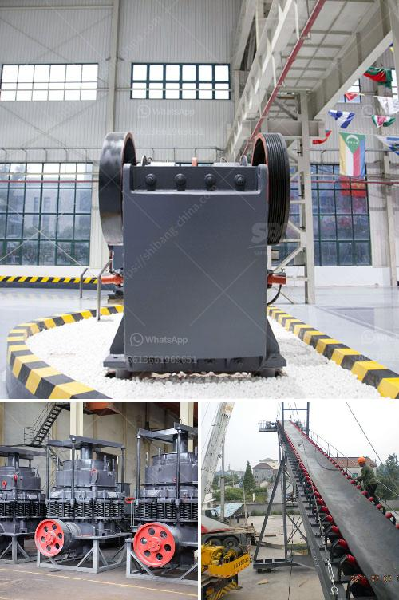

<h3>سعر كسارة الفك 400x600</h3>
تُعد كسارة الفك أحد أهم الأدوات في صناعة التعدين والبناء، وتستخدم لسحق وتكسير المواد الصلبة والصخور. وتتوفر العديد من الموديلات المختلفة، بما في ذلك كسارة الفك 400x600.

تتمتع كسارة الفك 400x600 بمزايا عديدة تجعلها مناسبة للاستخدام العام في الصناعات المختلفة. فمع طول أقل من 600 مم وعرض أقل من 400 مم، يمكن أن تكون هذه الكسارة صغيرة الحجم وسهلة الاستخدام. يجب الإشارة إلى أنها تتميز بسعر معقول ومناسب للعديد من الشركات والمشاريع.

يعتمد سعر كسارة الفك 400x600 على عدة عوامل، مثل العلامة التجارية والجودة والمنشأ وأوقات تسليم المنتج. ولكن بشكل عام، يمكن القول أن السعر الاعتيادي لكسارة الفك 400x600 يتراوح بين 2000 و5000 دولار أمريكي. ويعتمد ذلك على الشركة المصنعة والسوق المستهدفة.

عند شراء كسارة الفك 400x600، يجب أن يأخذ المشترين في الاعتبار العوامل التالية:

1. الجودة: الجودة أمر حاسم عند اختيار كسارة الفك الصحيحة. يجب أن تكون الكسارة قوية ومتينة وقادرة على تحمل الاستخدام الشاق.

2. الكفاءة: يجب أيضًا أن يكون للكسارة القدرة على سحق المواد بشكل فعال وسريع. قدرة الأداء العالية تعزز الإنتاجية وتوفر الوقت والجهد.

3. الصيانة: يجب أن يكون الصيانة والتشغيل سهلين وبسيطين. ينبغي أن تكون قطع الغيار متوفرة بسهولة وبأسعار معقولة.

4. السعر: يجب أن يكون السعر مناسبًا للتكلفة العامة للمشروع أو الشركة. يجب أن تكون الكسارة ذات قيمة جيدة للمال المستثمر.

في النهاية، يعتبر سعر كسارة الفك 400x600 معقولًا بشرط أن تلبي المتطلبات المذكورة أعلاه. ويمكن أن تكون هذه الكسارة حلاً فعالًا للعديد من الشركات والمشاريع.
<h3>Contact us</h3><ul><li><strong>Whatsapp:&nbsp;<a href="https://wa.me/8613661969651">+8613661969651</a></strong></li><li><a href="https://swt.shibang-china.com/?git&amp;zhl&amp;سعر كسارة الفك 400x600"><strong>Online Service(chat now)</strong></a></li></ul><h3>Related</h3><ul><li><a href='كسارات الحجر الرخيصة.md'>كسارات الحجر الرخيصة</a></li><li><a href='عملية الحجر الجيري.md'>عملية الحجر الجيري</a></li><li><a href='آلات سحق الفحم في جنوب أفريقيا.md'>آلات سحق الفحم في جنوب أفريقيا</a></li><li><a href='كيفية صنع كسارة فك صغيرة لنفسك.md'>كيفية صنع كسارة فك صغيرة لنفسك</a></li><li><a href='مطحنة المطرقة للبيع في دبي.md'>مطحنة المطرقة للبيع في دبي</a></li></ul>