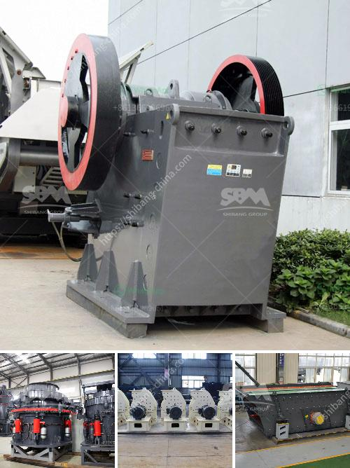

<h3>سعر كسارة الفك PE 400</h3>
تعتبر كسارة الفك PE 400 من بين الكسارات الشائعة المستخدمة في مجال التعدين والبناء وصناعة المواد الكيميائية وغيرها من الصناعات. وتتميز هذه الكسارة بقدرتها على سحق المواد ذات الصلابة المتوسطة والعالية بفعالية.

أحد العوامل الرئيسية التي تؤثر في سعر كسارة الفك PE 400 هو الجودة والموثوقية. عادةً ما يتراوح سعر هذا النوع من الكسارات بين 5000 و 20000 دولار أمريكي. تختلف الأسعار بناءً على العوامل المختلفة مثل العلامة التجارية، والقوة، والمواد المستخدمة في الصنع وغيرها.

على سبيل المثال، قد تجد بعض العلامات التجارية الشهيرة التي تنتج كسارات الفك بجودة عالية بسعر يتراوح بين 15000 و 20000 دولار أمريكي. تعتبر هذه الكسارات موثوقة وتوفر أداءً ممتازًا وتعد استثمارًا جيدًا للمقاولين والشركات المصنعة.

ومع ذلك، يمكن أن تكون هناك خيارات رخيصة أيضًا، حيث يمكن العثور على بعض الكسارات ذات الجودة المقبولة والموثوقية التي تبلغ قيمتها حوالي 5000 دولار أمريكي. هذه الخيارات قد تكون مناسبة لبعض الأفراد الذين يعملون على مشاريع صغيرة أو الذين يمتلكون ميزانية محدودة.

بالطبع، يجب أن يتم النظر في العوامل الأخرى قبل اتخاذ القرار النهائي بشراء كسارة الفك PE 400. على سبيل المثال، قد تحتاج إلى مراعاة عمر الكسارة المستخدمة وتاريخ الصيانة والخدمات المتاحة. كذلك، يحب عليك مراعاة حجم ونوع المواد التي تحتاج إلى سحقها وتكنولوجيا الكسارة المطلوبة.

في الختام، سعر كسارة الفك PE 400 قد يختلف بناءً على العديد من العوامل المتعلقة بالجودة والموثوقية والمواد المستخدمة والعلامة التجارية. يجب أن تقوم بالبحث والمقارنة بين العلامات التجارية المختلفة وإجراء اختبار الأداء قبل اتخاذ قرار الشراء. الاستثمار في كسارة الفك PE 400 الجيدة يمكن أن يكون فعالًا ويساهم في زيادة إنتاجيتك وتحقيق نجاح مشروعك.
<h3>Contact us</h3><ul><li><strong>Whatsapp:&nbsp;<a href="https://wa.me/8613661969651">+8613661969651</a></strong></li><li><a href="https://swt.shibang-china.com/?git&amp;zhl&amp;سعر كسارة الفك PE 400"><strong>Online Service(chat now)</strong></a></li></ul><h3>Related</h3><ul><li><a href='كسارة الصدم المحمولة في إثيوبيا.md'>كسارة الصدم المحمولة في إثيوبيا</a></li><li><a href='آلة طحن الكرة من المنغنيز.md'>آلة طحن الكرة من المنغنيز</a></li><li><a href='مصانع تكسير الأحجار قرب الدوران.md'>مصانع تكسير الأحجار قرب الدوران</a></li><li><a href='المعدات اللازمة لبدء تعدين الحجر الجيري.md'>المعدات اللازمة لبدء تعدين الحجر الجيري</a></li><li><a href='مطحنة رايموند للطحن الدقيق جدا.md'>مطحنة رايموند للطحن الدقيق جدا</a></li></ul>