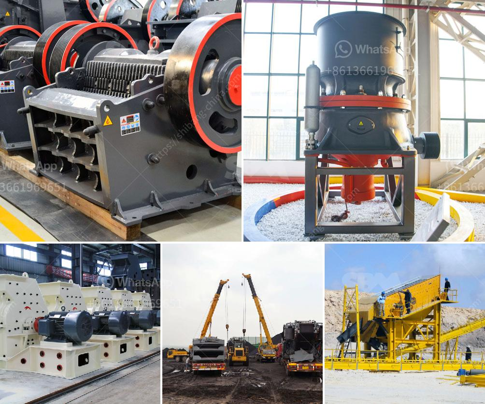

<h3>سعر كسارة الفك المحمولة</h3>
تعتبر كسارة الفك المحمولة أحد الأدوات الهامة في صناعة التعدين والبناء، حيث تستخدم لسحق الصخور والأحجار الكبيرة في حجمها الأصلي إلى حجم أصغر يسهل نقله واستخدامه في عملية البناء أو التعدين. يعتبر سعر كسارة الفك المحمولة متغيرًا بناءً على الطراز والمواصفات التقنية للكسارة.

قد يتراوح سعر كسارة الفك المحمولة بين 200 و 400 ألف ريال بحسب العلامة التجارية والمواصفات المحددة. ويعتمد سعر الكسارة أيضًا على سعة التحميل وسرعة الإنتاج وجودة المواد المستخدمة في تصنيع الكسارة.

إضافة إلى ذلك، يؤثر أيضًا عامل الطلب والعرض في تحديد سعر كسارة الفك المحمولة، حيث قد يزداد الطلب عليها في فترات زمنية معينة أو في أسواق معينة، مما يتسبب في ارتفاع سعرها. وقد يتأثر العرض بتوافر المواد الأساسية لصناعة الكسارة مثل الصلب الخام وقطع الغيار.

من الجوانب الأخرى لاستخدام كسارة الفك المحمولة، يمكن أن يكون لها تأثير إيجابي كبير على تقليل تكاليف النقل والتشغيل لشركات التعدين والبناء. فباستخدام الكسارة المحمولة، يمكن للشركات توفير كلفة النقل للصخور الكبيرة إلى محطات الكسارة المركزية، حيث يمكن تركيز عملية السحق في موقع محدد يسهل الوصول إليه وتقليل الوقت اللازم للتكسير. بالإضافة إلى ذلك، تساهم الكسارة المحمولة في تحسين الكفاءة والإنتاجية، حيث يمكن للعمال استخدامها للعمل في أماكن مختلفة بسهولة ويسر.

في الختام، يعتبر سعر كسارة الفك المحمولة متغيرًا ومتأثرًا بعدة عوامل، بما في ذلك العلامة التجارية والمواصفات والطلب والعرض. ومع ذلك، فإن استخدام الكسارة المحمولة يُعتبر حلاً اقتصاديًا وعمليًا للشركات في صناعة التعدين والبناء، حيث يسهل الوصول إليها واستخدامها في موقع العمل، مما يسهل العملية ويقلل من تكاليف النقل والتشغيل.
<h3>Contact us</h3><ul><li><strong>Whatsapp:&nbsp;<a href="https://wa.me/8613661969651">+8613661969651</a></strong></li><li><a href="https://swt.shibang-china.com/?git&amp;zhl&amp;سعر كسارة الفك المحمولة"><strong>Online Service(chat now)</strong></a></li></ul><h3>Related</h3><ul><li><a href='كسارة الحجر في إندونيسيا.md'>كسارة الحجر في إندونيسيا</a></li><li><a href='آلة صنع مسحوق الرخام.md'>آلة صنع مسحوق الرخام</a></li><li><a href='مواصفات كسارة الفك.md'>مواصفات كسارة الفك</a></li><li><a href='تأجير سحق وفرز الهاتف المحمول.md'>تأجير سحق وفرز الهاتف المحمول</a></li><li><a href='عملية الكرة الطحن.md'>عملية الكرة الطحن</a></li></ul>