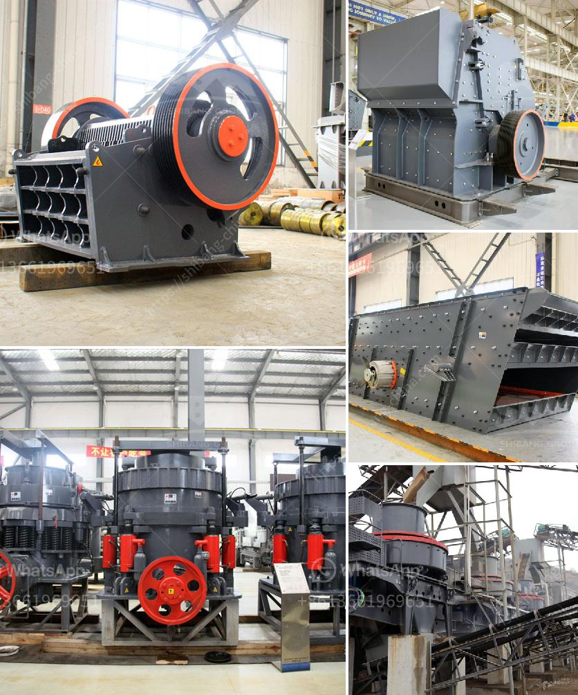

<h3>سعر كسارة الفك في جنوب أفريقيا</h3>
تُعتبر كسارة الفك من أهم الأدوات المستخدمة في صناعة التعدين والبناء، وتستخدم لسحق المواد الخام وإعادة تدويرها. ومن المعروف أن جنوب أفريقيا تحتوي على ثروات طبيعية كبيرة وتعتبر من أكبر منتجي الذهب والماس في العالم، ولذلك فإن طلب كسارة الفك في جنوب أفريقيا يعتبر مرتفعًا.

تختلف أسعار كسارة الفك في جنوب أفريقيا بناءً على عدة عوامل، مثل السعة والحجم والموديل والماركة والجودة والتكنولوجيا المستخدمة في تصنيعها، وكذلك منافستها في السوق. ويمكن أن تتراوح أسعار كسارة الفك في جنوب أفريقيا من حوالي 200 إلى 400 ألف راند جنوب أفريقي.

وتتوفر في السوق الجنوب أفريقية العديد من الموديلات من كسارة الفك لتلبية احتياجات العملاء المختلفة. فمن الممكن أن تكون هناك كسارات فك صغيرة الحجم بسعة أقل، وعادة ما تكون الأسعار أقل لهذه الطرازات. وتزداد القدرة والحجم للكسارات الأكبر، مما يؤدي إلى زيادة السعر أيضًا.

تتميز بعض الكسارات بتقنيات حديثة تستخدم فيها التكنولوجيا الأكثر تطورًا، مثل التحكم الآلي، ومؤشرات الإنتاجية، ونظام تشحيم ذاتي، وسهولة الصيانة. وبالطبع، كلما زادت التقنيات المستخدمة والجودة، زاد سعر الكسارة.

كما يلعب المنافسون في السوق الجنوب أفريقية دورًا في تحديد سعر كسارة الفك. حيث يوجد العديد من الشركات المصنعة في السوق، مما يتطلب منهم ضبط الأسعار وتحسين الجودة للتنافس. وبالتالي، يمكن أن يؤثر وجود المزيد من المنافسين على تقليل سعر الكسارة.

في النهاية، إن شراء كسارة الفك في جنوب أفريقيا يتطلب دراسة ميزات الكسارة والماركة والأسعار والتكنولوجيا المستخدمة. كما يجب أيضًا أخذ الاحتياجات الفردية للعميل وتوفر الميزات الاختيارية في الاعتبار. لذا، يُنصح بالتشاور مع الخبراء والموزعين للحصول على مشورة حول الكسارة الأنسب والتي يناسبها السعر المناسب.
<h3>Contact us</h3><ul><li><strong>Whatsapp:&nbsp;<a href="https://wa.me/8613661969651">+8613661969651</a></strong></li><li><a href="https://swt.shibang-china.com/?git&amp;zhl&amp;سعر كسارة الفك في جنوب أفريقيا"><strong>Online Service(chat now)</strong></a></li></ul><h3>Related</h3><ul><li><a href='مورد سيور ناقلة للفحم من الهند.md'>مورد سيور ناقلة للفحم من الهند</a></li><li><a href='الحجم في مطاحن طحن الأسمنت.md'>الحجم في مطاحن طحن الأسمنت</a></li><li><a href='طاحونة عمودية للأسمنت في كينيا بسعة 100 طن.md'>طاحونة عمودية للأسمنت في كينيا بسعة 100 طن</a></li><li><a href='معدات طحن الكلنكر لسعة ٥٠٠ طن يومياً.md'>معدات طحن الكلنكر لسعة ٥٠٠ طن يومياً</a></li><li><a href='سعر كسارة الصخور.md'>سعر كسارة الصخور</a></li></ul>