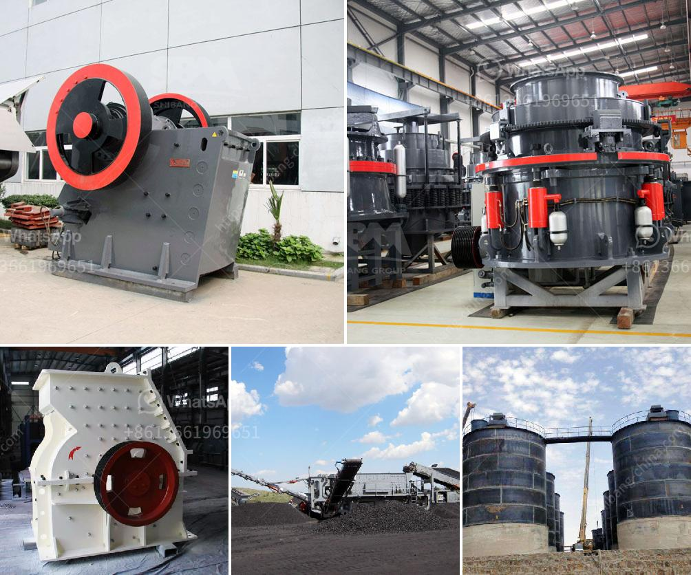

<h3>سعر كسارة الفك في نيجيريا</h3>
تعد كسارة الفك من أهم المعدات في صناعة التعدين والبناء. وتستخدم على نطاق واسع في سحق المواد الصلبة، مثل الحجر الجيري والجرانيت وخام الحديد والنحاس والبازلت والخبث ومواد المقاولات الأخرى. وتتميز هذه الكسارات بقدرتها العالية على سحق المواد إلى حجم أصغر وجعلها منتجًا نهائيًا مفيدًا في صناعة البناء.

يتأثر سعر كسارة الفك في نيجيريا بعدة عوامل. منها الطاقة الإنتاجية للكسارة وتصميمها والمواد المستخدمة في تصنيعها. وتتراوح أسعار كسارات الفك المتوفرة في السوق بين 5000 دولار إلى 100000 دولار أمريكي. وتختلف هذه الأسعار حسب الشركة المصنعة والموديل المطروح في السوق.

علاوة على ذلك، تؤثر تكاليف الشحن والتوريد في سعر كسارة الفك. حيث يمكن أن تكون للعوامل الجغرافية والبنية التحتية دور في تحديد سعر الشحن. وعليه، فإن موقع المشتري قد يؤثر على التكلفة النهائية لكسارة الفك. 

من الجدير بالذكر أن نيجيريا تمتلك ثروات طبيعية هائلة، وتعد صناعة التعدين والبناء من القطاعات المهمة في البلاد. وبالنسبة لسعر كسارة الفك في نيجيريا، يتأثر أيضًا بالطلب والعرض المحلي. حيث يمكن أن يُصنع بعض الموديلات محليًا بأسعار أرخص نسبيًا بالمقارنة بالموديلات المستوردة. وتعتبر الموديلات المحلية ذات الجودة العالية والميزانية المناسبة خيارًا شائعًا بين المشترين.

باختصار، يمكننا القول إن سعر كسارة الفك في نيجيريا يتأثر بعدة عوامل، بما في ذلك الطاقة الإنتاجية، وتصميم الكسارة، والمواد المستخدمة في تصنيعها، والشحن والتوريد، والطلب والعرض المحلي. وباختيار الكسارة المناسبة التي تتوافق مع احتياجات المشروع، يمكن للمشتري الحصول على أفضل قيمة مقابل المال المدفوع.
<h3>Contact us</h3><ul><li><strong>Whatsapp:&nbsp;<a href="https://wa.me/8613661969651">+8613661969651</a></strong></li><li><a href="https://swt.shibang-china.com/?git&amp;zhl&amp;سعر كسارة الفك في نيجيريا"><strong>Online Service(chat now)</strong></a></li></ul><h3>Related</h3><ul><li><a href='آلة التكسير للبيع في نيجيريا.md'>آلة التكسير للبيع في نيجيريا</a></li><li><a href='عملية تدمير صخور الحجر الجيري آلة كسارة الحجر.md'>عملية تدمير صخور الحجر الجيري آلة كسارة الحجر</a></li><li><a href='أنواع الكسارات المستخدمة في التعدين pdf.md'>أنواع الكسارات المستخدمة في التعدين pdf</a></li><li><a href='سعر معدات معالجة المنغنيز.md'>سعر معدات معالجة المنغنيز</a></li><li><a href='آلة صنع الحجر الجيري.md'>آلة صنع الحجر الجيري</a></li></ul>