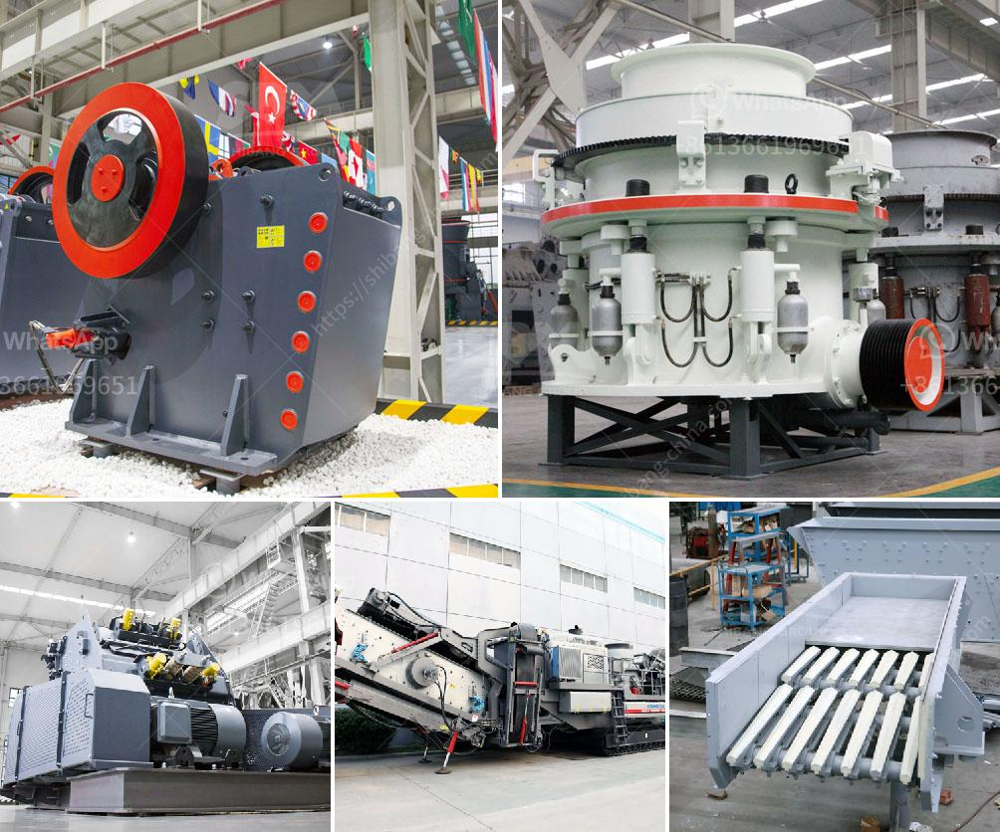

<h3>سعر كسارة الفك</h3>
سعر كسارة الفك هو أحد العوامل الرئيسية التي ينظر إليها المشترين عند البحث عن كسارة الصخور. تستخدم كسارة الفك على نطاق واسع في مجال التعدين والبناء وصناعة السيارات والكيمياء وغيرها من الصناعات ذات الصلة. تتوفر كسارات الفك بسعر يتراوح بين 200 و 400 دولار.

يعد سعر كسارة الفك بمثابة استثمار مهم للعديد من الشركات والمشاريع التجارية. تعتمد تكلفة كسارة الفك على الكثير من العوامل، مثل سعة الإنتاج المطلوبة ومواد الإنتاج ومكان الشراء والعلامة التجارية ومستوى التكنولوجيا.

قد يكون سعر كسارة الفك في نطاق 200-400 دولار معقولًا للعديد من المشترين. ومع ذلك، يجب مراعاة أن الجودة والأداء ليسا أقل أهمية من السعر. يوصى بشراء كسارة فكية ذات جودة عالية وموثوقة ومن العلامات التجارية المعروفة لضمان تحقيق العائد على الاستثمار على المدى الطويل.

عند شراء كسارة الفك، يجب التأكد من أنها متوافقة مع احتياجاتك المحددة. يجب أن تكون قادرًا على معالجة نوعية المواد التي ستستخدمها بكفاءة وبدقة. سعة الإنتاج أمر آخر يجب مراعاته، حيث يجب أن تتناسب مع حجم الإنتاج الذي تحتاجه.

بالإضافة إلى ذلك، يجب أن يكون لديك خطة صيانة جيدة لكسارة الفك لضمان استمرارية عملها وتحقيق أفضل أداء. ينصح بشكل عام بشراء قطع الغيار الأصلية والتعامل مع فنيين مؤهلين لصيانة وإصلاح الكسارة.

في الختام، يجب أن يتم اختيار كسارة الفك بعناية استنادًا إلى الاحتياجات الفعلية وليس فقط على أساس السعر. يجب أن تكون جودة الجهاز وأدائه وخدمة ما بعد البيع عوامل أخرى تُعَدُّ في عملية الشراء. بذلك، ستكون قد حققت استثمارًا جيدًا وستستفيد من كسارة الفك لسنوات قادمة.
<h3>Contact us</h3><ul><li><strong>Whatsapp:&nbsp;<a href="https://wa.me/8613661969651">+8613661969651</a></strong></li><li><a href="https://swt.shibang-china.com/?git&amp;zhl&amp;سعر كسارة الفك"><strong>Online Service(chat now)</strong></a></li></ul><h3>Related</h3><ul><li><a href='كيفية عمل مصنع سحق الحجر.md'>كيفية عمل مصنع سحق الحجر</a></li><li><a href='دليل تصميم كسارة مخروط بتنسيق PDF.md'>دليل تصميم كسارة مخروط بتنسيق PDF</a></li><li><a href='سعر كسارة الفحم.md'>سعر كسارة الفحم</a></li><li><a href='تحكم هيدروليكي في فك الكسارة.md'>تحكم هيدروليكي في فك الكسارة</a></li><li><a href='مطحنة الأسطوانة في الهند.md'>مطحنة الأسطوانة في الهند</a></li></ul>