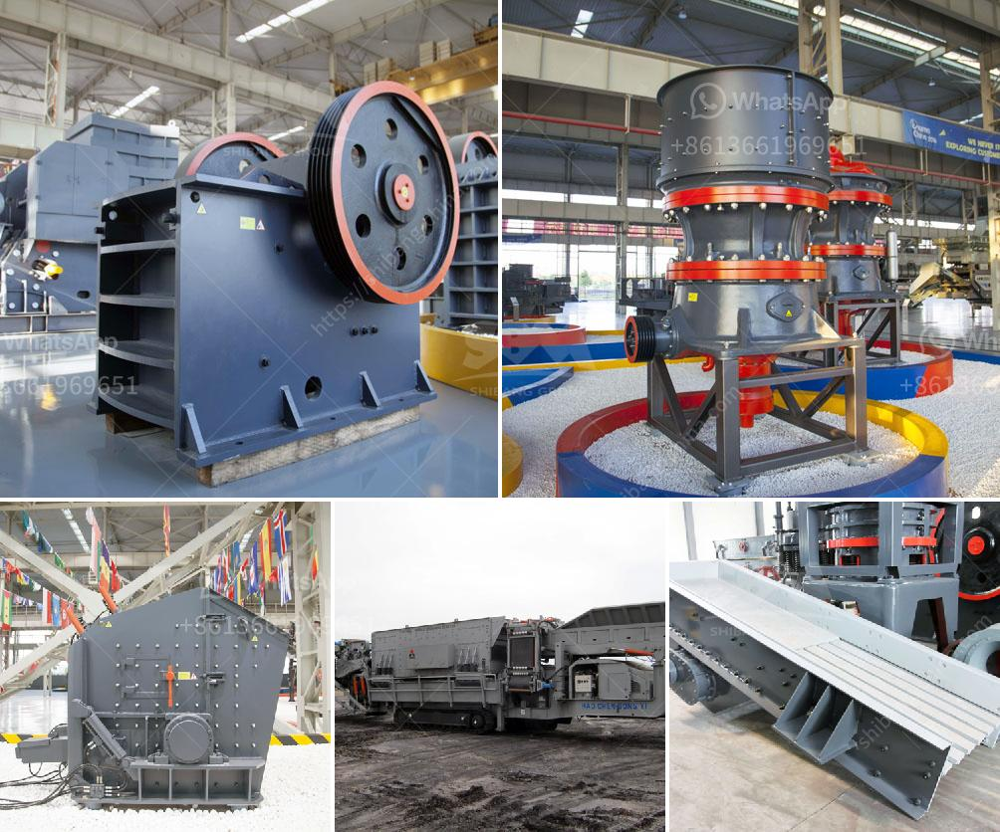

<h3>سعر كسارة المختبر المستخدمة</h3>
تُعد كسارة المختبر أداة حيوية في مجال البحث العلمي والتحليلات المختبرية. تستخدم في تحطيم وطحن العينات المختلفة، سواء كانت صلبة أو سائلة، من أجل تجهيزها للتحليل أو الدراسة. تتوفر كسارات المختبر في مجموعة واسعة من الأحجام والأنواع، وتختلف تكلفتها وفقًا للمواصفات والميزات المختلفة.

بشكل عام، يتراوح سعر كسارة المختبر المستعملة ما بين 200 و400 دولار. هناك العديد من العوامل التي تؤثر في تحديد السعر، بما في ذلك نوع الكسارة وحجمها وحالتها العامة. قد يكون هناك أيضًا اختلاف في السعر وفقًا للشركة المصنعة والمورد، حيث يمكن أن تتفاوت الجودة والموثوقية بين الماركات المختلفة.

يمكن العثور على كسارات المختبر المستعملة من خلال العديد من المصادر، مثل المعارض التجارية والمزادات والخدمات الإلكترونية على الإنترنت المتخصصة في معدات المختبر. قد يسهل إيجاد عروض مغرية وأسعار منخفضة بشكل كبير من خلال شراء كسارات المختبر المستعملة، مما يساهم في توفير الميزانية والموارد المالية للمختبرات والمؤسسات البحثية.

ومع ذلك، يجب أن يتم اختيار كسارة المختبر المستعملة بعناية. يجب التحقق من حالتها العامة ومدى عملها الفعال، وذلك من خلال طلب تقرير تفصيلي عن الكسارة المستعملة وتوصية من البائع أو المورد. قد يستحسن أيضًا البحث عن مراجعات المستخدمين السابقين للكسارة المستعملة، فقد يكون لديهم معلومات قيمة حول أداء الكسارة وجودتها.

من الجدير بالذكر أنه قد يكون هناك بعض العلامات التجارية المعروفة والموثوقة لكسارات المختبر، والتي قد تتطلب توفير ميزانية أكبر. ومع ذلك، فإن الاستثمار في كسارة مختبرية عالية الجودة وموثوقة يمكن أن يوفر الكثير من الوقت والجهد في المدى الطويل، حيث ستساعد على تسريع العمليات المختبرية وتحسين نتائج التحليل والدراسة.

باختصار، كسارة المختبر المستخدمة تُعد خيارًا اقتصاديًا لتلبية احتياجات المختبرات والمؤسسات البحثية. يجب الالتفات إلى المواصفات والحالة العامة للكسارة المستخدمة قبل شرائها، مع الاهتمام بالجودة والموثوقية لضمان الحصول على أداة تلبي احتياجات التحليل والبحث بشكل مثالي.
<h3>Contact us</h3><ul><li><strong>Whatsapp:&nbsp;<a href="https://wa.me/8613661969651">+8613661969651</a></strong></li><li><a href="https://swt.shibang-china.com/?git&amp;zhl&amp;سعر كسارة المختبر المستخدمة"><strong>Online Service(chat now)</strong></a></li></ul><h3>Related</h3><ul><li><a href='صور شاشات الاهتزاز.md'>صور شاشات الاهتزاز</a></li><li><a href='معدات سحق الجرانيت.md'>معدات سحق الجرانيت</a></li><li><a href='مصنع معالجة البازلت.md'>مصنع معالجة البازلت</a></li><li><a href='تاجر كسارة الحجر في الصين.md'>تاجر كسارة الحجر في الصين</a></li><li><a href='عملية كربونات الكالسيوم المترسبة.md'>عملية كربونات الكالسيوم المترسبة</a></li></ul>