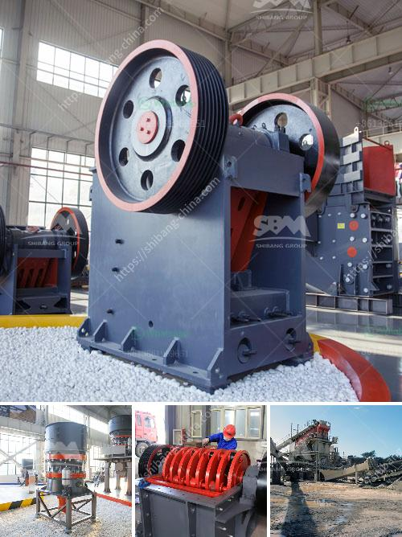

<h3>سعر كسارة الهامر العلامة التجارية</h3>
إنّ كسارة الهامر هي أداة مهمة في صناعة التكسير والطحن. تعتبر هذه الآلة جزءًا أساسيًّا من عملية سحق المواد الخام في المصانع والمناجم. واحدة من العلامات التجارية الأكثر شهرة عند الحديث عن كسارات الهامر هي "هامر"، وهي معروفة بجودتها وفعاليتها في عملية التكسير.

يتراوح سعر كسارة الهامر من 200 إلى 400 دولارًا، وهذا يعتمد على الحجم والقدرة الإنتاجية للكسارة. الكسارات الصغيرة التي تستخدم في التطبيقات المنزلية أو في صناعة البناء الصغيرة قد تكون أرخص من ذلك بكثير، حيث يمكن أن يتراوح سعرها بين 200 إلى 300 دولارًا. على الجانب الآخر، قد تكون الكسارات الكبيرة المستخدمة في المصانع أو المناجم أغلى قليلاً، حيث يمكن أن يصل سعرها إلى 400 دولارًا.

يعزى سعر كسارة الهامر العلامة التجارية إلى العديد من العوامل، بما في ذلك جودة المواد المستخدمة في الكسارة وتقنية التصنيع المستخدمة. تستخدم الكسارات عادة سبائك من الفولاذ العالي الجودة والمواد المقاومة للتآكل لضمان عمر طويل وأداء متفوق. كذلك، تعتمد جودة المحرك وقدرة قوة الضرب على سعر الكسارة. إن المحركات عالية الجودة والتي يتم تصميمها بشكل فعال يمكن أن تزيد من سعر الكسارة.

بالإضافة إلى ذلك، يؤثر العرض والطلب على سعر كسارة الهامر. في حالة كون الطلب على الكسارة عاليًا والعرض محدودًا، فمن المرجح أن يكون سعرها أعلى. على العكس من ذلك، إذا كان هناك تنافس قوي بين الشركات المصنعة للكسارات، فقد يتراجع سعرها قليلاً.

عند شراء كسارة الهامر، يجب أن يأخذ المشتري في الاعتبار احتياجاته الخاصة. يجب عليه أن يبحث عن ماكينة تتناسب مع نوع المعدات المراد تكسيرها بالإضافة إلى مدى الاحتياجات الإنتاجية المطلوبة. قد تتوفر العديد من الخيارات بين العلامات التجارية لكسارات الهامر، ومن المهم مراجعة المواصفات والتقييمات للعثور على الجهاز الذي يلبي احتياجاتك ويناسب ميزانيتك المحددة.

بإمكان كسارات الهامر تحسين عملية التصنيع والتعدين، حيث تقدم قدرة تكسير فعالة ودقيقة. وعلى الرغم من أنها قد تكلف بعض المبالغ، إلا أن فعاليتها وجودتها ستساعد بالتأكيد على تحقيق عوائد استثمارية طويلة الأجل. لذلك، يجب أن يعتبر مشتري الكسارة تكلفتها كما تمثل استثمارًا هامًا في تحسين عملياته وزيادة كفاءته.
<h3>Contact us</h3><ul><li><strong>Whatsapp:&nbsp;<a href="https://wa.me/8613661969651">+8613661969651</a></strong></li><li><a href="https://swt.shibang-china.com/?git&amp;zhl&amp;سعر كسارة الهامر العلامة التجارية"><strong>Online Service(chat now)</strong></a></li></ul><h3>Related</h3><ul><li><a href='كسارة مخروطية قياسية قدم.md'>كسارة مخروطية قياسية قدم</a></li><li><a href='بيع كسارة الصخور.md'>بيع كسارة الصخور</a></li><li><a href='قشارة وكسارة متعددة الوظائف في الصين.md'>قشارة وكسارة متعددة الوظائف في الصين</a></li><li><a href='خط إنتاج الحجر الجيري.md'>خط إنتاج الحجر الجيري</a></li><li><a href='استخراج الحجر في باكستان.md'>استخراج الحجر في باكستان</a></li></ul>