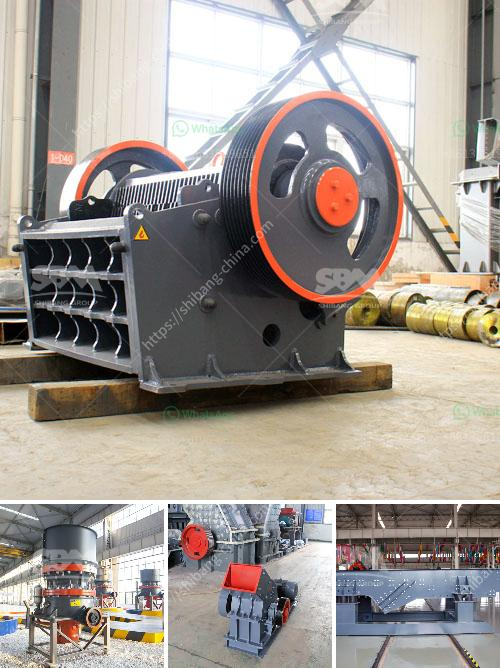

<h3>سعر كسارة الهامر للطن الواحد في الساعة</h3>
تعتبر كسارة الهامر من الآلات الهامة في صناعة التعدين والبناء. وتستخدم هذه الكسارات بشكل واسع في سحق المواد الخام وتقطيعها إلى قطع صغيرة قابلة للاستخدام في العديد من التطبيقات المختلفة.

سعر كسارة الهامر للطن الواحد في الساعة يعتمد على العديد من العوامل المختلفة، مثل حجم الكسارة وسعة التشغيل وتكنولوجيا الإنتاج المستخدمة والمادة التي يتم سحقها والموقع الجغرافي. وعادة ما يتم تقدير سعرها بالطن الواحد أو الساعة.

إذا كنا ننظر إلى منطقة الشرق الأوسط على سبيل المثال، فإن سعر كسارة الهامر للطن الواحد في الساعة يتراوح بين 50 إلى 100 دولار أمريكي تقريبًا. ومع ذلك، قد يختلف هذا السعر حسب العوامل المذكورة سابقًا.

يجب ملاحظة أن هناك العديد من الشركات المصنعة لكسارات الهامر في جميع أنحاء العالم، وكل منها يقدم أنواعًا مختلفة من الكسارات ذات الأحجام والقدرات المختلفة. وبالتالي، سعر كسارة الهامر قد يتنوع بشكل كبير من شركة لشركة ومن طراز لآخر.

بعض العوامل الأخرى التي قد تؤثر على سعر كسارة الهامر للطن الواحد في الساعة تشمل تكلفة المواد الخام المستخدمة في الإنتاج، وتكلفة العمالة والتشغيل، وتكلفة الصيانة والإصلاح، والعمر الافتراضي للكسارة والضمان، وغيرها من العوامل التي تؤثر على تكاليف الإنتاج وتشغيل الكسارة.

بشكل عام، يمكن القول أن سعر كسارة الهامر للطن الواحد في الساعة يتراوح ما بين 50 إلى 100 دولار أمريكي، ولكن يجب مراعاة حالة السوق المحلية والعوامل الأخرى عند تقدير السعر النهائي.
<h3>Contact us</h3><ul><li><strong>Whatsapp:&nbsp;<a href="https://wa.me/8613661969651">+8613661969651</a></strong></li><li><a href="https://swt.shibang-china.com/?git&amp;zhl&amp;سعر كسارة الهامر للطن الواحد في الساعة"><strong>Online Service(chat now)</strong></a></li></ul><h3>Related</h3><ul><li><a href='معالجة الذهب في الفلبين.md'>معالجة الذهب في الفلبين</a></li><li><a href='آلات إنتاج الجبس.md'>آلات إنتاج الجبس</a></li><li><a href='أسعار كسارة الحجر في إندونيسيا.md'>أسعار كسارة الحجر في إندونيسيا</a></li><li><a href='إجراء إنتاج الأسمنت في المطحنة العمودية.md'>إجراء إنتاج الأسمنت في المطحنة العمودية</a></li><li><a href='أسعار كسارة رمل السيليكا.md'>أسعار كسارة رمل السيليكا</a></li></ul>