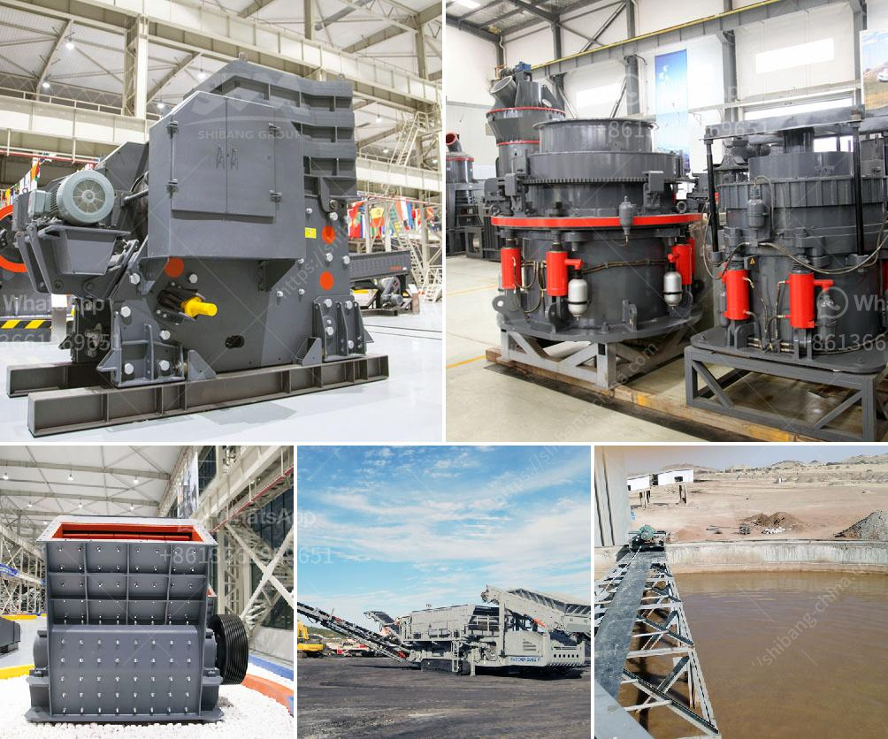

<h3>سعر كسارة تأثير الصخور</h3>
تعتبر كسارة تأثير الصخور من أهم المعدات في صناعة التعدين والبناء، حيث تستخدم لتفتيت الصخور الكبيرة إلى قطع صغيرة بحجم مناسب للاستخدام في عمليات التشييد والبناء. يختلف سعر كسارة تأثير الصخور بناءً على العديد من العوامل، مثل الحجم والقوة والمواصفات التقنية للمعدة.

عند البحث عن كسارة تأثير الصخور، يمكن الوفاء بالمتطلبات المذكورة في السؤال بشراء جهاز بسعر يتراوح بين 200 إلى 400 دولار. ومع ذلك، يجب مراعاة أن الأسعار قد تختلف من بلد إلى آخر ومن شركة لأخرى. كما أن تكلفة الشحن والتسليم أيضًا تأثر في السعر النهائي للمنتج.

يتعلق سعر الكسارة تأثير الصخور أيضًا بمؤشرات مثل القدرة والاستهلاك ونسبة الفحمة. بالطبع، كلما ارتفعت هذه المؤشرات، زاد سعر الكسارة. عوامل أخرى تؤثر في تحديد السعر تشمل شركة الصناعة، حيث أن الشركات المعروفة بجودة منتجاتها غالبًا ما توفر منتجات بأسعار مرتفعة نسبيًا.

تعد الكسارة تأثير الصخور أداة حيوية في صناعة التعدين والبناء، وتستخدم لتحطيم الصخور الكبيرة إلى قطع أصغر قابلة للاستخدام. يمكن استخدام الكسارة تأثير الصخور لتفتيت العديد من المواد المختلفة، مثل الحجر الجيري والجرانيت وخام الحديد والنحاس والذهب وغيرها.

بالإضافة إلى ذلك، يجب أن يتم اختيار الكسارة المناسبة وفقًا لاحتياجات المشروع. يجب مراعاة العديد من العوامل الأخرى، مثل سعة الإنتاج المطلوبة وحجم الصخور المراد تفتيتها. علاوة على ذلك، قد يكون من الضروري توجيه الاهتمام إلى الكفاءة وضوضاء الكسارة، حيث يمكن أن تؤثر هذه العوامل على تكاليف التشغيل والصيانة.

بالاختصار، سعر كسارة تأثير الصخور يتأثر بعدة عوامل، ويتفاوت من بلد إلى آخر ومن شركة لأخرى. بالإضافة إلى ذلك، يجب مراعاة العديد من المتغيرات الفنية ومتطلبات المشروع عند شراء الكسارة. المهم هو التأكد من اختيار الكسارة المناسبة التي تلبي الاحتياجات الفعلية للمشروع، وفقًا للمتطلبات المحددة للقدرة والجودة.
<h3>Contact us</h3><ul><li><strong>Whatsapp:&nbsp;<a href="https://wa.me/8613661969651">+8613661969651</a></strong></li><li><a href="https://swt.shibang-china.com/?git&amp;zhl&amp;سعر كسارة تأثير الصخور"><strong>Online Service(chat now)</strong></a></li></ul><h3>Related</h3><ul><li><a href='سعر كسارة في موزمبيق.md'>سعر كسارة في موزمبيق</a></li><li><a href='سعر كسارة الفك 24x12.md'>سعر كسارة الفك 24x12</a></li><li><a href='مصنع معالجة الذهب آلة كسارة الحجر التركية.md'>مصنع معالجة الذهب آلة كسارة الحجر التركية</a></li><li><a href='مطاحن الكرة للحجر الجيري في ماليزيا.md'>مطاحن الكرة للحجر الجيري في ماليزيا</a></li><li><a href='شركات تصنيع آلات الطحن في تايلاند.md'>شركات تصنيع آلات الطحن في تايلاند</a></li></ul>