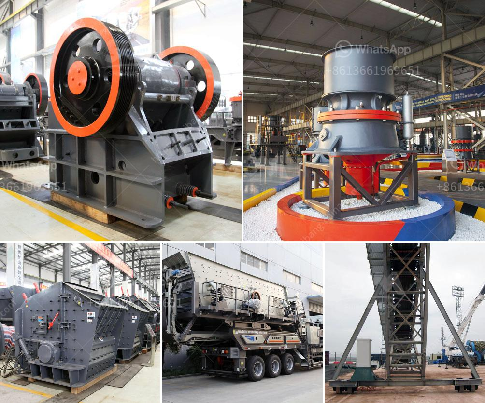

<h3>سعر كسارة حجر البازلت</h3>
تعد كسارة حجر البازلت من أهم الأدوات المستخدمة في صناعة البناء والأعمال العامة. فهي تستخدم في تكسير البازلت، والذي يعد من أصعب الأحجار وأكثرها مقاومة. يتم استخدام حجر البازلت في إنشاء الطرق والمباني والجسور والأنفاق بفضل خصائصه الميكانيكية الممتازة وقوة تحمله العالية.

سعر كسارة حجر البازلت يعتمد على العديد من العوامل، مثل حجم الكسارة وقدرتها الإنتاجية والموصفات التقنية المختلفة للكسارة. كما تؤثر الأسعار أيضًا بناءًا على السوق المحلية والعالمية للحجر ومنتجاته. 

على سبيل المثال، قد يكون سعر كسارة صغيرة الحجم ومنخفضة القدرة بين 200 إلى 500 دولار، بينما قد تصل أسعار الكسارات الكبيرة الحجم وعالية القدرة إلى العديد من آلاف الدولارات. هناك أيضًا العروض المستعملة المتاحة بأسعار مختلفة تعتمد على حالة الكسارة واستخدامها السابق.

من المهم أيضًا أن نلاحظ أنه يتم توفير إضافات مختلفة للكسارات التي تسهم في زيادة كفاءتها وتحسين تحملها، وستزيد هذه الإضافات غالبًا من تكلفة الكسارة. وبطبيعة الحال، تختلف أسعار الكسارات بحسب الخدمات الإضافية التي تقدمها الشركة المصنعة، مثل ضمان الجودة والصيانة وخدمة العملاء.

في النهاية، يجب على المشتري أن يدرس جيدًا احتياجاته وميزانيته قبل شراء كسارة حجر البازلت. يجب أن يتعاون مع متخصصين في هذا المجال لأنهم يمتلكون الخبرة والمعرفة اللازمة لمساعدته في اتخاذ القرار المناسب. يعتمد اختيار الكسارة الصحيحة على أنواع الحجارة التي ستتم معالجتها وتكلفة الصيانة وقدرة الإنتاج المطلوبة.

باختيار كسارة حجر البازلت المناسبة، سيتمكن المشتري من ضمان إنتاجية عالية وجودة ممتازة للحجارة المكسورة. كسارة حجر البازلت هي استثمار هام لأي شركة بناء ومقاولات، وبالتالي يجب على المشتري الانتباه للجوانب المتعلقة بالجودة والقدرة والأسعار قبل اتخاذ القرار النهائي.
<h3>Contact us</h3><ul><li><strong>Whatsapp:&nbsp;<a href="https://wa.me/8613661969651">+8613661969651</a></strong></li><li><a href="https://swt.shibang-china.com/?git&amp;zhl&amp;سعر كسارة حجر البازلت"><strong>Online Service(chat now)</strong></a></li></ul><h3>Related</h3><ul><li><a href='معدات معالجة خام الذهب المستخدمة للبيع.md'>معدات معالجة خام الذهب المستخدمة للبيع</a></li><li><a href='مسحوق الدولوميت 200 شبكة.md'>مسحوق الدولوميت 200 شبكة</a></li><li><a href='مطحنة المطرقة للبيع في دبي.md'>مطحنة المطرقة للبيع في دبي</a></li><li><a href='مصنع كسارة للفحم.md'>مصنع كسارة للفحم</a></li><li><a href='مطحنة الكرة لمسحوق الكوارتز في تاميل نادو.md'>مطحنة الكرة لمسحوق الكوارتز في تاميل نادو</a></li></ul>