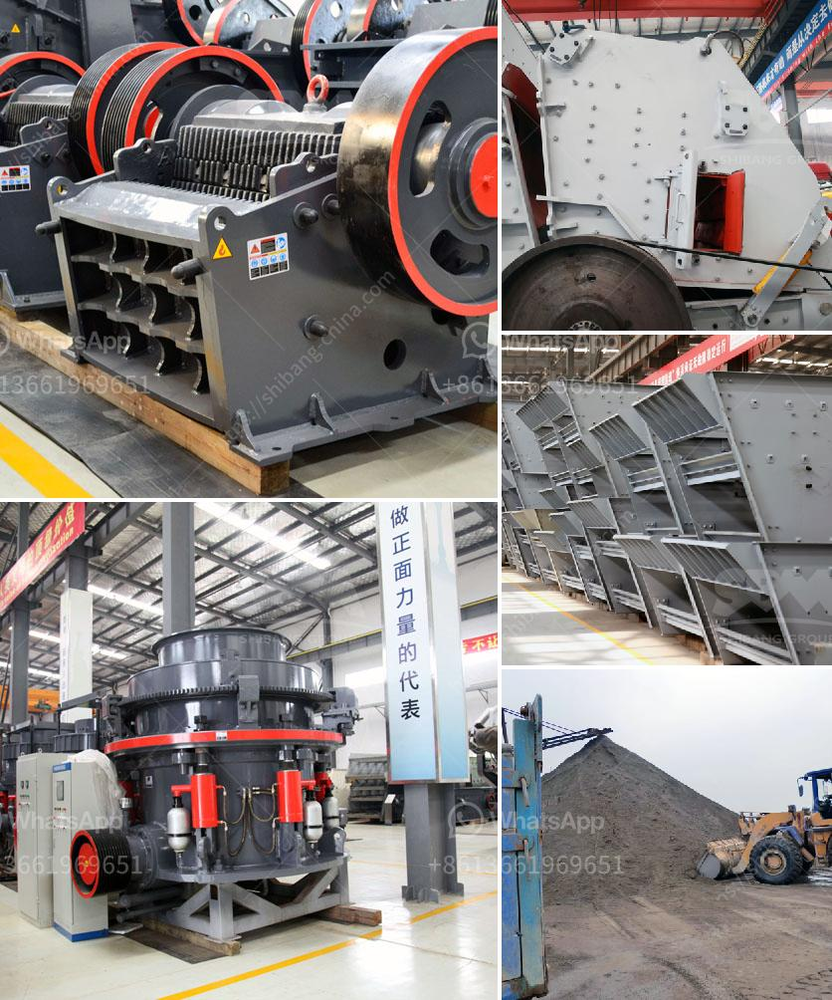

<h3>سعر كسارة حجر الركام في جنوب أفريقيا</h3>
تسعى صناعة البناء والإنشاءات في جنوب أفريقيا إلى مقابلة الطلب المتزايد على الركام والحصى في التشييد والبناء. واحتمالًا لا يمكن تجاهله، هو ارتفاع أسعار الكسارات التي تستخدم لكسر حجر الركام وتحويله إلى حجم وشكل مناسب للاستخدام في البناء.

يعتبر حجر الركام واحدًا من أهم الموارد الأساسية في صناعة البناء والإنشاءات، حيث يستخدم في الأساس في إنتاج الخرسانة والأسفلت وبعض المواد البنائية الأخرى. بالإضافة إلى ذلك، يستخدم أيضًا في إنشاء الطرق وأعمال الصرف الصحي والصناعات الأخرى.

من الجوانب المؤثرة في سعر كسارة حجر الركام في جنوب أفريقيا هو تأثير تكلفة الإنتاج، حيث يتطلب إنتاج حجر الركام استخدام معدات خاصة متطورة وتكنولوجيا متقدّمة لكسر الصخور وفصلها من الأتربة والشوائب الأخرى. بالإضافة إلى ذلك، يتطلب العمل في المناطق الجبلية أو الصحراوية الاعتماد على نقل الصخور من مصدرها إلى موقع الكسارة، وهو يمثل تكلفة إضافية.

بالإضافة إلى تكلفة الإنتاج، تتأثر أسعار الكسارة أيضًا بالعرض والطلب. تزداد الطلبات على الكسارة خلال فترات الذروة في صناعة البناء والإنشاءات، مما يؤدي إلى ارتفاع الأسعار. وعلى العكس، في فترات الركود الاقتصادي، يمكن أن يحدث انخفاض في الطلب ويؤثر بالتالي على الأسعار.

بشكل عام، يمكن تقدير تكلفة الكسارة في جنوب أفريقيا بناءً على سعر المعدات والتكنولوجيا المستخدمة في الإنتاج وتكلفة النقل والعمليات الأخرى المرتبطة بالإنتاج. وفي السوق المحلية، يمكن أن تتراوح أسعار الكسارات في المدى من 200 إلى 400 راند جنوب أفريقي (العملة المحلية). ومع ذلك، قد يتفاوت سعر الكسارة بين المناطق والمصانع المختلفة داخل البلاد.

في الختام، يجب أن يلاحظ أن تقدير الأسعار يعتمد على العوامل المتعددة المؤثرة والتي قد تختلف من فترة لأخرى ومن مكان لآخر. لذلك، يوصى بالتشاور مع الشركات المحلية المتخصصة في صناعة البناء والإنشاءات للحصول على مزيد من المعلومات المحددة والتحديثات المتعلقة بالأسعار.
<h3>Contact us</h3><ul><li><strong>Whatsapp:&nbsp;<a href="https://wa.me/8613661969651">+8613661969651</a></strong></li><li><a href="https://swt.shibang-china.com/?git&amp;zhl&amp;سعر كسارة حجر الركام في جنوب أفريقيا"><strong>Online Service(chat now)</strong></a></li></ul><h3>Related</h3><ul><li><a href='سعر مصنع الأسمنت.md'>سعر مصنع الأسمنت</a></li><li><a href='معدات طحن فائقة الدقة.md'>معدات طحن فائقة الدقة</a></li><li><a href='طاحونة الكرة الرطبة في الصين.md'>طاحونة الكرة الرطبة في الصين</a></li><li><a href='سعر كسارة مخروطية هيدروليكية بتغذية 20 مم.md'>سعر كسارة مخروطية هيدروليكية بتغذية 20 مم</a></li><li><a href='سعر كسارة الحجر في السوق.md'>سعر كسارة الحجر في السوق</a></li></ul>