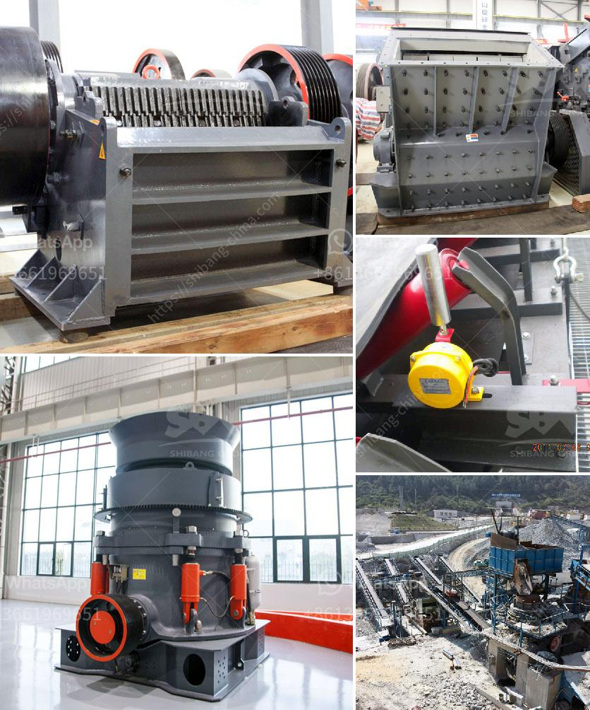

<h3>سعر كسارة حجر متنقلة صغيرة في روسيا</h3>
تعتبر الكسارات الحجرية المتنقلة الصغيرة أداة أساسية في صناعة التعدين والبناء، حيث تعمل على تكسير الصخور الكبيرة وتحويلها إلى حجارة صغيرة يمكن استخدامها في إنشاء الأساسات والطرق والمباني الأخرى. تتميز هذه الكسارات بحجمها الصغير وقدرتها على النقل بسهولة بين مواقع العمل المختلفة.

في روسيا، يعتبر سعر الكسارة الحجرية المتنقلة الصغيرة متوسطًا بين 200-400 دولار. يتأثر سعر الكسارة بعدة عوامل، بما في ذلك السعة والجودة والماركة. تتوفر العديد من الشركات المصنعة للكسارات الحجرية في روسيا، وبالتالي يوجد تنافس قوي بين المنافسين لتقديم أفضل المنتجات بأسعار مناسبة.

تختلف قدرة الكسارات الحجرية المتنقلة الصغيرة بين 20-50 طن في الساعة، ويتم تحقيق ذلك بواسطة محركات كهربائية قوية ومتميزة. تحتوي هذه الكسارات على فك متحرك وثابت، حيث يتم وضع الصخور بين الفكين وسحقها بواسطة الكسارة ليصبح كل منتج أصغر في الحجم ومناسبًا للاستخدام.

يتم استخدام الكسارات الحجرية المتنقلة الصغيرة في العديد من التطبيقات في روسيا، بما في ذلك بناء الطرق والأساسات والأحجار الزينة. تلبي هذه الكسارات احتياجات الشركات الصغيرة والمتوسطة التي ليس لديها القدرة على الاستثمار في معدات كبيرة أو القدرة على تحمل تكاليف النقل المتكرر.

قد تكون الكسارات الحجرية المتنقلة الصغيرة بمثابة حلاً مثاليًا للشركات التي تبحث عن تأجير أو شراء معدات بأسعار معقولة وفعالة في الوقت نفسه. إضافةً إلى ذلك، يمكن نقل هذه الكسارات بسهولة للمواقع المختلفة، مما يزيد من مرونة استخدامها وتحقيق الكفاءة في الإنتاج وتحقيق التوفير في التكاليف.

باختصار، تعتبر الكسارات الحجرية المتنقلة الصغيرة أداة مهمة في صناعة التعدين والبناء في روسيا. بسعر يتراوح بين 200-400 دولار، تعد هذه الكسارات مرنة وفعالة ومناسبة للشركات الصغيرة والمتوسطة التي تتطلع إلى تحقيق الكفاءة والتوفير في التكاليف في العملية التصنيعية.
<h3>Contact us</h3><ul><li><strong>Whatsapp:&nbsp;<a href="https://wa.me/8613661969651">+8613661969651</a></strong></li><li><a href="https://swt.shibang-china.com/?git&amp;zhl&amp;سعر كسارة حجر متنقلة صغيرة في روسيا"><strong>Online Service(chat now)</strong></a></li></ul><h3>Related</h3><ul><li><a href='فرضية عامة لكسارة الفك.md'>فرضية عامة لكسارة الفك</a></li><li><a href='مصنع كسارة المحاجر في إيطاليا.md'>مصنع كسارة المحاجر في إيطاليا</a></li><li><a href='آلة سحق الطين.md'>آلة سحق الطين</a></li><li><a href='شركة تصنيع آلات الكسارة في زامبيا.md'>شركة تصنيع آلات الكسارة في زامبيا</a></li><li><a href='عمود المرفق لكسارة الفك.md'>عمود المرفق لكسارة الفك</a></li></ul>