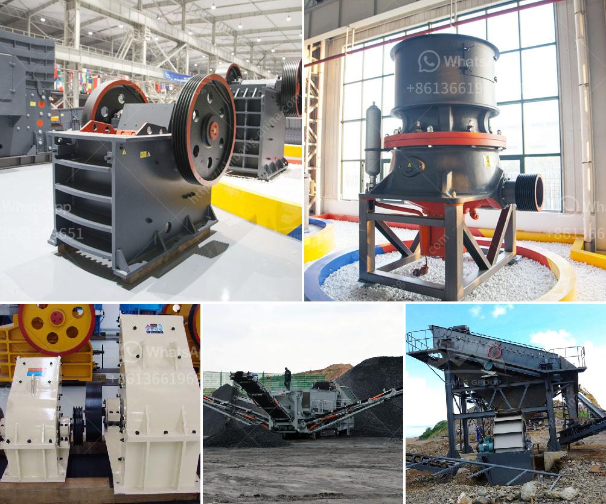

<h3>سعر كسارة في موزمبيق</h3>
تعد موزمبيق واحدة من الدول الأفريقية التي تشتهر بوفرة الموارد الطبيعية والثروات المعدنية. يعتبر قطاع التعدين من أهم قطاعات الاقتصاد الموزمبيقي، ومن بين المعادن المستخرجة بكميات كبيرة في البلاد هو خام الصخر الزيتي. وبالتالي يوجد سوق كبير للكسارات في موزمبيق.

تختلف أسعار الكسارات في موزمبيق حسب العديد من العوامل المختلفة، مثل الحجم والمواصفات والماركة والجودة. وعادةً ما يتحرك سعر الكسارة في نطاق يتراوح بين 200 إلى 400 دولار. يعتبر هذا السعر معقولًا نسبيًا فيما يتعلق بأسعار الكسارات في الأسواق العالمية.

ويجب أن نلاحظ أنه إلى جانب سعر الكسارة نفسها، هناك أيضًا تكاليف أخرى يجب أن يضاف إليها عند شراء الكسارة. ومن بين هذه التكاليف المحتملة هي تكلفة النقل ووسائل الإيصال، وتكلفة الطاقة اللازمة لتشغيل الكسارة، وتكلفة الصيانة وقطع الغيار. لذا يجب على المشتري أن يأخذ هذه العوامل في الاعتبار عند قياس تكلفة الكسارة بشكل عام.

ويمكن العثور على الكسارات في موزمبيق في العديد من المحلات والشركات المتخصصة في بيع وتوريد المعدات الثقيلة. وهذه الشركات غالبًا ما توفر مجموعة واسعة من الكسارات بمختلف المواصفات والأحجام والأنواع، مما يتيح للعملاء اختيار الكسارة التي تلبي احتياجاتهم بشكل اقتصادي وفعال.

في النهاية، يمكن القول إن سعر الكسارة في موزمبيق يتراوح بين 200 إلى 400 دولار، وهذا السعر يمكّن العملاء من اقتناء كسارة بتكلفة معقولة ومناسبة لمتطلباتهم. إلا أنه يجب على العملاء أيضًا أن يأخذوا في الاعتبار التكاليف الأخرى المرتبطة بشراء واستخدام الكسارة.
<h3>Contact us</h3><ul><li><strong>Whatsapp:&nbsp;<a href="https://wa.me/8613661969651">+8613661969651</a></strong></li><li><a href="https://swt.shibang-china.com/?git&amp;zhl&amp;سعر كسارة في موزمبيق"><strong>Online Service(chat now)</strong></a></li></ul><h3>Related</h3><ul><li><a href='حفارات مستعملة للبيع في نيجيريا.md'>حفارات مستعملة للبيع في نيجيريا</a></li><li><a href='كسارة الرخام في الصين.md'>كسارة الرخام في الصين</a></li><li><a href='تكلفة مشروع طحن التلك.md'>تكلفة مشروع طحن التلك</a></li><li><a href='تقرير تفصيلي حول مصنع مسحوق الكوارتز.md'>تقرير تفصيلي حول مصنع مسحوق الكوارتز</a></li><li><a href='أحجام كسارة الفك الحجر الجيري.md'>أحجام كسارة الفك الحجر الجيري</a></li></ul>