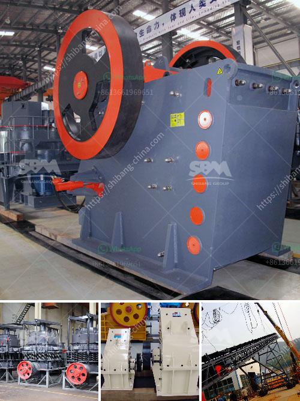

<h3>سعر كسارة متنقلة خام الكروم الرئيسية</h3>
تُعدّ الكسارات المتنقلة لخام الكروم الرئيسية أداة حاسمة في صناعة التعدين، حيث تُستخدم لسحق وطحن الخامات الغنية بالكروم لاستخراج المعادن الثمينة منها. يعتبر سعر الكسارة المتنقلة لخام الكروم الرئيسية من المعايير الرئيسية التي ينبغي مراعاتها عند شراء هذا الجهاز.

تتنوع أنواع الكسارات المتنقلة لخام الكروم الرئيسية وفقًا لحجمها وتكنولوجيا التشغيل المستخدمة. وتتراوح الأسعار بين 200 و400 دولار للكيلوغرام الواحد من قدرة الكسارة المطلوبة. يجب ملاحظة أن السعر يشمل أداء الجهاز وقدرته على معالجة الخامات بكفاءة.

تعتمد التكلفة على العديد من العوامل، بما في ذلك حجم الكسارة، وقوة المحرك المستخدمة، والجودة العامة للمكونات. قد تكون الكسارات ذات الأحجام الكبيرة أغلى من الصغيرة، نظرًا لاحتياجها إلى معدات ومساحة إضافية للتشغيل. علاوة على ذلك، يمكن أن يكون للتكنولوجيا المستخدمة في الكسارة تأثير كبير على السعر. تعتمد بعض الكسارات على التكنولوجيا التقليدية، في حين يستخدم البعض الآخر تكنولوجيا حديثة ومبتكرة تزيد من كفاءة الجهاز وتقلل من التكاليف التشغيلية.

من الأفضل التعاون مع شركات موثوقة ومعروفة في صناعة الكسارات المتنقلة لخام الكروم الرئيسية. يجب البحث عن الشركات التي توفر جودة عالية ومنتجات قوية وموثوقة. يمكن الاستعانة بالمراجعات والتوصيات من المهندسين والمستخدمين الآخرين لتحديد الشركات الموثوقة.

علاوة على ذلك، يجب أن يتم اختيار الكسارة المتنقلة لخام الكروم الرئيسية بناءً على طبيعة العمل واحتياجات التشغيل الخاصة بالشركة. يجب أن تكون الكسارة متوافقة مع المعدات الأخرى وتلبي متطلبات الإنتاج المحددة.

باختصار، يعتبر سعر الكسارة المتنقلة لخام الكروم الرئيسية من عوامل الاعتبار الأساسية عند اختيار الجهاز المناسب. يجب على المشترين دراسة العوامل المتعلقة بالجودة والأداء والتكنولوجيا المستخدمة والانطباعات العامة للشركات المصنعة قبل اتخاذ قرار الشراء.
<h3>Contact us</h3><ul><li><strong>Whatsapp:&nbsp;<a href="https://wa.me/8613661969651">+8613661969651</a></strong></li><li><a href="https://swt.shibang-china.com/?git&amp;zhl&amp;سعر كسارة متنقلة خام الكروم الرئيسية"><strong>Online Service(chat now)</strong></a></li></ul><h3>Related</h3><ul><li><a href='مصنعون لمطحنة الهامر في بيرو.md'>مصنعون لمطحنة الهامر في بيرو</a></li><li><a href='معدات ترقية خام الحديد.md'>معدات ترقية خام الحديد</a></li><li><a href='موردين مطاحن الطحن في الصين.md'>موردين مطاحن الطحن في الصين</a></li><li><a href='مصنع غسيل الرمل 50 طن في الساعة.md'>مصنع غسيل الرمل 50 طن في الساعة</a></li><li><a href='آلات التكسير والفحص.md'>آلات التكسير والفحص</a></li></ul>