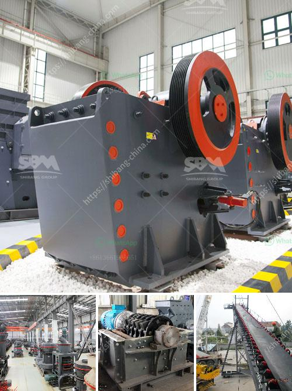

<h3>سعر كسارة محمولة</h3>
تعد الكسارات المحمولة من الأدوات الهامة في صناعة التعدين والبناء وغيرها من الصناعات التي تتطلب تكسير المواد وتكسيرها بسهولة. تتميز هذه الكسارات بأنها قابلة للتنقل بسهولة وتستطيع العمل في المواقع البعيدة والمناطق النائية بفاعلية وكفاءة عالية.

أما بالنسبة لسعر الكسارة المحمولة، فإنه يتفاوت حسب عدة عوامل. من بين هذه العوامل، حجم الكسارة وقدرتها التكسيرية، والعلامة التجارية المصنعة، والمنطقة الجغرافية التي تتم شراءها فيها.

قد يتراوح سعر الكسارة المحمولة من 200 إلى 400 دولار، ولكن هذا السعر قد يكون مجرد تقدير تقريبي، حيث يعتمد سعر الكسارة على المواصفات والمزايا التي تأتي بها. يمكن أن تكون الكسارات ذات الحجم الصغير والسعة الأقل أرخص من الكسارات الكبيرة ذات السعة العالية.

بالإضافة إلى ذلك، قد يؤثر اختلاف العلامة التجارية على سعر الكسارة المحمولة. فبعض العلامات التجارية المشهورة وذات السمعة الطيبة قد تكون أغلى من العلامات التجارية الأخرى المتاحة في السوق.

ولا يمكننا أن ننسى أن سعر الكسارة المحمولة قد يختلف حسب المنطقة الجغرافية. ففي بعض الأحيان، يمكن أن يتم تطبيق رسوم استيراد أو ضرائب أخرى على المعدات المستوردة من بلد إلى بلد، مما يؤثر على سعر الكسارة.

ومن المهم أن نلاحظ أن سعر الكسارة المحمولة ليس العامل الوحيد الذي يجب أن نأخذه بعين الاعتبار عند الشراء. يجب أيضًا مراعاة جودة الكسارة وفعاليتها في تكسير المواد، فقد تكون الكسارة ذات سعر منخفض، لكنها لا تقدم النتائج المرجوة في العملية.

بالختام، يجب أن ندرك أن سعر الكسارة المحمولة قد يختلف وفقًا للعوامل المذكورة أعلاه. ينصح بالبحث عن المعلومات ومقارنة الأسعار قبل اتخاذ القرار النهائي بشراء الكسارة المحمولة لضمان الحصول على أفضل قيمة مقابل المال المستثمر.
<h3>Contact us</h3><ul><li><strong>Whatsapp:&nbsp;<a href="https://wa.me/8613661969651">+8613661969651</a></strong></li><li><a href="https://swt.shibang-china.com/?git&amp;zhl&amp;سعر كسارة محمولة"><strong>Online Service(chat now)</strong></a></li></ul><h3>Related</h3><ul><li><a href='مطحنة الأسطوانة العمودية في الهند.md'>مطحنة الأسطوانة العمودية في الهند</a></li><li><a href='مصنع سحق الحجر الجيري.md'>مصنع سحق الحجر الجيري</a></li><li><a href='مناجم رمل السيليكا في الفلبين.md'>مناجم رمل السيليكا في الفلبين</a></li><li><a href='شراء آلة محجر من أوروبا.md'>شراء آلة محجر من أوروبا</a></li><li><a href='آلة سحق الأسفلت بسعة 15 طن في الساعة.md'>آلة سحق الأسفلت بسعة 15 طن في الساعة</a></li></ul>