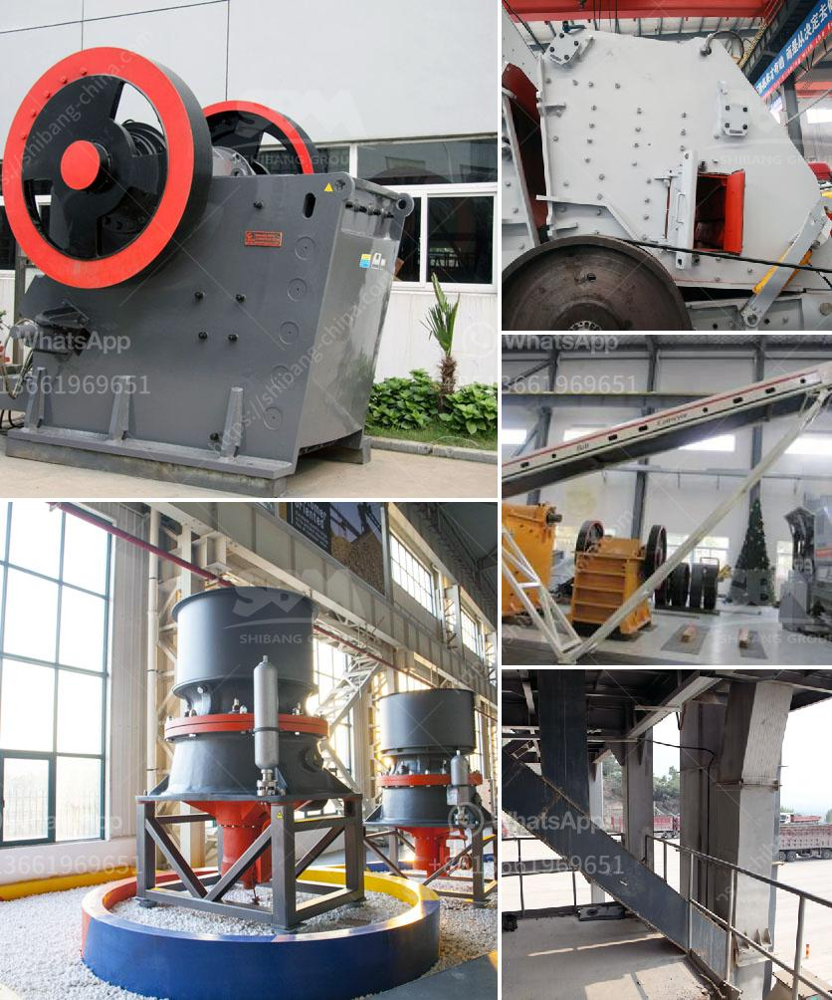

<h3>سعر كسارة مخروط محمولة من تركيا</h3>
تعد كسارات المخروط المحمولة من تركيا خيارًا شائعًا في صناعة التعدين والبناء. تتميز هذه الكسارات بكفاءتها العالية وقدرتها على سحق المواد الصلبة والصخور بكفاءة عالية. ويعتبر السعر من أهم العوامل التي ينبغي أن يأخذ بها العملاء عند شراء كسارة مخروط محمولة من تركيا.

تتفاوت أسعار كسارات المخروط المحمولة من تركيا وفقًا لعدة عوامل. أولاً وقبل كل شيء، يتأثر السعر بحجم وسعة الكسارة. إذا كانت الكسارة ذات سعة كبيرة، فمن المنطقي أن يكون سعرها أعلى. وبشكل عام، يمكن العثور على كسارات المخروط المحمولة من تركيا بأسعار تتراوح بين 50,000 و 100,000 دولار أمريكي.

بالإضافة إلى ذلك، يؤثر العلامة التجارية وجودة الكسارة أيضًا على سعرها. هناك عدة شركات تصنع وتورد كسارات المخروط المحمولة من تركيا، وبالتالي يعتمد السعر على سمعة العلامة التجارية والتقنيات المستخدمة في الكسارة. على سبيل المثال، قد تجد بعض الكسارات من شركات معروفة مثل Metso أو Sandvik بأسعار أعلى بسبب جودتها العالية وموثوقيتها.

ايضًا، يمكن أن يؤثر معدل الدوران على سعر الكسارة. إذا كانت الكسارة قادرة على سحق الصخور بسرعة أكبر، فمن المتوقع أن يكون سعرها أعلى بسبب الكفاءة الأعلى وأدائها القوي.

في الختام، رغم اختلاف الأسعار، إلا أن كسارات المخروط المحمولة من تركيا تعتبر خيارًا ممتازًا في صناعة التعدين والبناء. إذا كنت تبحث عن كسارة مخروط محمولة، فمن الأفضل مراجعة موردين مختلفين ومقارنة الأسعار والميزات للحصول على أفضل صفقة وفقًا لاحتياجاتك وميزانيتك.
<h3>Contact us</h3><ul><li><strong>Whatsapp:&nbsp;<a href="https://wa.me/8613661969651">+8613661969651</a></strong></li><li><a href="https://swt.shibang-china.com/?git&amp;zhl&amp;سعر كسارة مخروط محمولة من تركيا"><strong>Online Service(chat now)</strong></a></li></ul><h3>Related</h3><ul><li><a href='كسارة مخروطية غير مستخدمة في إثيوبيا للبيع.md'>كسارة مخروطية غير مستخدمة في إثيوبيا للبيع</a></li><li><a href='الحجر الجيري اللازم لإنتاج طن واحد من الأسمنت.md'>الحجر الجيري اللازم لإنتاج طن واحد من الأسمنت</a></li><li><a href='عملية تصنيع خام البنتونيت.md'>عملية تصنيع خام البنتونيت</a></li><li><a href='كيف يعمل مطحنة الهامر.md'>كيف يعمل مطحنة الهامر</a></li><li><a href='معدات صنع مسحوق كربونات الكالسيوم في ألمانيا.md'>معدات صنع مسحوق كربونات الكالسيوم في ألمانيا</a></li></ul>