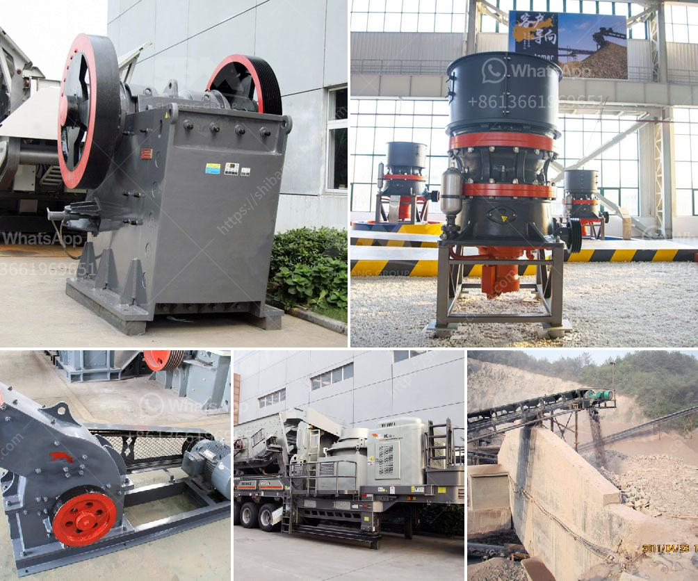

<h3>سعر كسارة مخروطية 250 طن</h3>
تعتبر الكسارات المخروطية من أهم الأدوات في صناعة التعدين والبناء، حيث تستخدم لتكسير المواد الصلبة والصخور الصلبة إلى حجم أصغر. إذا كنت تبحث عن كسارة مخروطية بسعة 250 طن، فأحد العوامل الهامة التي يجب أن تنظر إليها هو السعر.

يعتمد سعر كسارة المخروط التي تبلغ سعتها 250 طن على عدة عوامل. أولاً وقبل كل شيء هو الجودة والموثوقية. يجب أن تتأكد من أن الكسارة التي ترغب في شرائها مصنوعة من مواد عالية الجودة وتحتوي على تقنيات حديثة لضمان طول عمر الكسارة وقوتها. علاوة على ذلك، يجب أن تكون الكسارة مصممة بطريقة تسمح بسهولة الصيانة والتشغيل.

كما يؤثر حجم الكسارة على سعرها. على سبيل المثال، يمكنك العثور على كسارات مخروطية بحجم صغير جدًا تستخدم بطاريات صغيرة وتتميز بسعر منخفض. ومع ذلك، إذا كنت بحاجة إلى كسارة بسعة 250 طن، فستكون الكسارة ذات حجم كبير وأكبر تعقيدًا في التصنيع، مما يؤثر على السعر.

بالإضافة إلى ذلك، يعتبر العلامة التجارية للكسارة عاملاً آخر يؤثر في السعر. هناك العديد من الشركات المصنعة للكسارات المخروطية وكل شركة لديها سمعة مختلفة وتاريخ في تصنيع الكسارات. بعض العلامات التجارية الرائدة قد تكون أغلى من العلامات التجارية الأخرى، وذلك بسبب سمعتها وجودة منتجاتها.

أخيراً، يمكن أن يؤثر العرض والطلب على سعر الكسارة. إذا كان هناك ارتفاع في الطلب على الكسارات المخروطية بسعة 250 طن، فقد يؤدي ذلك إلى ارتفاع في الأسعار. على العكس من ذلك، إذا كان هناك عرض كبير من الكسارات المخروطية، فقد يتسبب ذلك في انخفاض في الأسعار.

اجتماع هذه العوامل يمكن أن يؤدي إلى تفاوت كبير في سعر كسارة مخروطية بسعة 250 طن. يمكن أن تتراوح الأسعار بين عدة آلاف من الدولارات وحتى العديد من الآلاف من الدولارات. لذا، قبل شراء الكسارة، ينبغي أن تؤخذ هذه العوامل في الاعتبار وتقارن بين العلامات التجارية والخيارات المتاحة لضمان الحصول على أفضل قيمة مقابل المال الذي ستدفعه.
<h3>Contact us</h3><ul><li><strong>Whatsapp:&nbsp;<a href="https://wa.me/8613661969651">+8613661969651</a></strong></li><li><a href="https://swt.shibang-china.com/?git&amp;zhl&amp;سعر كسارة مخروطية 250 طن"><strong>Online Service(chat now)</strong></a></li></ul><h3>Related</h3><ul><li><a href='آلة طحن الجير.md'>آلة طحن الجير</a></li><li><a href='أنواع الكسارات المستخدمة في التعدين pdf.md'>أنواع الكسارات المستخدمة في التعدين pdf</a></li><li><a href='مصنع كسارة السخام في الهند.md'>مصنع كسارة السخام في الهند</a></li><li><a href='آلة غسيل الرمال.md'>آلة غسيل الرمال</a></li><li><a href='تكلفة مصنع كسارة خام الحديد.md'>تكلفة مصنع كسارة خام الحديد</a></li></ul>