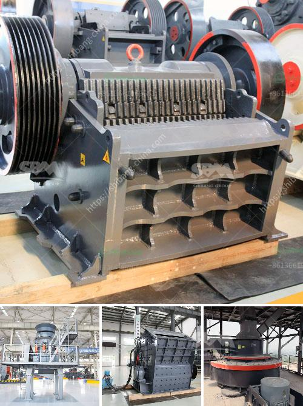

<h3>سعر كسارة مخروطية هيدروليكية بتغذية 20 مم</h3>
تعد الكسارة المخروطية الهيدروليكية أحد الأدوات الرئيسية في صناعة التعدين والبناء. وتستخدم لتكسير وسحق المواد الخام الصخرية بشكل فعال وسلس. وتتميز بمزايا عديدة مثل هيكلها المتين والمتانة، وسهولة الصيانة والاستخدام، ومعدل تكسير عالي.

قد تختلف أسعار الكسارات المخروطية الهيدروليكية بحسب العديد من العوامل مثل الحجم والسعة والمواصفات. وفيما يلي سنتكلم عن أسعار الكسارات المخروطية الهيدروليكية التي تتميز بتغذية 20 مم.

تتراوح أسعار الكسارة المخروطية الهيدروليكية بتغذية 20 مم بين مجموعة واسعة من القيم. يعتمد السعر بشكل أساسي على الماركة والجودة والسعة. على سبيل المثال، يمكن أن يكون سعر الكسارة بسعة 100-150 طن في الساعة حوالي 100000 دولار أمريكي، في حين أن الكسارات ذات السعة الأكبر قد تصل إلى 500000 دولار أمريكي.

وعند شراء الكسارة المخروطية الهيدروليكية، يجب أخذ العديد من العوامل في الاعتبار للحصول على أفضل قيمة مقابل المال. يمكن أن تكون هذه العوامل على سبيل المثال:

1- الجودة: ينبغي شراء كسارة من جودة عالية ومعتمدة من الجهات المعترف بها في الصناعة. قد يكون السعر أعلى قليلاً لكن الجودة ستكون أفضل.

2- الكفاءة: عند اختيار الكسارة، يجب مراجعة العديد من المعايير مثل سرعة الإنتاج ونسبة التكسير وتوفير الطاقة. يجب البحث عن الكسارات التي توفر أقصى معدل تكسير بأقل استهلاك للطاقة.

3- الخدمة والصيانة: يجب التحقق من سمعة الشركة المصنعة وقدرتها على تقديم دعم فني وصيانة مستمرة للكسارة بعد البيع.

4- الشهادات والتوجيهات: يجب التأكد من أن الكسارة تلتزم بالمعايير الصناعية المحلية والعالمية وتمتلك الشهادات المطلوبة.

5- التكلفة الإجمالية: يجب ضمان أن السعر المعروض يشمل جميع العناصر الأساسية مثل التركيب والضمان وقطع الغيار.

في النهاية، يجب أن يتم اختيار الكسارة المخروطية الهيدروليكية بالنظر إلى الاحتياجات الفعلية للعميل وبعد دراسة مستفيضة للخيارات المتاحة في السوق. على الرغم من أن السعر يعتبر عاملاً هامًا في عملية الشراء، يجب أن يتمتع العميل بكسارة ذات جودة عالية وذات كفاءة عالية ومعتمدة من جهة موثوقة قادرة على تقديم الخدمة والصيانة المناسبة عند الحاجة.
<h3>Contact us</h3><ul><li><strong>Whatsapp:&nbsp;<a href="https://wa.me/8613661969651">+8613661969651</a></strong></li><li><a href="https://swt.shibang-china.com/?git&amp;zhl&amp;سعر كسارة مخروطية هيدروليكية بتغذية 20 مم"><strong>Online Service(chat now)</strong></a></li></ul><h3>Related</h3><ul><li><a href='آلة سحق في الفلبين.md'>آلة سحق في الفلبين</a></li><li><a href='آلات صنع الحصى الكوارتز في الهند.md'>آلات صنع الحصى الكوارتز في الهند</a></li><li><a href='آلة صنع مسحوق الحجر الجيري في باكستان.md'>آلة صنع مسحوق الحجر الجيري في باكستان</a></li><li><a href='كسارة الصخور بوسطن.md'>كسارة الصخور بوسطن</a></li><li><a href='آلة معالجة البلانت.md'>آلة معالجة البلانت</a></li></ul>