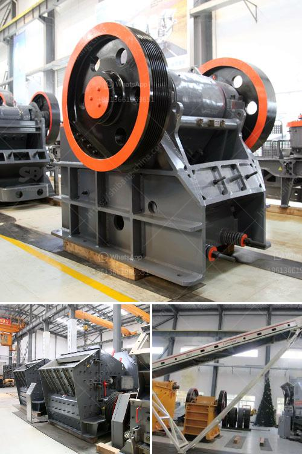

<h3>سعر كسارة مخروطية هيدروليكية</h3>
تضطلع الكسارات المخروطية الهيدروليكية بدور حاسم في صناعة تكسير الحجارة والتعدين. وهي معدات تستخدم لسحق الصخور الكبيرة إلى قطع أصغر وتصنف على أساس حجمها. تعتبر الكسارة المخروطية الهيدروليكية واحدة من أنواع الكسارات الرئيسية في هذه الصناعة، حيث تتمتع بفعالية عالية وأداء قوي.

تختلف أسعار الكسارات المخروطية الهيدروليكية وفقًا للعوامل المختلفة مثل الحجم والقدرة والموديل والشركة المصنعة. عادة ما يتراوح سعر الكسارة المخروطية الهيدروليكية بين 200-400 ألف دولار أمريكي. تتفاوت الأسعار أيضًا اعتمادًا على الجودة والتقنيات المتقدمة المستخدمة في الجهاز.

تعتمد كسارات المخروط الهيدروليكية على نظام هيدروليكي قوي لتحقيق عملية التكسير الفعالة المطلوبة. تعتبر قدرة الكسارة الهيدروليكية على ضبط حجم التفريغ بسرعة ودقة أحد العوامل الرئيسية التي تجعلها تبرز بين أنواع الكسارات الأخرى. تستخدم محطات الكسارات المخروطية الهيدروليكية على نطاق واسع في استخراج الصخور ومناجم الفحم وصناعة البناء والطرق والسكك الحديدية وغيرها من الصناعات.

بالنظر إلى الميزات والفوائد التي تقدمها الكسارات المخروطية الهيدروليكية، يتم استخدامها بشكل واسع في صناعة التكسير. تعتبر فعالية الأداء والقدرة على معالجة الصخور الكبيرة وتحقيق نسبة تخفيض كبيرة عوامل مهمة في اختيار هذا النوع من الكسارات.

بصفة عامة، فإن شراء كسارة مخروطية هيدروليكية قد يكون استثمارًا مكلفًا، لكنه يعتبر استثماراً جيدا نظرًا للفوائد والأداء العالي الذي توفره. يدعم استخدام الكسارة المخروطية الهيدروليكية العملية الإنتاجية للمصانع وتحسين جودة المنتج النهائي.

وفي الختام، فإن الكسارة المخروطية الهيدروليكية تعتبر واحدة من الأدوات الرئيسية في عمليات تكسير الصخور والتعدين. تستخدم على نطاق واسع في العديد من الصناعات وتتمتع بقدرة عالية وأداء قوي وتساهم في تحسين العمليات الإنتاجية للمصانع التي تستخدمها.
<h3>Contact us</h3><ul><li><strong>Whatsapp:&nbsp;<a href="https://wa.me/8613661969651">+8613661969651</a></strong></li><li><a href="https://swt.shibang-china.com/?git&amp;zhl&amp;سعر كسارة مخروطية هيدروليكية"><strong>Online Service(chat now)</strong></a></li></ul><h3>Related</h3><ul><li><a href='آلة كسارة لصنع الرمل من الحجر.md'>آلة كسارة لصنع الرمل من الحجر</a></li><li><a href='مصنع محطم الدولوميت في ماليزيا.md'>مصنع محطم الدولوميت في ماليزيا</a></li><li><a href='كسارة الكرة.md'>كسارة الكرة</a></li><li><a href='تكلفة آلة الطحن.md'>تكلفة آلة الطحن</a></li><li><a href='سعر كسارة الفحم القدرة.md'>سعر كسارة الفحم القدرة</a></li></ul>