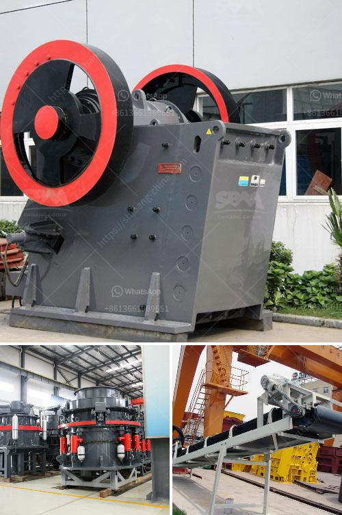

<h3>سعر ماكينة مولين في ميدان</h3>
تعد ماكينة مولين أحد الأدوات المنزلية الهامة التي يستخدمها الكثيرون في المنازل والمطابخ. تعتبر الخبز أحد الأطعمة الأساسية في حياة الكثير من الأشخاص وتستخدم في تحضير العديد من الوجبات والمأكولات الشهية. تختلف أنواع ماكينات المولين المتوفرة في الأسواق بحسب العلامة التجارية والمميزات التي تتميز بها كل منها.

يتراوح سعر ماكينة المولين في ميدان بين 200-400 دولار. يعتمد السعر على عدة عوامل، بما في ذلك الأداء والسعة التي تستوعبها الماكينة. توجد ماكينات مولين عادية بسعر منخفض يبدأ من 200 دولار وتعتبر مناسبة للاستخدام المنزلي العادي. تتميز هذه الماكينات بتصميمها البسيط وبعض الوظائف الأساسية مثل طحن الحبوب والبهارات واللحم وصنع المربى وعمل العجين.

من ناحية أخرى، تتوفر أيضًا ماكينات مولين فاخرة تتراوح أسعارها بين 300-400 دولار. تتميز هذه الماكينات بوجود مميزات إضافية مثل شاشة عرض رقمية، وظيفة الخبز الذاتي، ووجود عدة إعدادات لطحن الحبوب بمختلف القساوة، وسعة أكبر لتخزين الحبوب، وقدرة على إعداد مجموعة متنوعة من الأطعمة.

بالإضافة إلى العلامة التجارية والمميزات، قد تؤثر أيضًا عوامل أخرى على سعر الماكينة مثل الجودة والمتانة والضمان المقدم من الشركة المصنعة. قبل شراء ماكينة المولين، يجب أن تقوم ببعض الأبحاث والمقارنة بين الموديلات المختلفة وتقييم ميزات كل منها بناءً على احتياجاتك الشخصية.

باختيار ماكينة المولين المناسبة والتي تتناسب مع ميزانيتك واحتياجاتك، يمكنك الاستمتاع بإعداد الخبز اللذيذ والمأكولات الطازجة في راحة منزلك.
<h3>Contact us</h3><ul><li><strong>Whatsapp:&nbsp;<a href="https://wa.me/8613661969651">+8613661969651</a></strong></li><li><a href="https://swt.shibang-china.com/?git&amp;zhl&amp;سعر ماكينة مولين في ميدان"><strong>Online Service(chat now)</strong></a></li></ul><h3>Related</h3><ul><li><a href='معدات كسارة الفك المتنقلة.md'>معدات كسارة الفك المتنقلة</a></li><li><a href='مطحنة المطرقة في نيجيريا.md'>مطحنة المطرقة في نيجيريا</a></li><li><a href='مطحنة معدنية إلى 300 ميكرون.md'>مطحنة معدنية إلى 300 ميكرون</a></li><li><a href='موردين معدات سحق السيليكا.md'>موردين معدات سحق السيليكا</a></li><li><a href='مصنع تكسير في مالي.md'>مصنع تكسير في مالي</a></li></ul>