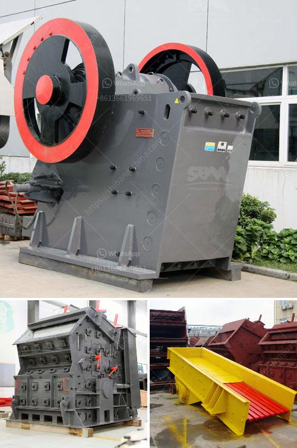

<h3>سعر مركز تركيز خام النحاس</h3>
تعتبر صناعة التعدين من أهم الصناعات التي تلعب دورًا حيويًا في اقتصاديات العديد من الدول حول العالم. ومن بين المعادن الهامة التي يتم تعدينها، يأتي خام النحاس على رأس القائمة. يتم استخراج خام النحاس من مناجمه وتركيباته الطبيعية، ويتم ذلك من خلال عمليات معقدة تحتاج إلى تركيز ومعالجة الخام للحصول على نسبة عالية من المعدن المرغوب فيه.

يعد سعر مركز تركيز خام النحاس من أهم المؤشرات التي تستخدم لقياس قيمة الخام على السوق. يتأثر سعر مركز التركيز بعدة عوامل مختلفة، مثل العرض والطلب، وحالة الاقتصاد العالمي، والتطورات الجيوسياسية، وتوترات العرض والطلب، وحجم الإنتاج العالمي والمخزون. يجب أن يكون لدى شركات التعدين مراقبة مستمرة لأسعار مركز تركيز خام النحاس لتأخذ قرارات مستنيرة بشأن عمليات التعدين والتسويق.

يتم تحديد سعر مركز التركيز بناءً على نسبة النحاس الموجودة في الخام ونسبة الشوائب الموجودة. كلما زادت نسبة النحاس، زادت قيمة الخام، وبالتالي زاد سعر مركز الخام. وعلى الرغم من أن النحاس يعتبر واحدًا من المعادن القيمة والمطلوبة، إلا أنه لا يمكن الاستغناء عن تركيز الخام ومعالجته للحصول على نسبة عالية من النحاس.

تعد الصين البلد الأكثر استهلاكًا للنحاس عالميًا، إذ تعتمد بشكل كبير على النحاس في الصناعات المختلفة مثل البناء، والسيارات، والإلكترونيات، والأجهزة المنزلية. ومع زيادة الطلب على النحاس في الصين وفي دول أخرى مثل الهند والولايات المتحدة، يتزايد الطلب على خام النحاس ذو تركيز عالي.

من المهم أن يكون للدول الرائدة في صناعة التعدين القدرة على تلبية الطلب المتزايد على خام النحاس ذو تركيز عالي. لتحقيق ذلك، تعمل الشركات المنتجة على تطوير تقنيات وعمليات أكثر كفاءة لتركيز الخام وزيادة نسبة النحاس فيه. وتشمل هذه التقنيات استخدام عمليات تكسير وتدوير وتعويم وفصل الجسيمات للحصول على تركيز عالي من النحاس دون إهدار الخام القيم.

باختصار، سعر مركز تركيز خام النحاس يعتبر مؤشرًا هامًا لقيمة الخام ويتأثر بعدة عوامل. ومن المهم أن يبذل المنتجون قصارى جهدهم لتحقيق تركيز عالي للنحاس في الخام، لتلبية الطلب المتزايد على النحاس في الصناعات المختلفة حول العالم.
<h3>Contact us</h3><ul><li><strong>Whatsapp:&nbsp;<a href="https://wa.me/8613661969651">+8613661969651</a></strong></li><li><a href="https://swt.shibang-china.com/?git&amp;zhl&amp;سعر مركز تركيز خام النحاس"><strong>Online Service(chat now)</strong></a></li></ul><h3>Related</h3><ul><li><a href='عملية غسيل الرمل.md'>عملية غسيل الرمل</a></li><li><a href='خط إنتاج خاص لتعدين مسحوق الكوارتز.md'>خط إنتاج خاص لتعدين مسحوق الكوارتز</a></li><li><a href='السحق النبات هو.md'>السحق النبات هو</a></li><li><a href='إنشاء محجر في نيجيريا.md'>إنشاء محجر في نيجيريا</a></li><li><a href='آلة تكسير وطحن مناجم الذهب.md'>آلة تكسير وطحن مناجم الذهب</a></li></ul>