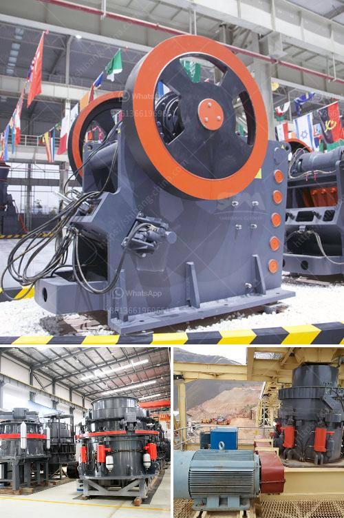

<h3>سعر مصنع الأسمنت على نطاق صغير في الهند</h3>
يُعتبر قطاع الأسمنت من القطاعات الرئيسية في صناعة البناء والتشييد في الهند، ويعكس تنمية البلاد الاقتصادية. يُلاحَظ في السنوات الأخيرة ارتفاع الطلب على الأسمنت الذي أدى إلى زيادة عدد المصانع على نطاق صغير في مختلف مناطق الهند.

قد يتراوح سعر المصنع على نطاق صغير لإنتاج الأسمنت في الهند بين 200 إلى 400 كلمة، وتتأثر التكلفة بمجموعة من العوامل. أهم هذه العوامل هي:

1. الطاقة والوقود: يعتمد سعر الأسمنت على تكلفة الطاقة والوقود المستخدمة في العملية الإنتاجية. قد تتضمن هذه التكلفة استهلاك الكهرباء والوقود الأحفوري مثل الفحم أو الفحم الحجري.

2. تكاليف المواد الخام: تتعلق تكلفة المواد الخام بمكونات الأسمنت مثل الحجر الجيري والصخور الزيتية والسيليكا والأكاسيد. قد يؤثر توفر هذه المواد الخام وتكلفتها على سعر المصنع.

3. التكلفة العمالية والتشغيلية: تعتبر التكلفة العمالية والتشغيلية عاملاً مهمًا في تحديد سعر المصنع على نطاق صغير. تتضمن هذه التكاليف أجور العمال والمهندسين والتكنولوجيا المستخدمة في العملية الإنتاجية.

4. تقنية الإنتاج: قد يؤثر تطور التقنية ومستوى التكنولوجيا المستخدمة في مصنع الأسمنت على تكلفة الإنتاج وبالتالي على سعر المنتج النهائي.

5. الضرائب واللوائح: يتأثر سعر الأسمنت بالضرائب واللوائح المفروضة من قبل الحكومة المحلية والوطنية، والتي قد تختلف من منطقة إلى أخرى في الهند.

على الرغم من التحديات التي تواجهها صناعة الأسمنت في الهند، إلا أن استثمارات في هذا القطاع مستمرة وتوسع القاعدة التحتية في الهند يؤدي إلى زيادة الطلب على الأسمنت. هذا النمو في الطلب قد يؤدي في المستقبل إلى زيادة عدد المصانع على نطاق صغير وقد يؤدي ذلك إلى تحسين الأسعار وزيادة المنافسة بين الشركات المصنعة.

لذا، يُعد سعر مصنع الأسمنت على نطاق صغير في الهند أمرًا متغيرًا ويعتمد على مجموعة من العوامل المذكورة أعلاه. تحديدًا، وفقًا للعوامل السابقة، فإنه يصعب تحديد سعر محدد لمصنع الأسمنت على نطاق صغير في الهند، وعليه، فإنه يجب على المستثمرين والمشترين القيام ببحوث سوقية والتشاور مع الشركات المصنعة المحلية للحصول على تقديرات دقيقة لأسعار المصانع المحلية.
<h3>Contact us</h3><ul><li><strong>Whatsapp:&nbsp;<a href="https://wa.me/8613661969651">+8613661969651</a></strong></li><li><a href="https://swt.shibang-china.com/?git&amp;zhl&amp;سعر مصنع الأسمنت على نطاق صغير في الهند"><strong>Online Service(chat now)</strong></a></li></ul><h3>Related</h3><ul><li><a href='مصانع غسيل الفحم المستخدمة للبيع في الهند.md'>مصانع غسيل الفحم المستخدمة للبيع في الهند</a></li><li><a href='مطحنة أسطوانية صينية.md'>مطحنة أسطوانية صينية</a></li><li><a href='شاشة جريزلي للبيع نيوزيلندا.md'>شاشة جريزلي للبيع نيوزيلندا</a></li><li><a href='جميع نماذج كسارة البازلت.md'>جميع نماذج كسارة البازلت</a></li><li><a href='كسارة حجر في المملكة المتحدة.md'>كسارة حجر في المملكة المتحدة</a></li></ul>